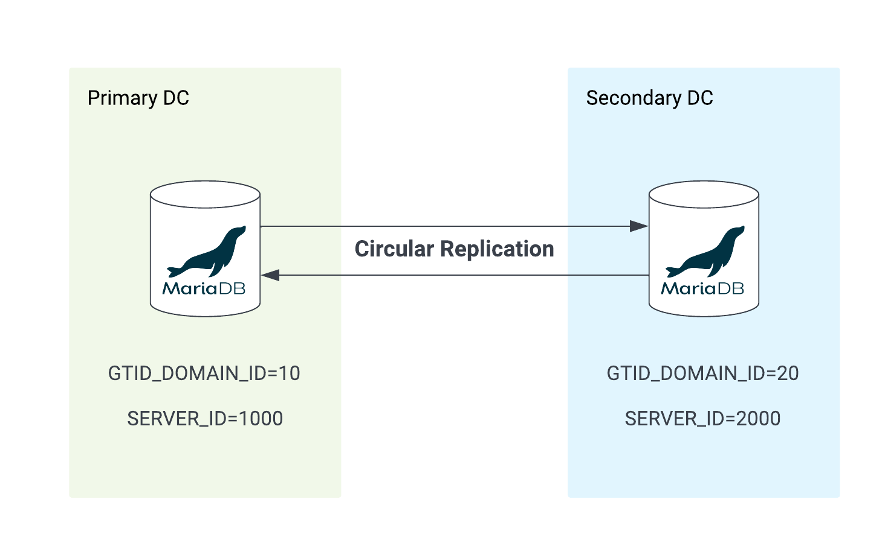
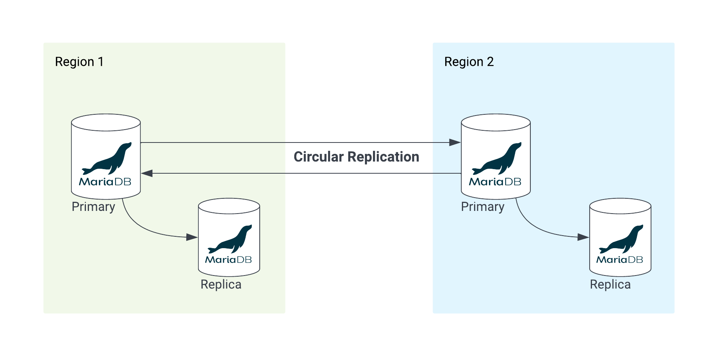

# MariaDB - Circular Replication

We all know how to set up standard Primary Replica replication, but I have been asked by many about what we call Multi-Source replication and how to set it up. This leads to the discussion of Circular Replication. Circular replication and Multi-Source replication have one thing in common, the use of `GTID_DOMAIN_ID` setup. We are going to discuss this in this blog.

As a followup to this blog, I will be discussing Multi-source replication which will be published sometime in the future.

## Assumptions

This is a going to be a short blog, we ar assuming that we have two servers running MariaDB 10.5 or higher, firwall between these two nodes have been opened to allow traffic on the defualt MariaDB port, `3306`. The document should also work with older versions of MariaDB as well.

***Note:** Important thing to take note here is that the replication technology discussed here isonly applicabele to MariaDB standard storage engines like InnoDB, RocksDB, etc. Xpand and ColumnStore are out of scope as these two have thir own way of distributing data across the cluster and don't really use replicaiton of any sort.*

## Architecture


  
The base concept behind circular replication is the same as standard replicaiton, we just have repeat the steps twice from both sides. 

As the above image demonstrates the architecture. The two nodes of MariaDB replicates from each other. Which means, Primary DC is a Primary node in it's own rights while it's also a Replica to the Secondary DC node. Same thing apples to the MariaDB server on the Secondary DC, it's a Primary and also a Replica to the MariaDB server running in the Primary DC. 

## Usecases

There are some specific usecases to this setup. One of them can be described as follows. 

- Multi-Regional Application Support
  - The two DC nodes are geographically separated and a fully synchronous replciation is not possoble due to the network lag.
  - The app is also running locally in each region to support the clients.
  - Both the apps in each region connect to the local database to prevent latency and provide best possible experience. 

This is a very common scenario, while there are other options available like Xpand to provide an extremely scalable solution, but an app that just needs a simple architecture, this is a good solution.



### Pros

- Easy to set up
- Fast asynchronus two way/circular replicaiton
  - See cons section for things to watch out for
- Further HA can be setup by adding a local Replica
- MaxScale can be used locally in each DC for local HA and automatic failover
  
### Cons

- No way to identify conflicting transaction
  - Both sides submit same transaction, only one will be commnitted.
- Not ideal if multi-master writes is a requirement but still possible thanks to mixed GTID_DOMAIN_ID setup.
- MaxScale does not support circular replication, failover between DC must be handled manually.

## Implementation

We are working with two MariaDB servers running 10.5 or higher. For our case it's MariaDB Enterprise 10.6


### Configuration

Here is what is required at a minimum to set up circular replication. 

`/etc/my.cnf.d/server.cnf` or `/etc/mysql/mariadb.conf.d/50-server.cnf` depending on the OS.

**Node-1:**
```
[mariadb]
log_error=server.log
log_bin=mariadb-bin
log_slave_updates=1
gtid_strict_mode=1
binlog_format=row

### Replication Durability 
sync_binlog=1
sync_relay_log=1
sync_master_info=1
sync_relay_log_info=1
###

innodb_flush_log_at_trx_commit=1

gtid_domain_id=10
server_id=1000
```

**Node-2:**

```
[mariad]
...
...
gtid_domain_id=20
server_id=2000
```

Take note of the "Replication Durability" section in the configuration, it will slow down the replication process purely because of the additional IO that is done here but highly recommended.

Node-1 amd Node-2 configuration is identical except for the `gtid_domain_id` and `server_id`. Generally `gtid_domain_id` is kept the same for all the nodes within the same Primary/Replica cluster but since this is a multi-master circular replication setup, a distinct `gtid_domain_id` is mandatory.

### Replication User

Once the configuration setup is done and both the servers have restarted successfully, we can now create a replication user `rep_user@'%'` with spicific replicaiton grants. This is the same user we would create for the standard replication.

***Note:** This user is created only on Node-1, this will automatically get replicated to Node-2 once the one way replication is done.* 

```
MariaDB [(none)]> create user rep_user@'%' identified by 'VerySecretPassw0rd!';
Query OK, 0 rows affected (0.003 sec)

MariaDB [(none)]> grant replication slave on *.* to rep_user@'%';
Query OK, 0 rows affected (0.003 sec)
```

Now we are ready for replicaiton setup from `Node-1 > Node-2`

### Replication

Validate that Node-1 has a valid GTID since we have already configured binary logging and done some transactions.

Node-1:

```
MariaDB [(none)]> show global variables like 'GTID%';
+-------------------------+-----------+
| Variable_name           | Value     |
+-------------------------+-----------+
| gtid_binlog_pos         | 10-1000-2 |
| gtid_binlog_state       | 10-1000-2 |
| gtid_cleanup_batch_size | 64        |
| gtid_current_pos        | 10-1000-2 |
| gtid_domain_id          | 10        |
| gtid_ignore_duplicates  | OFF       |
| gtid_pos_auto_engines   |           |
| gtid_slave_pos          |           |
| gtid_strict_mode        | ON        |
+-------------------------+-----------+
```

The above shows that the Domain-ID and the GTID values are proper based on the setup in the `server.cnf` file. The GTID **`10-1000-2`** reads as, "This server is at Domain-ID=10, Server-ID=1000 and 
Transaction=2"

Validate the same GTID status on the Node-2

```
MariaDB [(none)]> show global variables like 'GTID%';
+-------------------------+-------+
| Variable_name           | Value |
+-------------------------+-------+
| gtid_binlog_pos         |       |
| gtid_binlog_state       |       |
| gtid_cleanup_batch_size | 64    |
| gtid_current_pos        |       |
| gtid_domain_id          | 20    |
| gtid_ignore_duplicates  | OFF   |
| gtid_pos_auto_engines   |       |
| gtid_slave_pos          |       |
| gtid_strict_mode        | ON    |
+-------------------------+-------+
```

We can see the GTID on the Node-2 are completely empty which is fine as we know the server is new and no transactions have been performed on it. Take note of the `GTID_SLAVE_POS` which is also empty. We would gnerally set this to the GTID position from wherever we want the replication to start. But in this case "Empty" means it will start to request replkication data from the very first transaction which was logged in the binary logs on the Node-1.

Execute the `CHANGE MASTER` on Node-2 just like we would do to set up the standard replicaiton.

**Node-2:**

```
MariaDB [(none)]> CHANGE MASTER TO MASTER_HOST="172.31.24.201", 
MASTER_USER="rep_user", 
MASTER_PASSWORD="VerySecretPassw0rd!", 
MASTER_PORT=3306, 
MASTER_USE_GTID=slave_pos;
Query OK, 0 rows affected (0.079 sec)

MariaDB [(none)]> show slave status\G
*************************** 1. row ***************************
                Slave_IO_State: Waiting for master to send event
                   Master_Host: 172.31.24.201
                   Master_User: rep_user
                   Master_Port: 3306
                 Connect_Retry: 60
               Master_Log_File: mariadb-bin.000001
           Read_Master_Log_Pos: 1500
                Relay_Log_File: ip-172-31-17-125-relay-bin.000002
                 Relay_Log_Pos: 1801
         Relay_Master_Log_File: mariadb-bin.000001
              Slave_IO_Running: Yes
             Slave_SQL_Running: Yes
                                ...
              Master_Server_Id: 1000
                    Using_Gtid: Slave_Pos
                   Gtid_IO_Pos: 10-1000-2
                                ...
                                ...
```

The above pouints to Node-1 as the master and confirms that the slave from Node-1 > Node-2 is working well as we can see the `GTID_IO_POS` reports `10-1000-2`. Now let's switch to Node-1 and repeat the same step with a slight twist.

**Node-1:**

We can now complete the other half of the replication Node-2 > Node-1 by following the same steps but with a slight difference.

Take note of the current GTID status of the Node-1

```
MariaDB [(none)]> show global variables like 'gtid_binlog_state';
+-------------------+-----------+
| Variable_name     | Value     |
+-------------------+-----------+
| gtid_binlog_state | 10-1000-2 |
+-------------------+-----------+
1 row in set (0.001 sec)

MariaDB [(none)]> show global variables like 'gtid_slave_pos';
+----------------+-------+
| Variable_name  | Value |
+----------------+-------+
| gtid_slave_pos |       |
+----------------+-------+
1 row in set (0.001 sec)
```

We need to set the gtid_slave_pos to be the same as gtid_binlog_state so that replication can start from this point onwards. This is required so that the server does not repeat the samer events which are already in it's local binary logs.

```
MariaDB [(none)]> SET GLOBAL gtid_slave_pos=@@gtid_binlog_state;
Query OK, 0 rows affected (0.006 sec)

MariaDB [(none)]> show global variables like 'gtid_slave_pos';
+----------------+-----------+
| Variable_name  | Value     |
+----------------+-----------+
| gtid_slave_pos | 10-1000-2 |
+----------------+-----------+
1 row in set (0.001 sec)

MariaDB [(none)]> CHANGE MASTER TO MASTER_HOST="172.31.17.125", MASTER_USER="rep_user", MASTER_PASSWORD="Password!234", MASTER_USE_GTID=slave_pos;
Query OK, 0 rows affected (0.015 sec)

MariaDB [(none)]> start slave;
Query OK, 0 rows affected (0.006 sec)
```

This time the `MASTER_HOST` points to the Node-2. 

Time to check the replication status but before we do that, let's do a few transactions on the Node-2.

```
MariaDB [(none)]> create database testdb;
Query OK, 1 row affected (0.002 sec)

MariaDB [(none)]> use testdb;
Database changed

MariaDB [testdb]> create table t(id serial, c varchar(100));
Query OK, 0 rows affected (0.011 sec)

MariaDB [testdb]> show global variables like 'gtid%';
+-------------------------+---------------------+
| Variable_name           | Value               |
+-------------------------+---------------------+
| gtid_binlog_pos         | 10-1000-2,20-2000-2 |
| gtid_binlog_state       | 10-1000-2,20-2000-2 |
| gtid_cleanup_batch_size | 64                  |
| gtid_current_pos        | 10-1000-2,20-2000-2 |
| gtid_domain_id          | 20                  |
| gtid_ignore_duplicates  | OFF                 |
| gtid_pos_auto_engines   |                     |
| gtid_slave_pos          | 10-1000-2,20-2000-2 |
| gtid_strict_mode        | ON                  |
+-------------------------+---------------------+
```

The above indicates that binary logs have a mix of two domains, which is what we expect to see. Now going back to Node-1 and checking the `slave status` 

```
MariaDB [(none)]> show status status\G
*************************** 1. row ***************************
                Slave_IO_State: Waiting for master to send event
                   Master_Host: 172.31.17.125
                   Master_User: rep_user
                   Master_Port: 3306
                 Connect_Retry: 60
               Master_Log_File: mariadb-bin.000001
           Read_Master_Log_Pos: 1500
                Relay_Log_File: ip-172-31-24-201-relay-bin.000002
                 Relay_Log_Pos: 674
         Relay_Master_Log_File: mariadb-bin.000001
              Slave_IO_Running: Yes
             Slave_SQL_Running: Yes
                                ...
                                ...
              Master_Server_Id: 2000
                                ...
                    Using_Gtid: Slave_Pos
                   Gtid_IO_Pos: 10-1000-2,20-2000-2
                                ...
                                ...
```

We can already see that the Node-1 has replicated the two transactions from the Node-2 `20-2000-2` We can also confirm if the new database and table have been created on this node or not?

```
MariaDB [(none)]> use testdb;

Database changed
MariaDB [testdb]> show tables;
+------------------+
| Tables_in_testdb |
+------------------+
| t                |
+------------------+
```

Indeed, everything looks good and we have a circular replication in place. Now repeat some transaction on both nodes and confirm that the replication works both ways without breaking the replication.

References:

..
..
..

## Thank You!
