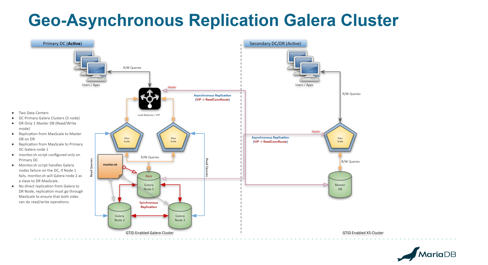

# MariaDB 10.4 Enterprise - Galera Architecture

## Assumptions

This guide is meant to be used with MariaDB 10.4 Enterprise Server on RHEL/CentOS 7 operating systems, however the setup on RHEL/CentOS 8 should not be much different. 

## Architecture

The requirement is simple, setup 2 Galera clusters (3 nodes each) on two data centers. Setup MaxScale 2.4 binlog router to replicate data from Galera cluster on the primary data cetner to the the standalone Primary node on the secondary data center. 

Same way, a reverse replication is is to be set up from the Secondary data center to the primary data cetners using MaxScale binlog router.

ref: **Image-1**


Reference Architecture using MaxScale's new Binlog router to replicate a 10.4 Galera cluster using asynchronous replication for maximum performance.

A stretched Galera cluster can be setup but if the latency numbers are bad between the two DC, galera cluster's performance will drop. It is recommended to set up two clusters instead using asyhcnronous replication for an **Active/Passive** site setup.

## Servers

We will setup the following servers in this workbook.

- MaxScale-70 (192.168.56.70) **(2.4)**
  - Galera-71 (192.168.56.71) **(10.4)**
  - Galera-72 (192.168.56.72) **(10.4)**
  - Galera-73 (192.168.56.73) **(10.4)**
- MaxScale-80 (192.168.56.80) **(2.4)**
  - Server-81 (192.168.56.81) **(10.4)**


## Galera Cluster

### Install MariaDB 10.4 Enterprise Server

```
➜  yum -y install MariaDB-server MariaDB-backup galera-enterprise-4         

Dependencies Resolved

==============================================================================================================================================================================================
 Package                                               Arch                                 Version                                       Repository                                     Size
==============================================================================================================================================================================================
Installing:
 MariaDB-backup                                        x86_64                               10.4.5_3-1.el7                                mariadb-es-main                               7.0 M
 MariaDB-server                                        x86_64                               10.4.5_3-1.el7                                mariadb-es-main                                21 M
 galera-enterprise-4                                   x86_64                               26.4.5-1.el7.8                                mariadb-es-main                               9.9 M
Installing for dependencies:
 MariaDB-client                                        x86_64                               10.4.5_3-1.el7                                mariadb-es-main                               7.0 M
 boost-program-options                                 x86_64                               1.53.0-28.el7                                 base                                          156 k
 lsof                                                  x86_64                               4.87-6.el7                                    base                                          331 k
 perl-Compress-Raw-Bzip2                               x86_64                               2.061-3.el7                                   base                                           32 k
 perl-Compress-Raw-Zlib                                x86_64                               1:2.061-4.el7                                 base                                           57 k
 perl-DBI                                              x86_64                               1.627-4.el7                                   base                                          802 k
 perl-Data-Dumper                                      x86_64                               2.145-3.el7                                   base                                           47 k
 perl-IO-Compress                                      noarch                               2.061-2.el7                                   base                                          260 k
 perl-Net-Daemon                                       noarch                               0.48-5.el7                                    base                                           51 k
 perl-PlRPC                                            noarch                               0.2020-14.el7                                 base                                           36 k
 socat                                                 x86_64                               1.7.3.2-2.el7                                 base                                          290 k

Transaction Summary
==============================================================================================================================================================================================
..
..
Complete!
```

Verify the installation on all 6 nodes

```
➜  rpm -qa | grep -i mariadb
MariaDB-common-10.4.5_3-1.el7.x86_64
MariaDB-compat-10.4.5_3-1.el7.x86_64
MariaDB-client-10.4.5_3-1.el7.x86_64
MariaDB-server-10.4.5_3-1.el7.x86_64
MariaDB-backup-10.4.5_3-1.el7.x86_64

➜  rpm -qa | grep -i galera 
galera-enterprise-4-26.4.5-1.el7.8.x86_64
```

All the required binaries are insalled on all the 6 galera nodes. 

#### Galera Configuration

Now that Galera Cluster has been installed on all 6 nodes, we can now configure those as 2 separate Galera clusters, here is a reference configuration for both clusters

The following needs to be edited in the `/etc/my.cnf.d/server.cnf` file

***Note:*** Don't forget to add **`log_error=/var/lib/mysql/server.log`** under the **`[mariadb]`** section for all MariaDB nodes. 

- Primary Data Center

  ```
  [galera]
  wsrep_on=ON
  wsrep_gtid_mode=ON
  wsrep_gtid_domain_id=70
  wsrep_auto_increment_control=0
  wsrep_provider=/usr/lib64/galera-enterprise-4/libgalera_enterprise_smm.so
  wsrep_cluster_address=gcomm://192.168.56.71,192.168.56.72,192.168.56.73
  wsrep_cluster_name=DC

  # Local node setup
  wsrep_node_address=192.168.56.71
  wsrep_node_name=galera-71

  ## Data Streaming for large transactions, activate if needed
  wsrep_trx_fragment_unit=rows
  wsrep_trx_fragment_size=10000

  #Galera Cache setup for performance as 5 GB, default location is on `datadir`
  wsrep_provider_options="gcache.size=5G; gcache.keep_pages_size=5G; gcache.recover=yes; gcs.fc_factor=0.8;"

  [mariadb]
  log_error=/var/lib/mysql/server.log
  binlog_format=row
  log_slave_updates=ON

  log_bin
  skip_slave_start=ON

  gtid_domain_id=71
  gtid_ignore_duplicates=ON
  server_id=7000
  default_storage_engine=InnoDB
  innodb_autoinc_lock_mode=2
  innodb_lock_schedule_algorithm=FCFS
  innodb_flush_log_at_trx_commit=2
  innodb_buffer_pool_size=512M
  innodb_log_file_size=512M

  auto_increment_offset=1
  auto_increment_increment=4

  character-set-server = utf8
  collation-server = utf8_unicode_ci

  ## Allow server to accept connections on all interfaces.
  bind-address=0.0.0.0
  ```

- DR Data Center which is running as a standalone Primary Node

  ```
  [maraidb]
  log_error=/var/lib/mysql/server.log
  log_bin
  binlog_format=row
  log_slave_updates=ON

  gtid_domain_id=80
  gtid_ignore_duplicates=ON
  server_id=8000
  default_storage_engine=InnoDB
  innodb_autoinc_lock_mode=2
  innodb_lock_schedule_algorithm=FCFS
  innodb_flush_log_at_trx_commit=2
  innodb_buffer_pool_size=512M
  innodb_log_file_size=512M

  auto_increment_offset=4
  auto_increment_increment=4

  character-set-server = utf8
  collation-server = utf8_unicode_ci

  ## Allow server to accept connections on all interfaces.
  bind-address=0.0.0.0
  ```

***Note:** `wsrep_cluster_address` should not have any white spaces between the IP addresses!*

Referring to the above two configurations:

- **`wsrep_cluster_name`** needs to be different on both data centers
  - we will be using **`DC`** for first data center all three nodes
- **`wsrep_gtid_domain_id`** needs to be configured the with same value for each cluster.
  - We will be using **`wsrep_gtid_domain_id=70`** for all three nodes in the first cluster.
  - We will be using **`wsrep_gtid_domain_id=80`** for all three ndoes in the second cluster.
- **`server_id`** needs to be configured the with same value for each cluster.
  - We will be using **`server_id=7000`** for all the three nodes of the first cluster.
  - We will be using **`server_id=8000`** for the standalone node.
- **`gtid_domain_id`** needs to be setup as different values for each node in the cluster
  - We will be using **`gtid_domain_id=71`**, **`gtid_domain_id=72`** & **`gtid_domain_id=73`** for all three nodes of the first cluster.
  - We will be using **`gtid_domain_id=81`** for the single node on DR
- **`auto_increment_increment=4`** for all nodes because there are total 4 nodes (3 Galera + 1 Standalone Primary)
- `auto_increment_offset` for each node will be a `+ 1`
  - DC Node 1 = **`auto_increment_offset=1`**
  - DC Node 2 = **`auto_increment_offset=2`**
  - DC Node 3 = **`auto_increment_offset=3`**
  - DR Node 1 = **`auto_increment_offset=4`**
- **`innodb_buffer_pool_size`** to be calculated at 60% to 70% of the total memory size on each node. Since our setup here is very small, 1GB RAM for each node, I have calculated InnoDB Buffer Pool as 50% instead.
- **`innodb_flush_log_at_trx_commit=0`** worth mentioning that setting this to `0` imporoves Galera's TPS while still keeping the cluster ACID compliant thanks to it's replication nature.

***Note:** the **`wsrep_provider`** points to a different path/file for the Community version as `wsrep_provider=/usr/lib64/galera-4/libgalera_smm.so`*

The above setup will enable GTID for each Galera node. The `log_slave_upates=ON` is very important which will generate local binlogs for each nodes.

Once all the nodes have been configured correctly using the `/etc/my.cnf.d/server/cnf` file, bootstrap the Galera cluster using `galera_new_cluster` from the first node on the Primary DC and normal MariaDB standalone server start using `systemctl start mariadb` on the DR.

```
➜  galera_new_cluster
➜  mariadb -uroot
Welcome to the MariaDB monitor.  Commands end with ; or \g.
Your MariaDB connection id is 8
Server version: 10.4.5-3-MariaDB-enterprise-log MariaDB Enterprise Server

Copyright (c) 2000, 2018, Oracle, MariaDB Corporation Ab and others.

Type 'help;' or '\h' for help. Type '\c' to clear the current input statement.

MariaDB [(none)]> select version();
+---------------------------------+
| version()                       |
+---------------------------------+
| 10.4.5-3-MariaDB-enterprise-log |
+---------------------------------+
1 row in set (0.000 sec)

MariaDB [(none)]> show global status like 'wsrep_cluster_size';
+--------------------+-------+
| Variable_name      | Value |
+--------------------+-------+
| wsrep_cluster_size | 1     |
+--------------------+-------+
1 row in set (0.002 sec)
```

We can see bootstrap is successful and cluster size is currently 1 for the first data center. Let's start other 2 nodes normally using `systemctl start mariadb` on the primary data center.

```
MariaDB [(none)]> select @@hostname;
+------------+
| @@hostname |
+------------+
| galera-71  |
+------------+
1 row in set (0.000 sec)

MariaDB [(none)]> show global status like 'wsrep_cluster_size';
+--------------------+-------+
| Variable_name      | Value |
+--------------------+-------+
| wsrep_cluster_size | 3     |
+--------------------+-------+
1 row in set (0.003 sec)
```

This confirms that all the nodes are now a part of the Galera cluster.

The DR center also has a standalone MariaDB server running!

## Setup MaxScale 2.4

Install **MaxScale + MariaDB-client** on both MaxScale nodes (DC and DR)

**Note:** _Make Sure MariaDB-client is installed on all the MaxScale nodes!_

```txt
➜  yum -y install maxscale MariaDB-client

Dependencies Resolved

==============================================================================================================================================================================================
 Package                                Arch                                Version                                        Repository                                                    Size
==============================================================================================================================================================================================
Updating:
 MariaDB-client                         x86_64                              10.4.5_3-1.el7                                 mariadb-es-main                                              7.0 M
 maxscale                               x86_64                              2.4.3-2.rhel.7                                 /maxscale-2.4.3-2.rhel.7.x86_64                              168 M
Installing for dependencies:
 libatomic                              x86_64                              4.8.5-39.el7                                   base                                                          50 k

Transaction Summary
==============================================================================================================================================================================================
..
..                                                                                                                                                            
Complete!
```

#### MaxScale config for Primary DC

Edit the `/etc/maxscale.cnf` file on Primary DC and define the  Galera cluster configuration as follows.

```txt
[maxscale]
# The number of worker threads that are handling the events coming from the kernel.
threads=auto
# Enable or disable the substitution of environment variables in the MaxScale configuration file
substitute_variables=true
# Send output to Syslog 0 Disabled / 1 Enabled
syslog=0
# Enable or disable the logging of messages whose syslog priority is info
log_info=off
# Enable or disable the logging of messages whose syslog priority is notice
log_notice=on
# Enable or disable the logging of messages whose syslog priority is warning
log_warning=off

# List of servers in the Cluster
[Galera-71]
type=server
address=192.168.56.71
port=3306
protocol=MariaDBBackend
priority=1

[Galera-72]
type=server
address=192.168.56.72
port=3306
protocol=MariaDBBackend
priority=2

[Galera-73]
type=server
address=192.168.56.73
port=3306
protocol=MariaDBBackend
priority=3

# Monitoring for the Galera server nodes
[Galera-Monitor]
type=monitor
module=galeramon
servers=Galera-71,Galera-72,Galera-73
user=maxuser
password=SecretP@ssw0rd
monitor_interval=2000
use_priority=true
available_when_donor=true

# This will ensure that the current master remains the master as long as it's up and dunning
disable_master_failback=true
backend_connect_timeout=3s
backend_write_timeout=3s
backend_read_timeout=3s

# Failver script for setting up dynamic slaves to a remove MaxScale node
script=/var/lib/maxscale/monitor.sh --initiator=$INITIATOR --parent=$PARENT --children=$CHILDREN --event=$EVENT --node_list=$NODELIST --list=$LIST --master_list=$MASTERLIST --slave_list=$SLAVELIST --synced_list=$SYNCEDLIST

# Galera Read/Write Splitter service
[Galera-RW-Service]
type=service
router=readwritesplit
servers=Galera-71,Galera-72,Galera-73
user=maxuser
password=SecretP@ssw0rd
master_reconnection=true
transaction_replay=true
transaction_replay_retry_on_deadlock=true
master_failure_mode=error_on_write
slave_selection_criteria=ADAPTIVE_ROUTING

# Galera cluster listener
[Galera-Listener]
type=listener
service=Galera-RW-Service
protocol=MariaDBClient
port=4006
address=0.0.0.0

[Replication-Service]
type=service
router=readconnroute
router_options=master
servers=Galera-71,Galera-72,Galera-73
user=maxuser
password=SecretP@ssw0rd
router_options=master

[Replication-Listener]
type=listener
service=Replication-Service
protocol=MariaDBClient
port=4007
address=0.0.0.0
```

***Note:** Best to encrypt the Passwords in the `maxscale.cnf` file, but we are keeping it simple here.*

**Refer to:** [script=/var/lib/maxscale/monitor.sh](monitor.sh) for the source.

Set the `/var/lib/maxscale/monitor.sh` with the ownership of `maxscale` user / group and change the permission to `500` to ensure minimum permission for users.

This needs to be done on all the MaxScale nodes on both data centers.

```
➜  chown maxscale:maxscale /var/lib/maxscale/monitor.sh
➜  chmod 500 /var/lib/maxscale/monitor.sh
```

An additional hidden file needs to be created owned by `maxscale:maxscale` and `chown 400` limited privileges, the file contains the following parameters 

```
remoteMaxScale=<DR MaxScale IP Address>
remoteMaxScaleName=DR-MaxScale
remoteMaxScaleReplicationPort=4007
repuser=repl_user
reppwd=SecretP@ssw0rd
maxuser=maxuser
maxpwd=SecretP@ssw0rd
```

- `remoteMaxScale=<IP of the Remote MaxScale Node>`
  - This will point to the VIP or the physical IP of the MaxScale on the **DR data center**
- `remoteMaxScaleName=<MaxScale Name>`
  - This is the name that you want to give to the Replication connection, generally we can use "DR-MaxScale" or "DC-MaxScale"
- `remoteMaxScaleReplicationPort=<MaxScale ReadConnRoute Port>`
  - The port of the **`ReadConRoute`** listener service that we configured, e.g `4007`
- `repuser=<Replication User Name>` & `reppwd=<Replication User Password>`
  - This is the replication user defined `repl_user@'%'`, the value should be without the hostname as in the example above block.
  - The password is the replication user's password for the database account
- `maxuser=<MaxScale Monitor User>` & `maxpwd=<MaxScale User Password>`
  - These are the user and password for the MaxScale user. 

This file will be owned by `maxscale` user and permission of `r-- -- ---` so that only maxsclae user can read it no other user will have access to this file.

This setup gives us the basic read/write split, standard monitoring and a connection router used for replication across DC.

#### MaxScale config for DR

On the DR, since we have only 1 node Master, we don't need to setup Read/Write split service, a `readconnroute` is enough.

Two routers will be defined, 1 for client connections and 1 for replication service.

```
[maxscale]
# The number of worker threads that are handling the events coming from the kernel.
threads=auto
# Enable or disable the substitution of environment variables in the MaxScale configuration file
substitute_variables=true
# Send output to Syslog 0 Disabled / 1 Enabled
syslog=0
# Enable or disable the logging of messages whose syslog priority is info
log_info=off
# Enable or disable the logging of messages whose syslog priority is notice
log_notice=on
# Enable or disable the logging of messages whose syslog priority is warning
log_warning=off

# List of servers in the Cluster
[Server-81]
type=server
address=192.168.56.71
port=3306
protocol=MariaDBBackend

# Monitoring for the Standalone server node
[Server-Monitor]
type=monitor
module=mariadbmon
servers=Server-81
user=maxuser
password=SecretP@ssw0rd
monitor_interval=2000
backend_connect_timeout=3s
backend_write_timeout=3s
backend_read_timeout=3s

# Server Main Router
[Server-RW-Service]
type=service
router=readconnroute
router_options=master
servers=Server-81
user=maxuser
password=SecretP@ssw0rd

# Server listener
[Server-Listener]
type=listener
service=Server-RW-Service
protocol=MariaDBClient
port=4006
address=0.0.0.0

[Replication-Service]
type=service
router=readconnroute
router_options=master
servers=Server-81
user=maxuser
password=SecretP@ssw0rd
router_options=master

[Replication-Listener]
type=listener
service=Replication-Service
protocol=MariaDBClient
port=4007
address=0.0.0.0
```

### Configure MaxScale & Replication Users

We need to create the **`maxuser`** & **`repl_user`** accounts with a password of `SecretP@ssw0rd` (As defined in the `maxscale.cnf`), we will also grant **`mysql@localhost`** use the MariaDB Backup grants for SST.

Do the following on any one node of the Galera cluster of the Primary DC and also on the stand alone node of DR DC.

```sql
CREATE USER maxuser@'%' IDENTIFIED BY 'SecretP@ssw0rd';
GRANT SELECT ON mysql.* TO maxuser@'%';
GRANT SHOW DATABASES ON *.* TO maxuser@'%';
GRANT SUPER ON *.* TO maxuser@'%';
CREATE USER repl_user@'%' IDENTIFIED BY 'SecretP@ssw0rd';
GRANT REPLICATION SLAVE ON *.* TO repl_user@'%';
GRANT RELOAD, PROCESS, LOCK TABLES, REPLICATION CLIENT ON *.* TO mysql@localhost;
```

Now we can start MaxScale node on the **Primary DC** and verify the cluster status.

```
➜  systemctl start maxscale
➜  maxctrl list servers 
┌───────────┬───────────────┬──────┬─────────────┬─────────────────────────┬───────────┐
│ Server    │ Address       │ Port │ Connections │ State                   │ GTID      │
├───────────┼───────────────┼──────┼─────────────┼─────────────────────────┼───────────┤
│ Galera-71 │ 192.168.56.71 │ 3306 │ 0           │ Master, Synced, Running │ 70-7000-6 │
├───────────┼───────────────┼──────┼─────────────┼─────────────────────────┼───────────┤
│ Galera-72 │ 192.168.56.72 │ 3306 │ 0           │ Slave, Synced, Running  │ 70-7000-6 │
├───────────┼───────────────┼──────┼─────────────┼─────────────────────────┼───────────┤
│ Galera-73 │ 192.168.56.73 │ 3306 │ 0           │ Slave, Synced, Running  │ 70-7000-6 │
└───────────┴───────────────┴──────┴─────────────┴─────────────────────────┴───────────┘
```

We can see the clust is healthy with GTID / Domain & Server IDs showing up as per our configuration. At this point the GTID should be `70-7000-6` since we have only performed 5 transactions on this cluster, the DR DC should also be at the same state `80-8000-6`

Let's verify if the service has already started or not

```
➜  maxctrl list services 
┌─────────────────────┬────────────────┬─────────────┬───────────────────┬─────────────────────────────────┐
│ Service             │ Router         │ Connections │ Total Connections │ Servers                         │
├─────────────────────┼────────────────┼─────────────┼───────────────────┼─────────────────────────────────┤
│ Replication-Service │ readconnroute  │ 0           │ 0                 │ Galera-71, Galera-72, Galera-73 │
├─────────────────────┼────────────────┼─────────────┼───────────────────┼─────────────────────────────────┤
│ Galera-RW-Service   │ readwritesplit │ 0           │ 0                 │ Galera-71, Galera-72, Galera-73 │
└─────────────────────┴────────────────┴─────────────┴───────────────────┴─────────────────────────────────┘
```

#### Setup SST for Galera Nodes

Edit the `/etc/my.cnf.d/server.cnf` file on **all Galera nodes** and add the following to the **`[galera]`** section

```
wsrep_sst_method=mariabackup
wsrep_sst_auth=mysql:
```

This will tell MariaDB Galera to use MariaDB Backup for SST, this will improve the cluster availability and stability. Once defined, restart all the nodes `systemctl restart mariadb` on **Primary data centers** one by one.

### Setting up GTID_SLAVE_POS

Reset the GTID on the Standalone node of the **DR** data center as `RESET MASTER; RESET SLAVE ALL;`

Reset the `GTID_SLAVE_POS` on all the galera nodes in the **Primary DC**.

```
MariaDB [(none)]> SET GLOBAL GTID_SLAVE_POS='';
Query OK, 0 rows affected (0.048 sec)
```

At this time, the **Primary MaxScale** will show the following status since we have already set gtid_slave_pos on all the nodes:

```
┌───────────┬───────────────┬──────┬─────────────┬─────────────────────────┬─────────────────────┐
│ Server    │ Address       │ Port │ Connections │ State                   │ GTID                │
├───────────┼───────────────┼──────┼─────────────┼─────────────────────────┼─────────────────────┤
│ Galera-71 │ 192.168.56.71 │ 3306 │ 0           │ Master, Synced, Running │ 70-7000-6,          │
├───────────┼───────────────┼──────┼─────────────┼─────────────────────────┼─────────────────────┤
│ Galera-72 │ 192.168.56.71 │ 3306 │ 0           │ Slave, Synced, Running  │ 70-7000-6,          │
├───────────┼───────────────┼──────┼─────────────┼─────────────────────────┼─────────────────────┤
│ Galera-73 │ 192.168.56.71 │ 3306 │ 0           │ Slave, Synced, Running  │ 70-7000-6,          │
└───────────┴───────────────┴──────┴─────────────┴─────────────────────────┴─────────────────────┘
```

Let's do a dummy transaction on the DR node just so that there is an actual GTID there

```
MariaDB [(none)]> CREATE DATABASE testdb_remote;
Query OK, 0 rows affected (0.041 sec)
```

At this time the GTID of the DR will show the following

```
┌───────────┬───────────────┬──────┬─────────────┬─────────────────────────┬─────────────────────┐
│ Server    │ Address       │ Port │ Connections │ State                   │ GTID                │
├───────────┼───────────────┼──────┼─────────────┼─────────────────────────┼─────────────────────┤
│ Server-81 │ 192.168.56.81 │ 3306 │ 0           │ Master, Running         │ 80-8000-1           │
└───────────┴───────────────┴──────┴─────────────┴─────────────────────────┴─────────────────────┘
```

Set up the the `GTID_SLAVE_POS` on the **DR** node, based on the GTID from Primary Cluster

```
MariaDB [(none)]> SET GLOBAL GTID_SLAVE_POS='70-7000-6';
Query OK, 0 rows affected (0.048 sec)
```

At this time, the **DR MaxScale** will show the following status since we have already set gtid_slave_pos on the DR single node:

```
┌───────────┬───────────────┬──────┬─────────────┬─────────────────────────┬─────────────────────┐
│ Server    │ Address       │ Port │ Connections │ State                   │ GTID                │
├───────────┼───────────────┼──────┼─────────────┼─────────────────────────┼─────────────────────┤
│ Server-81 │ 192.168.56.81 │ 3306 │ 0           │ Master, Running         │ 70-7000-6,80-8000-1 │
└───────────┴───────────────┴──────┴─────────────┴─────────────────────────┴─────────────────────┘
```

### Setting up Replication

The monitor.sh on the Primary MaxScale will automatically handle the replicaiton from DC to DR, but from DR to DC needs to be hooked manually. 

On the DR node, since we have already set up the `GTID_SLAVE_POS`, we can simply run the `CHANGE MASTER` command to connect to the `readconnroute` service as a master

```
MariaDB [(none)]> CHANGE MASTER TO MASTER_HOST='172.31.27.15', MASTER_PORT=4007, MASTER_USER='repl_user', MASTER_PASSWORD='SecretP@ssw0rd', MASTER_USE_GTID=slave_pos;
Query OK, 0 rows affected (0.009 sec)

MariaDB [(none)]> START SLAVE;
Query OK, 0 rows affected (0.006 sec)
```

Verify the slave status to ensure no problems

```
MariaDB [(none)]> SHOW SLAVE STATUS\G
*************************** 1. row ***************************
                Slave_IO_State: Waiting for master to send event
                   Master_Host: 192.168.56.70
                   Master_User: repl_user
                   Master_Port: 4007
                 Connect_Retry: 60
               Master_Log_File: g1-bin.000048
           Read_Master_Log_Pos: 485
                Relay_Log_File: server1-relay-bin.000002
                 Relay_Log_Pos: 635
         Relay_Master_Log_File: g1-bin.000048
              Slave_IO_Running: Yes
             Slave_SQL_Running: Yes
               Replicate_Do_DB:
           Replicate_Ignore_DB:
            Replicate_Do_Table:
        Replicate_Ignore_Table:
       Replicate_Wild_Do_Table:
   Replicate_Wild_Ignore_Table:
                    Last_Errno: 0
                    Last_Error:
                  Skip_Counter: 0
           Exec_Master_Log_Pos: 485
               Relay_Log_Space: 946
               Until_Condition: None
                Until_Log_File:
                 Until_Log_Pos: 0
            Master_SSL_Allowed: No
            Master_SSL_CA_File:
            Master_SSL_CA_Path:
               Master_SSL_Cert:
             Master_SSL_Cipher:
                Master_SSL_Key:
         Seconds_Behind_Master: 0
 Master_SSL_Verify_Server_Cert: No
                 Last_IO_Errno: 0
                 Last_IO_Error:
                Last_SQL_Errno: 0
                Last_SQL_Error:
   Replicate_Ignore_Server_Ids:
              Master_Server_Id: 7000
                Master_SSL_Crl:
            Master_SSL_Crlpath:
                    Using_Gtid: Slave_Pos
                   Gtid_IO_Pos: 70-7000-6,80-8000-1
       Replicate_Do_Domain_Ids:
   Replicate_Ignore_Domain_Ids:
                 Parallel_Mode: conservative
                     SQL_Delay: 0
           SQL_Remaining_Delay: NULL
       Slave_SQL_Running_State: Slave has read all relay log; waiting for the slave I/O thread to update it
              Slave_DDL_Groups: 0
Slave_Non_Transactional_Groups: 0
    Slave_Transactional_Groups: 0
1 row in set (0.000 sec)
```

Since we have the monitor script already in place which is triggered as soon as there is an even trigger on MaxScale, we just need to Stop the "Master" nodes on both **data centers** and that Monitoring script will automatically set up replication between the two clusters.

Use `systemctl stop mariadb` on Master Nodes on DC Cluster

```
┌───────────┬───────────────┬──────┬─────────────┬─────────────────────────┬─────────────────────┐
│ Server    │ Address       │ Port │ Connections │ State                   │ GTID                │
├───────────┼───────────────┼──────┼─────────────┼─────────────────────────┼─────────────────────┤
│ Galera-71 │ 192.168.56.71 │ 3306 │ 0           │ Down                    │                     │
├───────────┼───────────────┼──────┼─────────────┼─────────────────────────┼─────────────────────┤
│ Galera-72 │ 192.168.56.72 │ 3306 │ 1           │ Master, Synced, Running │ 70-7000-6,80-8000-1 │
├───────────┼───────────────┼──────┼─────────────┼─────────────────────────┼─────────────────────┤
│ Galera-73 │ 192.168.56.73 │ 3306 │ 1           │ Slave, Synced, Running  │ 70-7000-6,80-8000-1 │
└───────────┴───────────────┴──────┴─────────────┴─────────────────────────┴─────────────────────┘
```

The New selected Master on the Primary DC cluster will show the following output which is connected to the DR MaxScale (`192.168,56.70`).

```
MariaDB [(none)]> show all slaves status\G
*************************** 1. row ***************************
               Connection_name: DR-RemoteMaxScale
               Slave_SQL_State: 
                Slave_IO_State: 
                   Master_Host: 192.168.56.80
                   Master_User: repl_user
                   Master_Port: 4007
                 Connect_Retry: 10
               Master_Log_File: MariaDB-bin.000017
           Read_Master_Log_Pos: 771
                Relay_Log_File: server1-relay-bin.000010
                 Relay_Log_Pos: 717
         Relay_Master_Log_File: MariaDB-bin.000017
              Slave_IO_Running: Yes
             Slave_SQL_Running: Yes
               Replicate_Do_DB: 
           Replicate_Ignore_DB: 
            Replicate_Do_Table: 
        Replicate_Ignore_Table: 
       Replicate_Wild_Do_Table: 
   Replicate_Wild_Ignore_Table: 
                    Last_Errno: 0
                    Last_Error: 
                  Skip_Counter: 0
           Exec_Master_Log_Pos: 771
               Relay_Log_Space: 1116
               Until_Condition: None
                Until_Log_File: 
                 Until_Log_Pos: 0
            Master_SSL_Allowed: No
            Master_SSL_CA_File: 
            Master_SSL_CA_Path: 
               Master_SSL_Cert: 
             Master_SSL_Cipher: 
                Master_SSL_Key: 
         Seconds_Behind_Master: NULL
 Master_SSL_Verify_Server_Cert: No
                 Last_IO_Errno: 0
                 Last_IO_Error: 
                Last_SQL_Errno: 0
                Last_SQL_Error: 
   Replicate_Ignore_Server_Ids: 
              Master_Server_Id: 7000
                Master_SSL_Crl: 
            Master_SSL_Crlpath: 
                    Using_Gtid: Slave_Pos
                   Gtid_IO_Pos: 70-7000-6,80-8000-1
       Replicate_Do_Domain_Ids: 
   Replicate_Ignore_Domain_Ids: 
                 Parallel_Mode: optimistic
                     SQL_Delay: 0
           SQL_Remaining_Delay: NULL
       Slave_SQL_Running_State: 
              Slave_DDL_Groups: 1
Slave_Non_Transactional_Groups: 0
    Slave_Transactional_Groups: 0
          Retried_transactions: 0
            Max_relay_log_size: 1073741824
          Executed_log_entries: 57
     Slave_received_heartbeats: 0
        Slave_heartbeat_period: 30.000
                Gtid_Slave_Pos: 70-7000-6,80-8000-1
1 row in set (0.000 sec)
```

We can now start the stopped Galera node using `systemctl start mariadb`

From this point onwards the replication is confirmed between both data centers and also provide HA no matter which node is available / down the monitor script will automatically handle the cluster to cluster replicaiton.

The positive of this setup is that both sides provide an Active environment and can be used for reads and writes. 

## Thank You!
