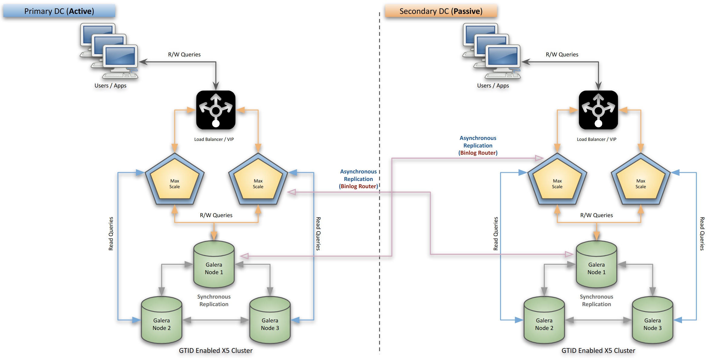
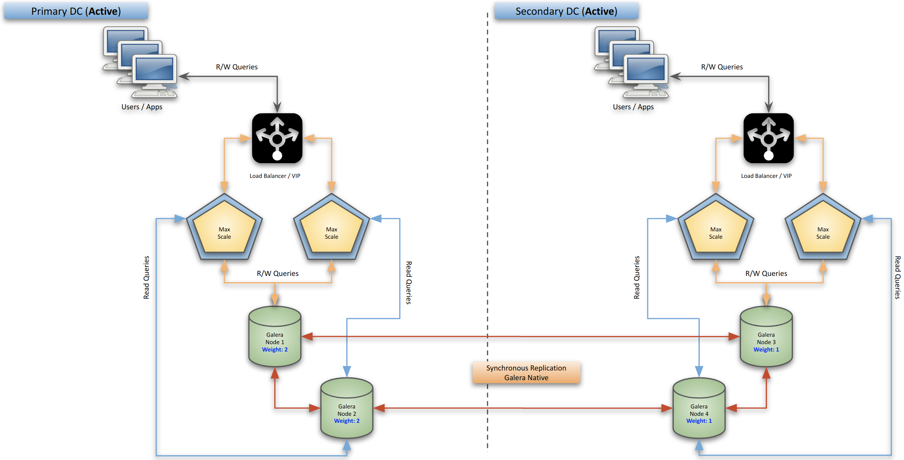

# MariaDB 10.5 Enterprise - Galera Architecture

## Architecture

The requirement is simple, setup 2 Galera clusters (3 nodes each) on two data centers. Setup MaxScale 2.5 binlog router to replicate data from Galera cluster on the primary data cetner to the the other Galera cluster on the secondary data center. 

Same way, a reverse replication is is to be set up from the Secondary data center to the primary data cetners using MaxScale binlog router.

ref: **Image-1**


Reference Architecture using MaxScale's new Binlog router to replicate a 10.5 Galera cluster using asynchronous replication for maximum performance.

A stretched Galera cluster can be setup but if the latency numbers are bad between the two DC, galera cluster's performance will drop. It is recommended to set up two clusters instead using asyhcnronous replication for an **Active/Passive** site setup.

ref: **Image-2**


A stretched galera cluster with 2 nodes on each side, this provides an Active/Active setup and capability to Read/Write anywhere. This architecture uses node weightage on both sides to help achieve Quorum, ideal setup is to use 3 data centers and ODD number of nodes but nost commonly only two data centers are available and this is the way to go. 

***Note:** For this guide, we will be following the `ref: Image-1` as that is more challenging given the most common deployment due to latency issues bertween the data cetnters. Also, we will be ssetting up 2 MaxScale nodes, 1 on each side to keep it as simple as possble*

## Servers

We will setup the following servers in this workbook.

- MaxScale-70 (192.168.56.70) **(2.5)**
  - Galear-71 (192.168.56.71) **(10.5)**
  - Galear-72 (192.168.56.72) **(10.5)**
  - Galear-73 (192.168.56.73) **(10.5)**
- MaxScale-80 (192.168.56.80) **(2.5)**
  - Galear-81 (192.168.56.81) **(10.5)**
  - Galear-82 (192.168.56.82) **(10.5)**
  - Galear-83 (192.168.56.83) **(10.5)**

## Galera Cluster

### Install MariaDB 10.5 Enterprise Server

```
➜  yum -y install MariaDB-server MariaDB-backup galera-enterprise-4         

Dependencies Resolved

==============================================================================================================================================================================================
 Package                                               Arch                                 Version                                       Repository                                     Size
==============================================================================================================================================================================================
Installing:
 MariaDB-backup                                        x86_64                               10.5.5_3-1.el7                                mariadb-es-main                               7.0 M
 MariaDB-server                                        x86_64                               10.5.5_3-1.el7                                mariadb-es-main                                21 M
 galera-enterprise-4                                   x86_64                               26.4.5-1.el7.8                                mariadb-es-main                               9.9 M
Installing for dependencies:
 MariaDB-client                                        x86_64                               10.5.5_3-1.el7                                mariadb-es-main                               7.0 M
 boost-program-options                                 x86_64                               1.53.0-28.el7                                 base                                          156 k
 lsof                                                  x86_64                               4.87-6.el7                                    base                                          331 k
 perl-Compress-Raw-Bzip2                               x86_64                               2.061-3.el7                                   base                                           32 k
 perl-Compress-Raw-Zlib                                x86_64                               1:2.061-4.el7                                 base                                           57 k
 perl-DBI                                              x86_64                               1.627-4.el7                                   base                                          802 k
 perl-Data-Dumper                                      x86_64                               2.145-3.el7                                   base                                           47 k
 perl-IO-Compress                                      noarch                               2.061-2.el7                                   base                                          260 k
 perl-Net-Daemon                                       noarch                               0.48-5.el7                                    base                                           51 k
 perl-PlRPC                                            noarch                               0.2020-14.el7                                 base                                           36 k
 socat                                                 x86_64                               1.7.3.2-2.el7                                 base                                          290 k

Transaction Summary
==============================================================================================================================================================================================
Install  3 Packages (+11 Dependent packages)

  Installing : lsof-4.87-6.el7.x86_64                                                                                                                                                    1/14 
  Installing : perl-Data-Dumper-2.145-3.el7.x86_64                                                                                                                                       2/14 
  Installing : boost-program-options-1.53.0-28.el7.x86_64                                                                                                                                3/14 
  Installing : socat-1.7.3.2-2.el7.x86_64                                                                                                                                                4/14 
  Installing : galera-enterprise-4-26.4.5-1.el7.8.x86_64                                                                                                                                 5/14 
  Installing : 1:perl-Compress-Raw-Zlib-2.061-4.el7.x86_64                                                                                                                               6/14 
  Installing : MariaDB-client-10.5.5_3-1.el7.x86_64                                                                                                                                      7/14 
  Installing : perl-Net-Daemon-0.48-5.el7.noarch                                                                                                                                         8/14 
  Installing : perl-Compress-Raw-Bzip2-2.061-3.el7.x86_64                                                                                                                                9/14 
  Installing : perl-IO-Compress-2.061-2.el7.noarch                                                                                                                                      10/14 
  Installing : perl-PlRPC-0.2020-14.el7.noarch                                                                                                                                          11/14 
  Installing : perl-DBI-1.627-4.el7.x86_64                                                                                                                                              12/14 
  Installing : MariaDB-server-10.5.5_3-1.el7.x86_64                                                                                                                                     13/14 
2020-09-11  9:21:24 server_audit: MariaDB Audit Plugin version 2.0.2 STARTED.
2020-09-11  9:21:24 server_audit: Query cache is enabled with the TABLE events. Some table reads can be veiled.
2020-09-11  9:21:26 server_audit: STOPPED
..
..
Complete!
```

Verify the installation on all 6 nodes

```
➜  rpm -qa | grep -i mariadb
MariaDB-common-10.5.5_3-1.el7.x86_64
MariaDB-compat-10.5.5_3-1.el7.x86_64
MariaDB-client-10.5.5_3-1.el7.x86_64
MariaDB-server-10.5.5_3-1.el7.x86_64
MariaDB-backup-10.5.5_3-1.el7.x86_64

➜  rpm -qa | grep -i galera 
galera-enterprise-4-26.4.5-1.el7.8.x86_64
```

All the required binaries are insalled on all the 6 galera nodes. 

#### Galera Configuration

Now that Galera Cluster has been installed on all 6 nodes, we can now configure those as 2 separate Galera clusters, here is a reference configuration for both clusters

The following needs to be edited in the `/etc/my.cnf.d/server.cnf` file

- Primary Data Center

    ```
    [galera]
    wsrep_on=ON
    wsrep_gtid_mode=ON
    wsrep_gtid_domain_id=70
    wsrep_provider=/usr/lib64/galera-enterprise-4/libgalera_enterprise_smm.so
    wsrep_cluster_address=gcomm://192.168.56.71,192.168.56.72,192.168.56.73

    # Local node setup
    wsrep_node_address=192.168.56.71
    wsrep_node_name=galera-71

    # Data Streaming for large transactions
    wsrep_trx_fragment_unit=rows
    wsrep_trx_fragment_size=10000

    #Galera Cache setup for performance as 5 GB, default location is on `datadir`
    wsrep_provider_options="gcache.size=5G"

    binlog_format=row
    log_slave_updates=ON
    log_bin
    gtid_domain_id=71
    server_id=7000
    default_storage_engine=InnoDB
    innodb_autoinc_lock_mode=2
    innodb_flush_log_at_trx_commit=0
    innodb_buffer_pool_size=512M
    innodb_log_file_size=512M
    
    ## Allow server to accept connections on all interfaces.
    bind-address=0.0.0.0
    ```

- DR Data Center

    ```
    [galera]
    wsrep_on=ON
    wsrep_gtid_mode=ON
    wsrep_gtid_domain_id=80
    wsrep_provider=/usr/lib64/galera-enterprise-4/libgalera_enterprise_smm.so
    wsrep_cluster_address=gcomm://192.168.56.81,192.168.56.82,192.168.56.83

    # Local node setup
    wsrep_node_address=192.168.56.81
    wsrep_node_name=galera-81

    # Data Streaming for large transactions
    wsrep_trx_fragment_unit=rows
    wsrep_trx_fragment_size=10000

    #Galera Cache setup for performance as 5 GB, default location is on `datadir`
    wsrep_provider_options="gcache.size=5G"

    binlog_format=row
    log_slave_updates=ON
    log_bin
    gtid_domain_id=81
    server_id=8000
    default_storage_engine=InnoDB
    innodb_autoinc_lock_mode=2
    innodb_flush_log_at_trx_commit=0
    innodb_buffer_pool_size=512M
    innodb_log_file_size=512M
    
    ## Allow server to accept connections on all interfaces.
    bind-address=0.0.0.0
    ```

Referring to the above two configurations:

- **`wsrep_gtid_domain_id`** needs to be configured the with same value for each cluster.
  - We will be using **`wsrep_gtid_domain_id=70`** for all three nodes in the first cluster.
  - We will be using **`wsrep_gtid_domain_id=80`** for all three ndoes in the second cluster.
- **`server_id`** needs to be configured the with same value for each cluster.
  - We will be using **`server_id=7000`** for all the three nodes of the first cluster.
  - We will be using **`server_id=8000`** for all the three nodes of the second cluster.
- **`gtid_domain_id`** needs to be setup as different values for each node in the cluster
  - We will be using **`gtid_domain_id=71`**, **`gtid_domain_id=72`** & **`gtid_domain_id=73`** for all three nodes of the first cluster.
  - We will be using **`gtid_domain_id=81`**, **`gtid_domain_id=82`** & **`gtid_domain_id=83`** for all three nodes of the second cluster.
- **`innodb_buffer_pool_size`** to be calculated at 60% to 70% of the total memory size on each node. Since our setup here is very small, 1GB RAM for each node, I have calculated InnoDB Buffer Pool as 50% instead.
- **`innodb_flush_log_at_trx_commit=0`** worth mentioning that setting this to `0` imporoves Galera's TPS while still keeping the cluster ACID compliant thanks to it's replication nature.

***Note:** the **`wsrep_provider`** points to a different path/file for the Community version as `wsrep_provider=/usr/lib64/galera-4/libgalera_smm.so`*

The above setup will enable Galera based GTID for each node and because of the `log_slave_upates=ON` we will get a consistent GTID for respective to each galera cluster individually.

Once all the nodes have been configured correctly using the `/etc/my.cnf.d/server/cnf` file, bootstrap the Galera cluster using `galera_new_cluster` from the first node on each data center

```
➜  galera_new_cluster
➜  mariadb -uroot
Welcome to the MariaDB monitor.  Commands end with ; or \g.
Your MariaDB connection id is 8
Server version: 10.5.5-3-MariaDB-enterprise-log MariaDB Enterprise Server

Copyright (c) 2000, 2018, Oracle, MariaDB Corporation Ab and others.

Type 'help;' or '\h' for help. Type '\c' to clear the current input statement.

MariaDB [(none)]> select version();
+---------------------------------+
| version()                       |
+---------------------------------+
| 10.5.5-3-MariaDB-enterprise-log |
+---------------------------------+
1 row in set (0.000 sec)

MariaDB [(none)]> show global status like 'wsrep_cluster_size';
+--------------------+-------+
| Variable_name      | Value |
+--------------------+-------+
| wsrep_cluster_size | 1     |
+--------------------+-------+
1 row in set (0.002 sec)
```

We can see bootstrap is successful and cluster size is currently 1 for the first data center. Let's start other 2 nodes normally using `systemctl start mariadb` on the primary data center.

```
MariaDB [(none)]> select @@hostname;
+------------+
| @@hostname |
+------------+
| galera-71  |
+------------+
1 row in set (0.000 sec)

MariaDB [(none)]> show global status like 'wsrep_cluster_size';
+--------------------+-------+
| Variable_name      | Value |
+--------------------+-------+
| wsrep_cluster_size | 3     |
+--------------------+-------+
1 row in set (0.003 sec)
```

Now we can see all the three nodes are in the cluster on the primary data center. Repeat the same on the second data center. 

- Bootstrap Galera using `galera_new_cluster` from node 1 (Galera-81)
- Start the other two nodes using `systemctl start mariadb`
- Verify the cluster size using `show global status like 'wsrep_cluster_size';` to ensure it's 3

The two independent clusters are ready!

## Setup MaxScale 2.5

Install MaxScale RPM on both MaxScale nodes

```txt
➜  yum -y install maxscale

Dependencies Resolved

==============================================================================================================================================================================================
 Package                                Arch                                Version                                        Repository                                                    Size
==============================================================================================================================================================================================
Updating:
 maxscale                               x86_64                              2.5.3-2.rhel.7                                 /maxscale-2.5.3-2.rhel.7.x86_64                              168 M
Installing for dependencies:
 libatomic                              x86_64                              4.8.5-39.el7                                   base                                                          50 k

Transaction Summary
==============================================================================================================================================================================================
Install             ( 1 Dependent package)
Upgrade  1 Package

Total size: 168 M
Total download size: 50 k
Downloading packages:
libatomic-4.8.5-39.el7.x86_64.rpm                                                                                                                                      |  50 kB  00:00:00     
Running transaction check
Running transaction test
Transaction test succeeded
Running transaction
  Installing : libatomic-4.8.5-39.el7.x86_64                                                                                                                                              1/3 
  Updating   : maxscale-2.5.3-2.rhel.7.x86_64                                                                                                                                             2/3 
  Cleanup    : maxscale-2.4.11-1.x86_64                                                                                                                                                   3/3 
  Verifying  : libatomic-4.8.5-39.el7.x86_64                                                                                                                                              1/3 
  Verifying  : maxscale-2.5.3-2.rhel.7.x86_64                                                                                                                                             2/3 
  Verifying  : maxscale-2.4.11-1.x86_64                                                                                                                                                   3/3 

Dependency Installed:
  libatomic.x86_64 0:4.8.5-39.el7                                                                                                                                                             

Updated:
  maxscale.x86_64 0:2.5.3-2.rhel.7                                                                                                                                                            

Complete!
```

Edit the `/etc/maxscale.cnf` file on both data centers and define the respective Galera clusters, take note of the IP addresses and Node names need to be defined accordingly, the following is for the Primary data center, similarly just duplicate it and edit  the respective items for the second data center.

```txt
[maxscale]
threads=auto

# List of servers in the Cluster
[Galera-71]
type=server
address=192.168.56.71
port=3306
protocol=MariaDBBackend
priority=1

[Galera-72]
type=server
address=192.168.56.72
port=3306
protocol=MariaDBBackend
priority=2

[Galera-73]
type=server
address=192.168.56.73
port=3306
protocol=MariaDBBackend
priority=3

# Monitoring for the Galera server nodes
[Galera-Monitor]
type=monitor
module=galeramon
servers=Galera-71,Galera-72,Galera-73
user=maxuser
password=SecretP@ssw0rd
monitor_interval=2000
use_priority=true
available_when_donor=true

# Galera Read/Write Splitter service
[Galera-RW-Service]
type=service
router=readwritesplit
servers=Galera-71,Galera-72,Galera-73
user=maxuser
password=SecretP@ssw0rd
master_reconnection=true
transaction_replay=true
transaction_replay_retry_on_deadlock=true
master_failure_mode=error_on_write
slave_selection_criteria=ADAPTIVE_ROUTING

# Galera cluster listener
[Galera-Listener]
type=listener
service=Galera-RW-Service
protocol=MariaDBClient
port=4007
address=0.0.0.0
```

***Note:** Best to encrypt the Passwords in the `maxscale.cnf` file, but we are keeping it simple here.*

This setup gives us the basic read/write split and standard monitoring capabilities.

### Configure MaxScale User

Based on the `/etc/maxscale.cnf` configuration we need to creare a `maxuser` account with a password of `SecretP@ssw0rd`, since the Galera with binary logs is already configured, we can creatre this user on any node of the Parimary Datacenter.

```
MariaDB [(none)]> create user maxuser@'192.168.56.%' identified by 'SecretP@ssw0rd';
Query OK, 0 rows affected (0.058 sec)

MariaDB [(none)]> grant select on mysql.* to maxuser@'192.168.56.%';
Query OK, 0 rows affected (0.054 sec)

MariaDB [(none)]> grant show databases on *.* to maxuser@'192.168.56.%';
Query OK, 0 rows affected (0.054 sec)
```

Now we can start MaxScale node on the Primary DC and verify the cluster status.

```
➜  systemctl start maxscale
➜  maxctrl list servers 
┌───────────┬───────────────┬──────┬─────────────┬─────────────────────────┬───────────┐
│ Server    │ Address       │ Port │ Connections │ State                   │ GTID      │
├───────────┼───────────────┼──────┼─────────────┼─────────────────────────┼───────────┤
│ Galera-71 │ 192.168.56.71 │ 3306 │ 0           │ Master, Synced, Running │ 70-7000-2 │
├───────────┼───────────────┼──────┼─────────────┼─────────────────────────┼───────────┤
│ Galera-72 │ 192.168.56.72 │ 3306 │ 0           │ Slave, Synced, Running  │ 70-7000-2 │
├───────────┼───────────────┼──────┼─────────────┼─────────────────────────┼───────────┤
│ Galera-73 │ 192.168.56.73 │ 3306 │ 0           │ Slave, Synced, Running  │ 70-7000-2 │
└───────────┴───────────────┴──────┴─────────────┴─────────────────────────┴───────────┘
```

We can see the clust is healthy with GTID / Domain & Server IDs showing up as per our configuration.

We now need to define a binlog router so that while this node is doing quiery routing, it will also work as binary log router from Primary DC to DR DC.

We will define all three Galera nodes in the Primary DC as the Primary DB nodes for this MaxScale, this means, MaxScale can switch from one DB to another DB if one of the nodes in Primary DB goes down.

In the `/etc/maxscale.cnf` file, define a new router on the primary data center

```
[Replication-Proxy]
type=service
router=binlogrouter
servers=Galera-71,Galera-72,Galera-73
expire_log_duration=72h
expire_log_minimum_files=3
select_master=true
user=repl_user
password=SecretP@ssw0rd

[Replication-Listener]
type=listener
service=Replication-Proxy
protocol=MariaDBClient
port=4008
address=0.0.0.0
```

The above config defines a `binlogrouter` service that covers all the 3 Galera nodes, the binlogs expiry is set to 72 hours and automatic master selection is set to true, which means, if the master, from which MaxScale is currently getting the binary logs, dies, MaxScale will automatically select a new node as Primary (Master)

Finally, the listener at which this replication service is going to listen to and the port for that listener is defined as `4008`. This port will be used in the `CHANGE MASTER` command executed on one of the Galera nodes on the DR data center.

#### Replication User

Create the defined replication user under the `[Replication-Proxy]` section with standard replication privileges through any of the Galera nodes on the primary data center.

```
MariaDB [(none)]> create user repl_user@'192.168.56.%' identified by 'SecretP@ssw0rd';
Query OK, 0 rows affected (0.051 sec)

MariaDB [(none)]> grant show databases, replication slave, replication client on *.* to repl_user@'192.168.56.%';
Query OK, 0 rows affected (0.051 sec)

MariaDB [dbtest]> grant select on mysql.* to repl_user@'192.168.56.%';
Query OK, 0 rows affected (0.048 sec)
```

Restart the MaxScale service and the binlog router should automatically start.

Let's verify if the service has already started or not

```
➜  maxctrl list services 
┌───────────────────┬────────────────┬─────────────┬───────────────────┬─────────────────────────────────┐
│ Service           │ Router         │ Connections │ Total Connections │ Servers                         │
├───────────────────┼────────────────┼─────────────┼───────────────────┼─────────────────────────────────┤
│ Replication-Proxy │ binlogrouter   │ 0           │ 0                 │ Galera-71, Galera-72, Galera-73 │
├───────────────────┼────────────────┼─────────────┼───────────────────┼─────────────────────────────────┤
│ Galera-RW-Service │ readwritesplit │ 0           │ 0                 │ Galera-71, Galera-72, Galera-73 │
└───────────────────┴────────────────┴─────────────┴───────────────────┴─────────────────────────────────┘
```

We can see replication proxy is running `binlogrouter` for all the 3 Galera nodes on the primary data center.

#### Binary Logs

Binary logs for this router are stored on the default location of `/var/lib/maxscale/binlogs` this can be changed by defining `datadir=<new_path>` under the `binlogrouter` section.

Let's verify the binlogs folder

```
➜  pwd
/var/lib/maxscale/binlogs
➜  ls -lrt
total 24
-rw-r--r-- 1 maxscale maxscale 226 Sep 11 13:42 master-info.json
-rw-r--r-- 1 maxscale maxscale   9 Sep 11 13:42 rpl_state
-rw-r--r-- 1 maxscale maxscale 987 Sep 11 13:42 galera-71-bin.000003
-rw-r--r-- 1 maxscale maxscale 350 Sep 11 13:42 galera-71-bin.000002
-rw-r--r-- 1 maxscale maxscale 674 Sep 11 13:42 galera-71-bin.000001
-rw-r--r-- 1 maxscale maxscale 144 Sep 11 13:42 binlog.index
```

A quick check would to verify if the binlogs contain the transactions that we have performed so far on the Galera nodes

- CREATE `maxuser`
  - GRANT TO `maxuser`
- CREATE `repl_user`
  - GRANT TO `repl_user`

```
➜  mysqlbinlog -v galera-71-bin.000001 | grep maxuser
create user maxuser@'192.168.56.%' identified by 'SecretP@ssw0rd'
grant select on mysql.* to maxuser@'192.168.56.%'

➜  mysqlbinlog -v galera-71-bin.000003 | grep repl_user
create user repl_user@'192.168.56.%' identified by 'SecretP@ssw0rd'
grant replication slave, replication client on *.* to repl_user@'192.168.56.%'
```

Indeed we can find the four events in the binlogs.

Now this MaxScale is ready to be setup as a PRIMARY node for one of the Galera nodes on the DR Datacenter.

### Setting up the DR Datacenter

Primary DC is ready, now we need to pick up one of the nodes on the DR DC and set it up as a Replica to the MaxScale binloger service. The same repl_user and it's password will be used for this. It's basically just a matter of executing `CHANGE MASTER` command using the binlog router listener port to point to MaxScale as the source of the replication data.

On the Primary data center, let's create a new database and a table with some data, which should replicate using standard asynchronous repliation to the DR datacenter using the MaxScale as the binlog router.

```
MariaDB [(none)]> create database dbtest;
Query OK, 1 row affected (0.057 sec)

MariaDB [(none)]> use dbtest;
Database changed

MariaDB [dbtest]> create table tab(id serial, c1 varchar(100));
Query OK, 0 rows affected (0.125 sec)

MariaDB [dbtest]> insert into tab(c1) select column_name from information_schema.columns;
Query OK, 2244 rows affected (0.102 sec)
Records: 2244  Duplicates: 0  Warnings: 0
```

Now this database, table and the inserted data should have been captured in the binlogs of the MaxScale binlog router.

#### Set up Galera node as a Replica

On the DR data center, execute `CHANGE MASTER` command on one of the Galera node, this node will become the Replica of the MaxScale binlog router using the GTID based replication mechanism.

Before we execute `CHANGE MASTER` we need to set the `GTID_SLAVE_POS = ''` as empty string so that the MASTER_USE_GTID can start from `current_pos` which will pull all the transastions from the very first recorded GTID on the Primary data center.

```
➜  ~ mariadb -uroot
Welcome to the MariaDB monitor.  Commands end with ; or \g.
Your MariaDB connection id is 735
Server version: 10.5.5-3-MariaDB-enterprise-log MariaDB Enterprise Server

Copyright (c) 2000, 2018, Oracle, MariaDB Corporation Ab and others.

Type 'help;' or '\h' for help. Type '\c' to clear the current input statement.

MariaDB [(none)]> select @@hostname;
+------------+
| @@hostname |
+------------+
| galera-81  |
+------------+
1 row in set (0.000 sec)

MariaDB [(none)]> SHOW DATABASES;
+--------------------+
| Database           |
+--------------------+
| information_schema |
| mysql              |
| performance_schema |
+--------------------+
3 rows in set (0.006 sec)

MariaDB [(none)]> SET GLOBAL GTID_SLAVE_POS='';
Query OK, 0 rows affected (0.048 sec)

MariaDB [(none)]> CHANGE MASTER TO MASTER_HOST='192.168.56.70', MASTER_PORT=4008, MASTER_USER='repl_user', MASTER_PASSWORD='SecretP@ssw0rd', MASTER_USE_GTID=current_pos;
Query OK, 0 rows affected (0.083 sec)

MariaDB [(none)]> START SLAVE;
Query OK, 0 rows affected (0.055 sec)
```

Let's verify if the Replica has started successfully

```
MariaDB [(none)]> show slave status\G
*************************** 1. row ***************************
                Slave_IO_State: Waiting for master to send event
                   Master_Host: 192.168.56.70
                   Master_User: repl_user
                   Master_Port: 4008
                 Connect_Retry: 60
               Master_Log_File: galera-71-bin.000006
           Read_Master_Log_Pos: 299
                Relay_Log_File: galera-81-relay-bin.000002
                 Relay_Log_Pos: 602
         Relay_Master_Log_File: galera-71-bin.000006
              Slave_IO_Running: Yes
             Slave_SQL_Running: Yes
               Replicate_Do_DB: 
           Replicate_Ignore_DB: 
            Replicate_Do_Table: 
        Replicate_Ignore_Table: 
       Replicate_Wild_Do_Table: 
   Replicate_Wild_Ignore_Table: 
                    Last_Errno: 0
                    Last_Error: 
                  Skip_Counter: 0
           Exec_Master_Log_Pos: 299
               Relay_Log_Space: 915
               Until_Condition: None
                Until_Log_File: 
                 Until_Log_Pos: 0
            Master_SSL_Allowed: No
            Master_SSL_CA_File: 
            Master_SSL_CA_Path: 
               Master_SSL_Cert: 
             Master_SSL_Cipher: 
                Master_SSL_Key: 
         Seconds_Behind_Master: 0
 Master_SSL_Verify_Server_Cert: No
                 Last_IO_Errno: 0
                 Last_IO_Error: 
                Last_SQL_Errno: 0
                Last_SQL_Error: 
   Replicate_Ignore_Server_Ids: 
              Master_Server_Id: 1234
                Master_SSL_Crl: 
            Master_SSL_Crlpath: 
                    Using_Gtid: Current_Pos
                   Gtid_IO_Pos: 70-7000-10
       Replicate_Do_Domain_Ids: 
   Replicate_Ignore_Domain_Ids: 
                 Parallel_Mode: optimistic
                     SQL_Delay: 0
           SQL_Remaining_Delay: NULL
       Slave_SQL_Running_State: Slave has read all relay log; waiting for more updates
              Slave_DDL_Groups: 9
Slave_Non_Transactional_Groups: 0
    Slave_Transactional_Groups: 1
1 row in set (0.001 sec)
```

We can see this Galera node is arleady at **`70-7000-10`** GTID which should match with `maxctrl list server` output

```
➜  maxctrl list servers; 
┌───────────┬───────────────┬──────┬─────────────┬─────────────────────────┬────────────┐
│ Server    │ Address       │ Port │ Connections │ State                   │ GTID       │
├───────────┼───────────────┼──────┼─────────────┼─────────────────────────┼────────────┤
│ Galera-71 │ 192.168.56.71 │ 3306 │ 0           │ Master, Synced, Running │ 70-7000-10 │
├───────────┼───────────────┼──────┼─────────────┼─────────────────────────┼────────────┤
│ Galera-72 │ 192.168.56.72 │ 3306 │ 0           │ Slave, Synced, Running  │ 70-7000-10 │
├───────────┼───────────────┼──────┼─────────────┼─────────────────────────┼────────────┤
│ Galera-73 │ 192.168.56.73 │ 3306 │ 0           │ Slave, Synced, Running  │ 70-7000-10 │
└───────────┴───────────────┴──────┴─────────────┴─────────────────────────┴────────────┘
```

This confirms that the Galera node is in sync now, being Galera, all the other Galera nodes should also be in sync already with the Primary data center's servers.

Let's connect to the Second Galera node on the DR Datacenter and verify

```
MariaDB [(none)]> select @@hostname;
+------------+
| @@hostname |
+------------+
| galera-82  |
+------------+
1 row in set (0.000 sec)

MariaDB [(none)]> show databases;
+--------------------+
| Database           |
+--------------------+
| dbtest             |
| information_schema |
| mysql              |
| performance_schema |
+--------------------+
4 rows in set (0.006 sec)

MariaDB [(none)]> use dbtest;
Reading table information for completion of table and column names
You can turn off this feature to get a quicker startup with -A

Database changed
MariaDB [dbtest]> select count(*)  from tab;
+----------+
| count(*) |
+----------+
|     2244 |
+----------+
1 row in set (0.014 sec)
```

Indeed, all the data from the Prumary DC has been synced up with all the nodes in the DR DC.

This concludes 50% of our architecture, we now have data replicating from Primary to DR galera using asynchronoyus replication and MaxScale's binlog router.

## Setting Up Reverse Replication

We will follow the same steps as we did with the MaxScale on the Primary site, just need to connect the appropriate servers, that's all.

The `/etc/maxscale.cnf` file on DR data cetner should look like this following the DR ip addresses.

```txt
[maxscale]
threads=auto

# List of servers in the Cluster
[Galera-81]
type=server
address=192.168.56.81
port=3306
protocol=MariaDBBackend
priority=1

[Galera-82]
type=server
address=192.168.56.82
port=3306
protocol=MariaDBBackend
priority=2

[Galera-83]
type=server
address=192.168.56.83
port=3306
protocol=MariaDBBackend
priority=3

# Monitoring for the Galera server nodes
[Galera-Monitor]
type=monitor
module=galeramon
servers=Galera-81,Galera-82,Galera-83
user=maxuser
password=SecretP@ssw0rd
monitor_interval=2000
use_priority=true
available_when_donor=true

# Galera Read/Write Splitter service
[Galera-RW-Service]
type=service
router=readwritesplit
servers=Galera-81,Galera-82,Galera-83
user=maxuser
password=SecretP@ssw0rd
master_reconnection=true
transaction_replay=true
transaction_replay_retry_on_deadlock=true
master_failure_mode=error_on_write
slave_selection_criteria=ADAPTIVE_ROUTING

# Galera cluster listener
[Galera-Listener]
type=listener
service=Galera-RW-Service
protocol=MariaDBClient
port=4007
address=0.0.0.0

[Replication-Proxy]
type=service
router=binlogrouter
servers=Galera-81,Galera-82,Galera-83
expire_log_duration=72h
expire_log_minimum_files=3
select_master=true
user=repl_user
password=SecretP@ssw0rd

[Replication-Listener]
type=listener
service=Replication-Proxy
protocol=MariaDBClient
port=4008
address=0.0.0.0
```

This setup gives us the basic read/write split, standard monitoring capabilities and a binlog router for the DR data center.

***Note:** We don't need to worry about creating the maxuser & repl_user accounts on the DR Galera cluster as these are already replicated over from the Primary thanks to our initial setup of the binlog router.*

Once the above config is in, we can just start the MaxScale service and it will start the binlog service using the three nodes on the DR cluster. Let's try.

```
➜  systemctl restart maxscale         
➜  maxctrl list servers && maxctrl list services && maxctrl list listeners
┌───────────┬───────────────┬──────┬─────────────┬─────────────────────────┬────────────┐
│ Server    │ Address       │ Port │ Connections │ State                   │ GTID       │
├───────────┼───────────────┼──────┼─────────────┼─────────────────────────┼────────────┤
│ Galera-81 │ 192.168.56.81 │ 3306 │ 0           │ Master, Synced, Running │ 70-7000-10 │
├───────────┼───────────────┼──────┼─────────────┼─────────────────────────┼────────────┤
│ Galera-82 │ 192.168.56.82 │ 3306 │ 0           │ Slave, Synced, Running  │            │
├───────────┼───────────────┼──────┼─────────────┼─────────────────────────┼────────────┤
│ Galera-83 │ 192.168.56.83 │ 3306 │ 0           │ Slave, Synced, Running  │            │
└───────────┴───────────────┴──────┴─────────────┴─────────────────────────┴────────────┘
┌───────────────────┬────────────────┬─────────────┬───────────────────┬─────────────────────────────────┐
│ Service           │ Router         │ Connections │ Total Connections │ Servers                         │
├───────────────────┼────────────────┼─────────────┼───────────────────┼─────────────────────────────────┤
│ Replication-Proxy │ binlogrouter   │ 0           │ 0                 │ Galera-81, Galera-82, Galera-83 │
├───────────────────┼────────────────┼─────────────┼───────────────────┼─────────────────────────────────┤
│ Galera-RW-Service │ readwritesplit │ 0           │ 0                 │ Galera-81, Galera-82, Galera-83 │
└───────────────────┴────────────────┴─────────────┴───────────────────┴─────────────────────────────────┘
┌──────────────────────┬──────┬─────────┬─────────┬───────────────────┐
│ Name                 │ Port │ Host    │ State   │ Service           │
├──────────────────────┼──────┼─────────┼─────────┼───────────────────┤
│ Replication-Listener │ 4008 │ 0.0.0.0 │ Running │ Replication-Proxy │
├──────────────────────┼──────┼─────────┼─────────┼───────────────────┤
│ Galera-Listener      │ 4007 │ 0.0.0.0 │ Running │ Galera-RW-Service │
└──────────────────────┴──────┴─────────┴─────────┴───────────────────┘
```

We have all the services running on the DR envuronment wthout problems. 

We will now create a new table on the DR Galera Node 1 to see if it gets replicated over to Primary and how does the GTID looks like for the DR cluster.

```
MariaDB [dbtest]> select @@hostname;
+------------+
| @@hostname |
+------------+
| galera-81  |
+------------+
1 row in set (0.000 sec)

MariaDB [dbtest]> create table tab2 like tab;
Query OK, 0 rows affected (0.086 sec)
```

If we verify the `maxctrl list servers` on the DR MaxScale, we will see a mixed GTID, this tells each data center has it's unque GTID values in the setup.

```
➜  maxctrl list servers
┌───────────┬───────────────┬──────┬─────────────┬─────────────────────────┬──────────────────────┐
│ Server    │ Address       │ Port │ Connections │ State                   │ GTID                 │
├───────────┼───────────────┼──────┼─────────────┼─────────────────────────┼──────────────────────┤
│ Galera-81 │ 192.168.56.81 │ 3306 │ 0           │ Master, Synced, Running │ 70-7000-10,80-8000-1 │
├───────────┼───────────────┼──────┼─────────────┼─────────────────────────┼──────────────────────┤
│ Galera-82 │ 192.168.56.82 │ 3306 │ 0           │ Slave, Synced, Running  │ 80-8000-1            │
├───────────┼───────────────┼──────┼─────────────┼─────────────────────────┼──────────────────────┤
│ Galera-83 │ 192.168.56.83 │ 3306 │ 0           │ Slave, Synced, Running  │ 80-8000-1            │
└───────────┴───────────────┴──────┴─────────────┴─────────────────────────┴──────────────────────┘
```

The `70-7000-10` was replicated from Primary DC to DR, while DR got it's own `80-8000-1` transaction as donated by it's unique Domain and Server ID.

Let's set Galera Node 1 on the Primary DC cluster to replicate from the DR MaxScale binlog router. We will follow the same sequence

- SET GTID_SLAVE_POS to ''
- CHANGE MASTER
- START SLAVE

```
MariaDB [dbtest]> select @@hostname;
+------------+
| @@hostname |
+------------+
| galera-71  |
+------------+
1 row in set (0.000 sec)

MariaDB [dbtest]> SET GLOBAL GTID_SLAVE_POS='';
Query OK, 0 rows affected, 1 warning (0.054 sec)

MariaDB [dbtest]> show warnings;
+---------+------+------------------------------------------------------------------------------------------------------------------------------------------------------------------------------------------------------------------------------------------------------------------+
| Level   | Code | Message                                                                                                                                                                                                                                                          |
+---------+------+------------------------------------------------------------------------------------------------------------------------------------------------------------------------------------------------------------------------------------------------------------------+
| Warning | 1948 | Specified value for @@gtid_slave_pos contains no value for replication domain 70. This conflicts with the binary log which contains GTID 70-7000-10. If MASTER_GTID_POS=CURRENT_POS is used, the binlog position will override the new value of @@gtid_slave_pos |
+---------+------+------------------------------------------------------------------------------------------------------------------------------------------------------------------------------------------------------------------------------------------------------------------+
1 row in set (0.000 sec)

MariaDB [dbtest]> CHANGE MASTER TO MASTER_HOST='192.168.56.80', MASTER_PORT=4008, MASTER_USER='repl_user', MASTER_PASSWORD='SecretP@ssw0rd', MASTER_USE_GTID=current_pos;
Query OK, 0 rows affected (0.093 sec)

MariaDB [dbtest]> START SLAVE;
Query OK, 0 rows affected (0.046 sec)

MariaDB [dbtest]> SHOW SLAVE STATUS\G
*************************** 1. row ***************************
                Slave_IO_State: Waiting for master to send event
                   Master_Host: 192.168.56.80
                   Master_User: repl_user
                   Master_Port: 4008
                 Connect_Retry: 60
               Master_Log_File: galera-81-bin.000001
           Read_Master_Log_Pos: 54590
                Relay_Log_File: galera-71-relay-bin.000002
                 Relay_Log_Pos: 723
         Relay_Master_Log_File: galera-81-bin.000001
              Slave_IO_Running: Yes
             Slave_SQL_Running: Yes
               Replicate_Do_DB: 
           Replicate_Ignore_DB: 
            Replicate_Do_Table: 
        Replicate_Ignore_Table: 
       Replicate_Wild_Do_Table: 
   Replicate_Wild_Ignore_Table: 
                    Last_Errno: 0
                    Last_Error: 
                  Skip_Counter: 0
           Exec_Master_Log_Pos: 54590
               Relay_Log_Space: 1036
               Until_Condition: None
                Until_Log_File: 
                 Until_Log_Pos: 0
            Master_SSL_Allowed: No
            Master_SSL_CA_File: 
            Master_SSL_CA_Path: 
               Master_SSL_Cert: 
             Master_SSL_Cipher: 
                Master_SSL_Key: 
         Seconds_Behind_Master: 0
 Master_SSL_Verify_Server_Cert: No
                 Last_IO_Errno: 0
                 Last_IO_Error: 
                Last_SQL_Errno: 0
                Last_SQL_Error: 
   Replicate_Ignore_Server_Ids: 
              Master_Server_Id: 1234
                Master_SSL_Crl: 
            Master_SSL_Crlpath: 
                    Using_Gtid: Current_Pos
                   Gtid_IO_Pos: 70-7000-10,80-8000-1
       Replicate_Do_Domain_Ids: 
   Replicate_Ignore_Domain_Ids: 
                 Parallel_Mode: optimistic
                     SQL_Delay: 0
           SQL_Remaining_Delay: NULL
       Slave_SQL_Running_State: Slave has read all relay log; waiting for more updates
              Slave_DDL_Groups: 1
Slave_Non_Transactional_Groups: 0
    Slave_Transactional_Groups: 0
1 row in set (0.000 sec)
```

Refer to the warning, we can ignore it because our cluster has a differnet domain ID and we will never have a conflict. The `CHANGE MASTER` is now pointing to the DR MaxScale's binlog router service and port `4008` using the same user `repl_user` and it's password.

Let's check the MaxScale `maxctrl list servers` on the Primary site.

```
➜  maxctrl list servers;
┌───────────┬───────────────┬──────┬─────────────┬─────────────────────────┬──────────────────────┐
│ Server    │ Address       │ Port │ Connections │ State                   │ GTID                 │
├───────────┼───────────────┼──────┼─────────────┼─────────────────────────┼──────────────────────┤
│ Galera-71 │ 192.168.56.71 │ 3306 │ 0           │ Master, Synced, Running │ 70-7000-10,80-8000-1 │
├───────────┼───────────────┼──────┼─────────────┼─────────────────────────┼──────────────────────┤
│ Galera-72 │ 192.168.56.72 │ 3306 │ 0           │ Slave, Synced, Running  │ 70-7000-10           │
├───────────┼───────────────┼──────┼─────────────┼─────────────────────────┼──────────────────────┤
│ Galera-73 │ 192.168.56.73 │ 3306 │ 0           │ Slave, Synced, Running  │ 70-7000-10           │
└───────────┴───────────────┴──────┴─────────────┴─────────────────────────┴──────────────────────┘
```

We can se the Node 1 actualy recevied `80-8000-1` transaction from the DR DC, this transaction was performed earlier to create a new table in the `dbtest` database.

Let's verify.

```
MariaDB [dbtest]> select @@hostname;
+------------+
| @@hostname |
+------------+
| galera-71  |
+------------+
1 row in set (0.000 sec)

MariaDB [dbtest]> show tables;
+------------------+
| Tables_in_dbtest |
+------------------+
| tab              |
| tab2             |
+------------------+
2 rows in set (0.001 sec)
```

We can see the data has been received from DR DC successfully.

This concludes our Setup as presented in the picture `Ref: Image-1`.

There are few thing's to take note, only one data center should be ACTIVE at any given time, cannot use both in active state. This means, transactions should be coming from only 1 side and not from both sides at the same time, this will create conflicts and problems for the binlog router based asynchronous replication.

### Thank You!
