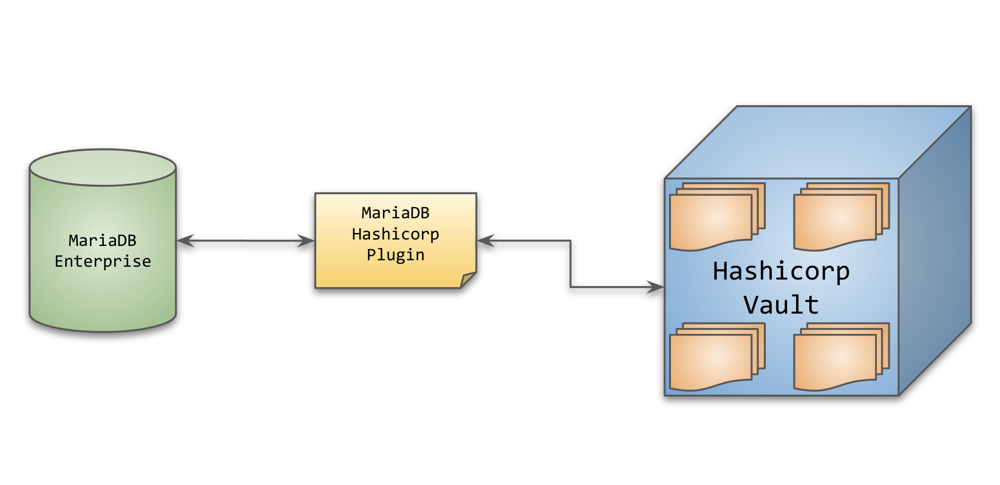
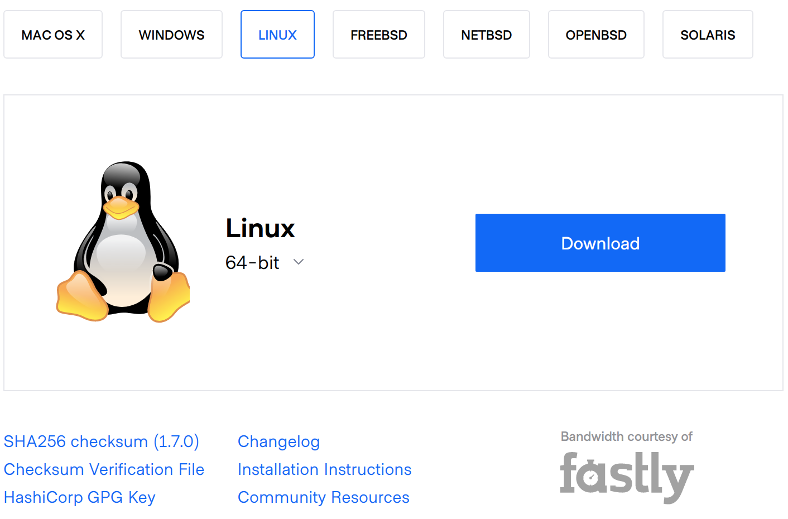

# MariaDB Encryption at Rest Using Hashicorp Vault

In the last part, we have seen how we can implement the encryption of specific columns but the application needs to maintain the encryption/decryption key and also needs to use the `AES_ENCRYPT()`, `AES_DECRYPT()` MariaDB built-in functions to read and write encrypted data.

We also learned how to implement the Encryption of data at rest a.k.a TDE, and what are the advantages of this approach, and how it helps protect the entire database against physical theft of data.

We used the File-based encryption key management plugin which stores the encryption key within the DB server. This is not the most secure way to protect the encryption key and the encrypted key(s). We can protect it by using external mounts to hold the keys which are not a part of the server itself but still not the best way to go about protecting our secret files.

Hashicorp Vault is a very popular open-source KMS and MariaDB enterprise has a special plugin that was introduced in 10.5 that can now use this vault to protect the encryption keys in an external server or a cluster of servers (used for HA) to store and provide the key file whenever MariaDB plugin demands it. This way we are sure that the Keys are secured in a safe place and even if someone steals the entire MariaDB rack/server he will still not be able to start the MariaDB service, let alone, read any data.

For the purpose of this blog, we are going to setup two CentOS 7 VMs one will be used to run Hashicorp Vault while the other one will be running MariaDB 10.5 Enterprise.

## Assumptions

Base assumptions:
- MariaDB 10.5 enterprise is used
- Hashicorp Vault is used as the KMS for MariaDB encryption
- SELinux and Firewall are disalbed.
  - This is just to keep the scope of the blog simple without being too long
  - Disabling Firewall and SELinux is never recommended for any secure setup and must always be configured properly.
- **`root`** user access for both MariaDB and Vault server is available.

***Note:** Vault runs on `8200` port, this needs to be opened for network traffic between MariaDB and Vault nodes if the **firewall** is not disabled.*

# TDE

As we discussed earlier, TDE is done and managed by the MariaDB server and the clients/apps don't have to worry about the key.
 
TDE requires a security key that the server uses to encrypt/decrypt the data files. This requires the use of plugins that are built by MariaDB and only available in the Enterprise 10.5 version.
 
- HashiCorp Vault Encruption Plugin
 - <https://mariadb.com/kb/en/hashicorp-vault-and-mariadb/>
 - This is the best way to setup encryption keys if internet access is not available
 - HashiCorp (opensource) Vault can be set up within the customer environment and the MariaDB plugin can access it for getting the secure keys.
 - Vault Download: <https://www.vaultproject.io/downloads>
   - A lot of simples to follow step by step tutorials are available on the website
   - Tutorials on configuring/using Vault: <https://learn.hashicorp.com/tutorials/vault/getting-started-intro?in=vault/getting-started>
 
***Note:** The scope of this blog is to cover the MariaDB Vault plugin, **not** how vault itself works!*
 
## Implementing TDE
 
Following are the high-level steps that are required to implement database encryption at rest using Hashicorp vault.
 
- Installing and Configure the Hashicorp Vault
- Configure the `vault.service` file for `systemd` handling.
- Starting up a Vault server
- Initialize the Vault keys and Token
- Generate multiple Security Keys
- Upload the keys to the vault
- Configure MariaDB Hashicorp Vault plugin within `/etc/my.cnf.d/server.cnf` file
- Restart the MariaDB server
- Verify the progress of the encryption within the MariaDB using MariaDB CLI
- Verify the physical data files are actually encrypted and unreadable.
- Hashicorp Vault management

The vault archicture we are trying to achieve will look like this



### Install Hashicorp Vault
 
#### Folder setup
 
Create the following folders on the Vault server in advance
 
```
$ mkdir -p /hashicorp/vault/bin
$ mkdir -p /hashicorp/data
$ mkdir -p /hashicorp/config
$ mkdir -p /hashicorp/logs
```
 
- `/hashicorp/vault/bin` will contain the Vault executable, only one file by the name **`vault`**
- `/hashicorp/data` will be used as the backend storage to store the secrets/security keys that are uploaded by the operator or users
 - The secrets include MariaDB encryption keys, for instance.
- `/hashicorp/config` will store the configuration file in JSON format
 - Vault supports both JSON & HCL "<https://github.com/hashicorp/hcl>" format, we will use `hcl` for this case
- `/hashicorp/logs` will store the running logs of the process.
 
Download the vault zip file for the targeted OS, we will be downloading for Linux of course.
 

 
The downloaded file is `vault_1.7.0_linux_amd64.zip` file, move it to a folder of choice, we will use `/hashicorp/vault`, once `unzip` a file `vault` will be extracted. This the executable **vault** binary file.
 
The contents of the folder will look like this, make sure the `vault` has read/execute permissions.
 
```txt
$ pwd
/hashicorp/vault/bin
 
$ unzip vault_1.7.0_linux_amd64.zip
Archive:  vault_1.7.0_linux_amd64.zip
 inflating: vault                  
 
$ ls -lrt
total 259328
-rwxr-xr-x. 1 root root 196759170 Mar 24 11:27 vault
-rw-r--r--. 1 root root  68789357 Mar 25 05:00 vault_1.7.0_linux_amd64.zip
```
 
Set the path `/hashicorp/vault/bin` under the script `/etc/profile` and import the updated prile into the current session.
 
```
$ echo "export PATH=$PATH:/hashicorp/vault/bin" >> /etc/profile
$ . /etc/profile
```
 
***Note:** Take note of the space between the `dot` and `/etc/profile`*
 
Once the above is done, the `vault` script can be executed from any location. Let's test it out of `vault` is accessible.
 
```
$ vault --version
Vault v1.7.0 (4e222b85c40a810b74400ee3c54449479e32bb9f)
```
 
#### vault-config.hcl file
 
The config file needs to be created as `/hashicorp/config/vault-config.hcl` file with the following content.
 
```hcl
storage "file" {
 path    = "/hashicorp/data"
}
 
listener "tcp" {
 address     = "0.0.0.0:8200"
 tls_disable = 1
}
 
api_addr = "http://192.168.56.101:8200"
 
max_lease_ttl = "730h"
default_lease_ttl = "730h"
 
ui = true
log_level = "Trace"
```
 
The storage is defined as "file" with a path, which is where the backend data for the keys will be stored after encryption. This can be on S3 storage, MariaDB (Primary/Replica), etc. Refer to the documentation <https://www.vaultproject.io/docs/configuration/storage> for a complete list of options available.
 
Example for a S3 bucket as the backend storage:
 
```hcl
storage "s3" {
 access_key = "abcd1234"
 secret_key = "defg5678"
 bucket     = "my-bucket"
}
```
 
The listener is defined as `tcp` and is listening to `0.0.0.0:8200` which means any source IP but on the port `8200`
 
`api_addr` is pointing to the Vault's server public IP address and `8200` port, and is used for external clients trying to connect to the vault via REST API.
 
`max_lease_ttl` and the `default_lease_ttl` define the **Time To Live (ttl)** for the tokens, once MariaDB or a client has fetched the token, the lease starts, we have configured this to be 730 hours which means, 1 month. Can be increased or decreased based on the security policies of the organization.
 
Once the lease expires, the tokens will not be available anymore and the operator / automated batch job needs to renew the lease for another 1 month or another period using Vault commands, refer to <https://www.vaultproject.io/docs/concepts/lease> for details.
 
`ui = true` is to enable the GUI management console. Which can be accessed from the browser and going to `http://192.168.56.101:8200` the URL.
 
`log_level` set the logging level as, available options are, in the order of increasing detail, `trace`, `debug`, `info`, `warn`, and `err`. The default log level is `info`, more detail on <https://learn.hashicorp.com/tutorials/vault/troubleshooting-vault#server-log-level>
 
We have everything necessary in place and can already start the vault service by executing `vault server -config /hashicorp/config/vault-config.hcl`
 
```
$ vault server -config /hashicorp/config/vault-config.hcl
==> Vault server configuration:
 
            Api Address: http://192.168.56.101:8200
                    Cgo: disabled
        Cluster Address: https://192.168.56.101:8201
             Go Version: go1.15.10
             Listener 1: tcp (addr: "0.0.0.0:8200", cluster address: "0.0.0.0:8201", max_request_duration: "1m30s", max_request_size: "33554432", tls: "disabled")
              Log Level: info
                  Mlock: supported: true, enabled: true
          Recovery Mode: false
                Storage: file
                Version: Vault v1.7.0
            Version Sha: 4e222b85c40a810b74400ee3c54449479e32bb9f
 
==> Vault server started! Log data will stream in below:
 
2021-03-31T18:32:45.360+0800 [INFO]  proxy environment: http_proxy= https_proxy= no_proxy=
```
 
The server is already running, but this is **not** what we want to do, we need to be able to manage the service using `systemd` such as `systemctl start vault`, `systemctl stop vault`, etc.
 
`ctrl-c` from the above process will stop the service returning `^C==> Vault shutdown triggered`
 
#### Config Vault Service
 
The next step is to define a Vault service file on the CentOS/RHEL OS, create the service file using `vi /etc/systemd/system/vault.service`, and add the following block to the file.
 
```
[Unit]
Description=Hashicorp Vault Service
Requires=network-online.target
After=network-online.target
ConditionFileNotEmpty=/hashicorp/config/vault-config.hcl
 
[Service]
KillSignal=SIGTERM
 
EnvironmentFile=-/etc/sysconfig/vault
Environment=GOMAXPROCS=2
Restart=on-failure
 
# Vault startup command line, all the logs will be redirected to /hashicorp/logs/vault.log
ExecStart=/bin/sh -c '/hashicorp/vault/bin/vault server -config=/hashicorp/config/vault-config.hcl 2>&1 >> /hashicorp/logs/vault.log'
 
LimitMEMLOCK=infinity
ExecReload=/bin/kill -HUP $MAINPID
```
 
Once the file is saved, we need to reload the systemctld daemon so that the new service file is loaded and ready, this is done by executing `systemctl daemon-reload`
 
Let's try to start the service properly this time using `systemctl start vault`
 
Since we defined "Trace" log level, a lot of data will be logged under the `/hashicorp/logs/vault.log` file, this log level needs to be adjusted later to `info` or `warning` based on the logging requirements.
 
```
$ systemctl start vault
 
$ ps -aux | grep vault
root      2184  0.0  0.0 115404  1424 ?        Ss   20:28   0:00 /bin/sh -c /hashicorp/vault/bin/vault server -config=/hashicorp/config/vault-config.hcl 2>&1 >> /hashicorp/logs/vault.log
root      2185  3.0 12.9 842300 243116 ?       SLl  20:28   0:00 /hashicorp/vault/bin/vault server -config=/hashicorp/config/vault-config.hcl
```
 
We can see the service started without problems. Let's review the logs folder
 
```
$ cat /hashicorp/logs/vault.log
 
==> Vault server configuration:
 
            Api Address: http://192.168.56.101:8200
                    Cgo: disabled
        Cluster Address: https://192.168.56.101:8201
             Go Version: go1.15.10
             Listener 1: tcp (addr: "0.0.0.0:8200", cluster address: "0.0.0.0:8201", max_request_duration: "1m30s", max_request_size: "33554432", tls: "disabled")
              Log Level: trace
                  Mlock: supported: true, enabled: true
          Recovery Mode: false
                Storage: file
                Version: Vault v1.7.0
            Version Sha: 4e222b85c40a810b74400ee3c54449479e32bb9f
 
==> Vault server started! Log data will stream in below:
```
 
Let's check the vault status
 
```
$ vault status
 
Error checking seal status: Get "https://127.0.0.1:8200/v1/sys/seal-status": http: server gave HTTP response to HTTPS client
```
 
We need to define the API path and for the first time and also add it to the /etc/profile so that it is always available. The IP is the Vault's internal IP so that the MariaDB node can talk to it.
 
```
$ export VAULT_ADDR=http://192.168.56.101:8200
$ echo "export VAULT_ADDR=http://192.168.56.101:8200" >> /etc/profile
```
 
We need to initialize the vault for the first time so that the tokens and security keys are generated.
 
#### Initialize the Vault keys and Token
 
Initialize the vault to generate it's access token and seal/unseal keys using the following command, a file will be generated in the location `/hashicorp/vault/init.file`, this file will contain the seal/unseal keys and an access token, we can now check the vault status
 
```
$ vault operator init > /hashicorp/vault/init.file
 
$ vault status
Key                Value
---                -----
Seal Type          shamir
Initialized        true
Sealed             true
Total Shares       5
Threshold          3
Unseal Progress    0/3
Unseal Nonce       n/a
Version            1.7.0
Storage Type       file
HA Enabled         false
```
 
Review the `init.file`, this file needs to be copied to a secure location as a backup.
 
```
$ cat /hashicorp/vault/init.file
Unseal Key 1: pjGeGw17vdPsk7GQ8Nnv4dYS2MSJIyjpQQTcLJc3RlwY
Unseal Key 2: Ro1phaFG0F/jooJbswOi1e9g/s9bSmxK6CTIHwCtYCXm
Unseal Key 3: +2ZQk+wPPsJwYa0GFl8d8S13E9L2QJTZsrwLk6nVAGdG
Unseal Key 4: tfjbQj1cK3m+aJBOoXD/Aga+IbQRjCsGc8YAUlNlfdjJ
Unseal Key 5: oopA7zV7Bn0FQGPnl4znJ1OYKlGRA/xGdxXhu95Q1sQm
 
Initial Root Token: s.jIUH6bxqriDg0b3lCIA8lJw0
 
Vault initialized with 5 key shares and a key threshold of 3. Please securely
distribute the key shares printed above. When the Vault is re-sealed,
restarted, or stopped, you must supply at least 3 of these keys to unseal it
before it can start servicing requests.
 
Vault does not store the generated master key. Without at least 3 key to
reconstruct the master key, Vault will remain permanently sealed!
 
It is possible to generate new unseal keys, provided you have a quorum of
existing unseal keys shares. See "vault operator rekey" for more information.
```
We can see there are 5 `Unseal Keys` and one `Initial Root Token`, this token is going to be used in the MariaDB server config file `server.cnf` to connect and talk to the Vault, while the `Unseal Keys` are used to unseal the Vault when the Vault service is restarted, vault automatically gets sealed and no one can access it unless the operator unseals it.
 
To unseal the vault, the operator must provide at least 3 of the 5 keys. Let's do a quick test to demonstrate this.
 
The current status of the Vault already shows the following two lines
 
```
Sealed             true
Unseal Progress    0/3
```
 
This shows that the Vault is currently in a sealed position and if we try to pull any secrets from it, it will not allow any access
 
We will try to create a new secrets Vault with the name "mariadb", it's going to be a KV (key-value) pair
 
```
$ vault secrets enable -path /mariadb -version=2 kv
Error enabling: Error making API request.
 
URL: POST http://192.168.56.101:8200/v1/sys/mounts/mariadb
Code: 503. Errors:
 
* error performing token check: Vault is sealed
```
 
We can see clearly that the vault is sealed currently, let's unseal it by providing any three of the unseal keys from the `init.file`
 
```
$ vault operator unseal pjGeGw17vdPsk7GQ8Nnv4dYS2MSJIyjpQQTcLJc3RlwY
Key                Value
---                -----
Seal Type          shamir
Initialized        true
Sealed             true
Total Shares       5
Threshold          3
Unseal Progress    1/3
Unseal Nonce       23755f43-2bfa-0b18-d708-3daff03ff95e
Version            1.7.0
Storage Type       file
HA Enabled         false
 
$ vault operator unseal Ro1phaFG0F/jooJbswOi1e9g/s9bSmxK6CTIHwCtYCXm
Key                Value
---                -----
Seal Type          shamir
Initialized        true
Sealed             true
Total Shares       5
Threshold          3
Unseal Progress    2/3
Unseal Nonce       23755f43-2bfa-0b18-d708-3daff03ff95e
Version            1.7.0
Storage Type       file
HA Enabled         false
 
$ vault operator unseal +2ZQk+wPPsJwYa0GFl8d8S13E9L2QJTZsrwLk6nVAGdG
Key             Value
---             -----
Seal Type       shamir
Initialized     true
Sealed          false
Total Shares    5
Threshold       3
Version         1.7.0
Storage Type    file
Cluster Name    vault-cluster-6f2f06ac
Cluster ID      d1b9aedd-e2b8-9434-a53e-6fb0786f3943
HA Enabled      false
```
 
We can see from the output, every time we unseal with one of the keys, we see the `Unseal Progress` progresses 1/3, 2/3 and finally on the third attempt, it shows `Sealed false`. So every time the vault service is restarted or an API seals the vault, someone must unseal it before the clients, MariaDB in our case can access the encryption keys.
 
Now that the vault has been unsealed, let's enable a secrets vault so that we can upload MariaDB encryption keys to it.
 
```
$ vault secrets enable -path /mariadb -version=2 kv
Error enabling: Error making API request.
 
URL: POST http://192.168.56.101:8200/v1/sys/mounts/mariadb
Code: 403. Errors:
 
* permission denied
```
 
This time we get a permission denied error because it's a secured environment, we need to login first before we can start using its services.
 
To log in, we need to pass the `Root Token` from the `init.file`, the value for us is shown as `Initial Root Token: s.jIUH6bxqriDg0b3lCIA8lJw0`
 
```
$ vault login s.jIUH6bxqriDg0b3lCIA8lJw0
 
Success! You are now authenticated. The token information displayed below
is already stored in the token helper. You do NOT need to run "vault login"
again. Future Vault requests will automatically use this token.
 
Key                  Value
---                  -----
token                s.jIUH6bxqriDg0b3lCIA8lJw0
token_accessor       Fc9TUtgg5EWiUPIC0grmfEeu
token_duration       ∞
token_renewable      false
token_policies       ["root"]
identity_policies    []
policies             ["root"]
```
 
Now, finally, let's create a vault as a Key-Value pair
 
```
$ vault secrets enable -path /mariadb -version=2 kv
Success! Enabled the kv secrets engine at: /mariadb/
```
 
Let's see the list of secrets currently available, we can find `mariadb` secrets vault mounted.
 
```
$ vault secrets list -detailed
Path          Plugin       Accessor              Default TTL    Max TTL    Force No Cache    Replication    Seal Wrap    External Entropy Access    Options           Description                                                UUID
----          ------       --------              -----------    -------    --------------    -----------    ---------    -----------------------    -------           -----------                                                ----
cubbyhole/    cubbyhole    cubbyhole_7935827d    n/a            n/a        false             local          false        false                      map[]             per-token private secret storage                           bfb0b301-4b81-7414-d169-bcab81afefb3
identity/     identity     identity_c167cd3c     system         system     false             replicated     false        false                      map[]             identity store                                             24df9e7e-e5b3-a98d-8101-56d80fcffb96
mariadb/      kv           kv_8a5e5da0           system         system     false             replicated     false        false                      map[version:2]    n/a                                                        e029724f-927b-918f-0d85-7ecf7bccf472
sys/          system       system_13a2b436       n/a            n/a        false             replicated     false        false                      map[]             system endpoints used for control, policy and debugging    bd939820-ea73-40fb-d9bf-d102b8b0bcab
```
 
The vault has finally been created, this is like creating a backend database within the Vault to store our key/value data. For us, it is going to be MariaDB encryption keys.
 
We can now generate two 32 bit encryption keys using the following method
 
```
$ openssl rand -hex 32
f9525e2788065bf84832d3c4c162101ede31acbc9d752719e8e4669979087669
 
$ openssl rand -hex 32
783603c4c050aeb08ecccf18badb502823e2fc5747ee16476f50af9de14b3b54
```
 
We can now, finally add these keys into the vault we created as "mariadb"
 
```
root@localhost ~]# vault kv put /mariadb/1 data=f9525e2788065bf84832d3c4c162101ede31acbc9d752719e8e4669979087669
Key              Value
---              -----
created_time     2021-03-31T14:35:42.411287794Z
deletion_time    n/a
destroyed        false
version          1
[root@localhost ~]# vault kv put /mariadb/2 data=783603c4c050aeb08ecccf18badb502823e2fc5747ee16476f50af9de14b3b54
Key              Value
---              -----
created_time     2021-03-31T14:36:06.17738742Z
deletion_time    n/a
destroyed        false
version          1
```

Two keys have been uploaded to the "mariadb" vault, we can even see

```
[root@localhost ~]# vault kv put kv/mariadb.1 key=0123456789ABCDEF0123456789ABCDEF
Success! Data written to: kv/mariadb.1
 
[root@localhost ~]# vault kv put kv/mariadb.2 key=2123456789ABCDEF0123456789ABCDEA
Success! Data written to: kv/mariadb.2
```

We can fetch the keys from the vault, the keys are decrypted automatically and shown us, remember without proper login to the vault, no one can see this data.

```
$ vault kv get mariadb/1
====== Metadata ======
Key              Value
---              -----
created_time     2021-03-31T14:35:42.411287794Z
deletion_time    n/a
destroyed        false
version          1

==== Data ====
Key     Value
---     -----
data    f9525e2788065bf84832d3c4c162101ede31acbc9d752719e8e4669979087669

$ vault kv get mariadb/2
====== Metadata ======
Key              Value
---              -----
created_time     2021-03-31T14:36:06.17738742Z
deletion_time    n/a
destroyed        false
version          1

==== Data ====
Key     Value
---     -----
data    783603c4c050aeb08ecccf18badb502823e2fc5747ee16476f50af9de14b3b54
```
 
### Enable Encryption within MariaDB
 
Before we encrypt the database, let's do a few quick tests, the simple SELECT statement retrieves the data as per normal
 
```
MariaDB [testdb]> select * from employee;
+----+--------------+
| id | name         |
+----+--------------+
|  1 | Roger Rabbit |
|  2 | Peter Pan    |
|  3 | Bugs Bunny   |
+----+--------------+
3 rows in set (0.001 sec)
```
 
Let's view the data stored within the raw file `/var/lib/mysql/testdb/employee.ibd`
 
```
$ cat /var/lib/mysql/testdb/employee.ibd | strings | head -20
infimum
supremum
Roger Rabbit 
Peter Pan
Bugs Bunny
```
 
The data is clearly visible in the open text as expected. Now we can proceed to implement the encryption configuration and restart the MariaDB server.
 
#### Install the MariaDB Hashicorp plugin

The plugin has to be installed separately just like other tools such as "MariaDB-backup", etc.

```
$ yum -y install MariaDB-hashicorp-key-management
Dependencies Resolved
 
================================================================================================================
Package                                    Arch           Version               Repository              Size
================================================================================================================
Installing:
MariaDB-hashicorp-key-management           x86_64         10.5.9_6-1.el7_9      mariadb-es-main         31 k
 
Transaction Summary
================================================================================================================
Install  1 Package
 
Total download size: 31 k
Installed size: 65 k
Downloading packages:
MariaDB-hashicorp-key-management-10.5.9_6-1.el7_9.x86_64.rpm                                                                                                                                                                                               |  31 kB  00:00:01    
Running transaction check
Running transaction test
Transaction test succeeded
Running transaction
 Installing : MariaDB-hashicorp-key-management-10.5.9_6-1.el7_9.x86_64                                                                                                                                                                                                       1/1
 Verifying  : MariaDB-hashicorp-key-management-10.5.9_6-1.el7_9.x86_64                                                                                                                                                                                                       1/1
 
Installed:
 MariaDB-hashicorp-key-management.x86_64 0:10.5.9_6-1.el7_9                                                                                                                                                                                                                     
 
Complete!
```
 
Edit the **`/etc/my.cnf.d/server.cnf`** file and add the following in the **`[mariadb]`** section as follows
 
```
[mariadb]
plugin_load_add = hashicorp_key_management
hashicorp-key-management-vault-url=http://192.168.56.101:8200/v1/mariadb
hashicorp-key-management-token=s.jIUH6bxqriDg0b3lCIA8lJw0
hashicorp-key-management-use-cache-on-timeout=ON
 
innodb_encrypt_tables = FORCE
innodb_encrypt_log = ON
innodb_encrypt_temporary_tables = ON
innodb_tablespaces_encryption = ON
encrypt_tmp_disk_tables = ON
encrypt_tmp_files = ON
encrypt_binlog = ON
aria_encrypt_tables = ON
 
innodb_encryption_threads = 4
innodb_encryption_rotation_iops = 2000
 
innodb_encryption_rotate_key_age = 1024
```
 
The `vault-url` above is pointing to the “mariadb” kv that we created earlier and the IP points to the Vault server.
 
`token` points to the `Root Token` from the `init.file`, the value for us is shown as **`Initial Root Token: s.jIUH6bxqriDg0b3lCIA8lJw0`**
 
The rest of the parameters are the same as we used in part #1 when using "File-based key management plugin"
 
***Note:** Remember that the vault plugin does not unseal the vault if it's already sealed by someone. This is done for security reasons to avoid unintentional/unauthorized access to the vault. The vault operator must unseal using the process explained previously before the MariaDB server can access the vault and the keys.*
 
If we restart the server now, we can see the tables encrypting in the background.
 
Let's restart the MariaDB server using **`systemctl restart mariadb`**.
 
The plugin list should now show `hashicorp_key_management` as Active.
 
```
MariaDB [(none)]> show plugins;
+-------------------------------+----------+---------------------+-----------------------------+---------+
| Name                          | Status   | Type                | Library                     | License |
+-------------------------------+----------+---------------------+-----------------------------+---------+
| binlog                        | ACTIVE   | STORAGE ENGINE      | NULL                        | GPL     |
| mysql_native_password         | ACTIVE   | AUTHENTICATION      | NULL                        | GPL     |
| ....                          |          |                     |                             |         |
| ....                          |          |                     |                             |         |
| ....                          |          |                     |                             |         |
| hashicorp_key_management      | ACTIVE   | ENCRYPTION          | hashicorp_key_management.so | GPL     |
+-------------------------------+----------+---------------------+-----------------------------+---------+
```
 
Verify the plugin variables are already set based on our configuration
 
```
MariaDB [(none)]> SHOW GLOBAL variables WHERE Variable_name LIKE 'hashicorp%';
+-----------------------------------------------+---------------------------------------+
| Variable_name                                 | Value                                 |
+-----------------------------------------------+---------------------------------------+
| hashicorp_key_management_caching_enabled      | ON                                    |
| hashicorp_key_management_max_retries          | 3                                     |
| hashicorp_key_management_timeout              | 15                                    |
| hashicorp_key_management_use_cache_on_timeout | ON                                    |
| hashicorp_key_management_vault_ca             |                                       |
| hashicorp_key_management_vault_url            | http://192.168.56.101:8200/v1/mariadb |
+-----------------------------------------------+---------------------------------------+
6 rows in set (0.002 sec)
```
 
 
We can monitor the progress of the background encryption by executing the following
 
```txt
MariaDB [none]> SELECT CURRENT_TIMESTAMP() AT, A.SPACE, A.NAME, B.ENCRYPTION_SCHEME, B.ROTATING_OR_FLUSHING
 FROM information_schema.INNODB_TABLESPACES_ENCRYPTION B
 JOIN information_schema.INNODB_SYS_TABLES A ON A.SPACE = B.SPACE
 WHERE ROTATING_OR_FLUSHING != 0
       ORDER BY B.ROTATING_OR_FLUSHING;
 
+---------------------+-------+------------------+-------------------+----------------------+
| AT                  | SPACE | NAME             | ENCRYPTION_SCHEME | ROTATING_OR_FLUSHING |
+---------------------+-------+------------------+-------------------+----------------------+
| 2021-03-22 19:02:19 |     0 | SYS_TABLESPACES  |                 1 |                    1 |
| 2021-03-22 19:02:19 |     0 | SYS_FOREIGN_COLS |                 1 |                    1 |
| 2021-03-22 19:02:19 |     0 | SYS_FOREIGN      |                 1 |                    1 |
| 2021-03-22 19:02:19 |     0 | SYS_VIRTUAL      |                 1 |                    1 |
| 2021-03-22 19:02:19 |     0 | SYS_DATAFILES    |                 1 |                    1 |
| 2021-03-22 19:02:19 |    17 | sbtest/sbtest1   |                 1 |                    1 |
+---------------------+-------+------------------+-------------------+----------------------+
6 rows in set (6.544 sec)
```
 
The above output shows that the tables/tablespaces are being encrypted. Wait till the output shows no rows, then we can be sure all the objects have been encrypted successfully.
 
The column `ROTATING_OR_FLUSHING` indicates that the table is being encrypted in the background. This is a background process and does not impact the normal usage of the database. At this time, clients can connect and start using MariaDB.
 
Once completed the above SQL will not return any output, we can now see which of the tables are encrypted using the following SQL.
 
```txt
MariaDB [none]> SELECT A.NAME, B.ENCRYPTION_SCHEME FROM information_schema.INNODB_TABLESPACES_ENCRYPTION B
     JOIN information_schema.INNODB_SYS_TABLES A ON A.SPACE = B.SPACE;
 
+----------------------------+-------------------+
| NAME                       | ENCRYPTION_SCHEME |
+----------------------------+-------------------+
| SYS_DATAFILES              |                 1 |
| SYS_FOREIGN                |                 1 |
| SYS_FOREIGN_COLS           |                 1 |
| SYS_TABLESPACES            |                 1 |
| SYS_VIRTUAL                |                 1 |
| mysql/gtid_slave_pos       |                 1 |
| mysql/innodb_index_stats   |                 1 |
| mysql/innodb_table_stats   |                 1 |
| mysql/transaction_registry |                 1 |
| testdb/employee            |                 1 |
+----------------------------+-------------------+
10 rows in set (0.002 sec)
```
 
As long as `ENCRYPTION_SCHEME` is > 0 the table is encrypted. All the above tables under `mysql.*` and `sbtest.*` tables have been successfully encrypted.
 
Let's repeat the test once more
 
```
MariaDB [testdb]> SELECT * FROM employee;
+----+--------------+
| id | c1           |
+----+--------------+
|  1 | Roger Rabbit |
|  2 | Peter Pan    |
|  3 | Bugs Bunny   |
+----+--------------+
3 rows in set (0.002 sec)
```
 
The data is still accessible without any special technique, as long the user has access grants to the table, the data is accessible. Let's view the data stored inside the raw InnoDB IBD file `/var/lib/mysql/testdb/employee.ibd`
 
```
$ strings employee.ibd | head -20
V42.V
]xR_
V_jj
:i:`i
`Ku@
dR^5
^'Px2
9re/
"B|+=
dg-_
()!O
J05T
yY)n
JVe{
>dNU
wg9Q
|P3G
pao0{
*O)n
H4f^
```
 
We can see that even though the user can query the table using SELECT, the actual data in the data files is indeed encrypted and unreadable. Now if someone wants to use these data files within his own server, he can't use them because these files are now encrypted using a secret key.
 
The best part is that the encryption keys are secure in a vault sitting in another server, even if someone steals the entire server, he will not be able to start it because of the missing connection to the vault that holds the encryption keys. This makes it the best solution for database encryption at rest.
 
### Removing TDE
 
Just as with the other plugins, we can remove encryption by simply setting the values of the following parameters to `NO`
 
```
innodb_encrypt_tables = NO
innodb_encrypt_log = NO
aria_encrypt_tables = NO
encrypt_tmp_disk_tables = NO
innodb_encrypt_temporary_tables = NO
encrypt_tmp_files = NO
encrypt_binlog = NO
 
innodb_encryption_rotation_iops = 2000
innodb_encryption_threads = 4
innodb_encryption_rotate_key_age = 1024
```
 
Restart the MariaDB server and monitor the progress using the same SQL as previously
 
```
SELECT A.NAME, B.ENCRYPTION_SCHEME FROM information_schema.INNODB_TABLESPACES_ENCRYPTION B
     JOIN information_schema.INNODB_SYS_TABLES A ON A.SPACE = B.SPACE WHERE B.ENCRYPTION_SCHEME = 0;
```
 
Once all the tables report `ENCRYPTION_SCHEME=0` the database has been decrypted, mow remove all the Encryption related configuration from the `server.cnf` file, shutdown the MariaDB service using `systemctl stop mariadb` and remove the redo log files **`ib_logfile0`**, this is usually located under the default data directory unless until defined to a different location. Once done, restart the server `systemctl restart mariadb` and the encryption is gone.
 
In part two of this blog, we will be looking at implementing this using the Hashicorp Vault for the best possible security and protection of the encryption keys.
 
## Conclusion
 
Hashicorp Vault is very powerful and the MariaDB plugin makes taking to it very simple and secure, it protects the encryption keys from unauthorized access and also protects against data theft. Even if the old hard drive is not properly disposed of, the data will be kept encrypted and no one will have access to it without connecting to the vault.
 
## Thank you!