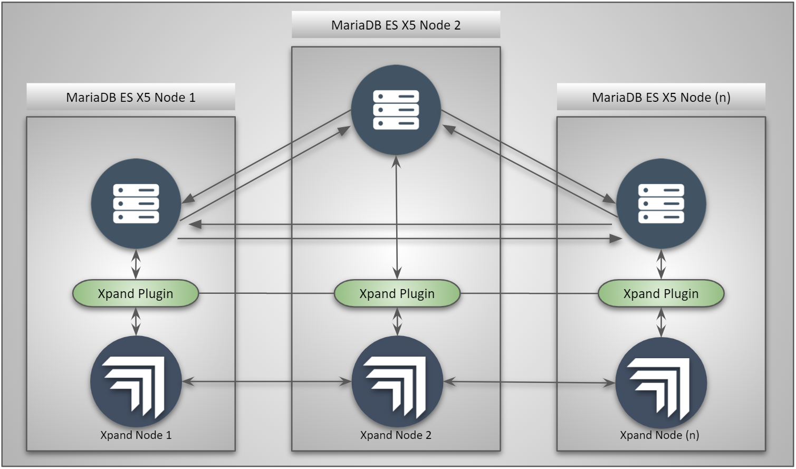

# Setting up The Xpand Cluster With MariaDB X5

This guide is to set up an Xpand cluster on the MariaDB X5 Enterprise server, Xpand is still in Beta/Gamma stages and this is to be considered as a preview of this cutting edge technology.

## Architecture

The minimum recommended architecture is to have 3 nodes of MariaDB enterprise server and 3 Xpand engine nodes. This is the recommendation for best performance, but Xpand can also be deployed by using a combined architecture where both MariaDB and Xpand engine sits on the same node. 

This particular guide implements a combined architecture, but the deployment methodology is the same, its just a matter of using relevant IP addresses for nodes being configured.

**Reference Architecture:**


### High-level Instructions

- Prepare three VM/Nodes with CentOS 7/RHEL 7 (CentOS 7 requires fewer dependencies).
- Download and Install Xpand Engine (Xpand Native).
- Download and Install MariaDB 10.5 Enterprise Server with Xpand Plugin.
- Configure Xpand USER account `xpand@'%'` and grant permissions.
- Activate Xpand Licence on 1st Xpand Node.
- Setup MariaDB Enterprise Xpand Plugin Configuration.
- Setup MariaDB Enterprise Star-Schema replication (Master `<->` Master).

We will go through all of the above in the sections below.

## Assumptions

- **Three** nodes with `RHEL 7.x` or `CentOS 7.x`.
- 8 CPU x 16 GB minimum requirement. 
- `SELinux` and `firewalld` are disabled.
- the nodes should be able to communicate with each other.
- filesystem on all the nodes used is `ext4` others are not supported by Xpand as shown here.
  ```
  =====   ERROR:   =====
  Filesystem 'xfs' on /data/clustrix (mount point: /) is not supported.
    Suggest using ext4 filesystem
  ======================
  ```

For more details, refer to <https://mariadb.com/docs/deploy/xpand-node/>

## Installation

### Important Nodes
- All the following steps are to be done on all the nodes unless otherwise specified
- The filesystem on all the nodes must be `ext4`
- Filesystem creation example
  - `shell> lsblk`
  - `shell> mkfs -t ext4 /dev/nvme0n1`
  - `shell> mount /dev/nvme0n1 /data`
- Recommended to create a separate munt for Xpand logs as well

### Install Dependencies

#### For RHEL 7

- `sudo rpm -ivh https://dl.fedoraproject.org/pub/epel/epel-release-latest-7.noarch.rpm`
- `yum-config-manager --enable "Red Hat Enterprise Linux 7 Server - Optional from RHUI (RPMs)"`
  - To get this name check the list of disabled repos through `yum repolist disabled` and copy the text that says **`Optional from RHUI`** as above

#### For CentOS 7
- `sudo yum -y install epel-release`

After installing `epel-release` and optional packages, install the dependencies as follows.

```
[shell]$ sudo yum -y install bzip2 xz wget screen ntp ntpdate htop mdadm

Dependencies Resolved

==============================================================================================================================================================================================================================================================
 Package                                                      Arch                                           Version                                                                    Repository                                                       Size
==============================================================================================================================================================================================================================================================
Installing:
 bzip2                                                        x86_64                                         1.0.6-13.el7                                                               rhel-7-server-rhui-rpms                                          52 k
 htop                                                         x86_64                                         2.2.0-3.el7                                                                epel                                                            103 k
 mdadm                                                        x86_64                                         4.1-4.el7                                                                  rhel-7-server-rhui-rpms                                         439 k
 ntp                                                          x86_64                                         4.2.6p5-29.el7_8.2                                                         rhel-7-server-rhui-rpms                                         549 k
 ntpdate                                                      x86_64                                         4.2.6p5-29.el7_8.2                                                         rhel-7-server-rhui-rpms                                          87 k
 screen                                                       x86_64                                         4.1.0-0.25.20120314git3c2946.el7                                           rhel-7-server-rhui-rpms                                         552 k
 wget                                                         x86_64                                         1.14-18.el7_6.1                                                            rhel-7-server-rhui-rpms                                         547 k
Installing for dependencies:
 autogen-libopts                                              x86_64                                         5.18-5.el7                                                                 rhel-7-server-rhui-rpms                                          66 k
 libreport-filesystem                                         x86_64                                         2.1.11-53.el7                                                              rhel-7-server-rhui-rpms                                          41 k

Transaction Summary
==============================================================================================================================================================================================================================================================
Install  7 Packages (+2 Dependent packages)
Installed:
  bzip2.x86_64 0:1.0.6-13.el7    htop.x86_64 0:2.2.0-3.el7    mdadm.x86_64 0:4.1-4.el7    ntp.x86_64 0:4.2.6p5-29.el7_8.2    ntpdate.x86_64 0:4.2.6p5-29.el7_8.2    screen.x86_64 0:4.1.0-0.25.20120314git3c2946.el7    wget.x86_64 0:1.14-18.el7_6.1   

Dependency Installed:
  autogen-libopts.x86_64 0:5.18-5.el7                                                                                       libreport-filesystem.x86_64 0:2.1.11-53.el7                                                                                      

Complete!
```

Enable NTP process on all three nodes

```txt
[shell]$ sudo systemctl start ntpd
[shell]$ sudo systemctl enable ntpd
```

### Preparing Filesystem

A dedicated mount `/data` with the type of `ext4` should be available, the output of the `df -h --print-type` should report a dedicated mount for `/data` with sufficient storage as follows

```txt
[shell]$ df -h --print-type
[centos@ip-172-31-9-216 ~]$ df -h --print-type 
Filesystem     Type      Size  Used Avail Use% Mounted on
devtmpfs       devtmpfs  7.4G     0  7.4G   0% /dev
tmpfs          tmpfs     7.4G     0  7.4G   0% /dev/shm
tmpfs          tmpfs     7.4G   17M  7.4G   1% /run
tmpfs          tmpfs     7.4G     0  7.4G   0% /sys/fs/cgroup
/dev/xvda1     xfs       8.0G  1.4G  6.7G  17% /
tmpfs          tmpfs     1.5G     0  1.5G   0% /run/user/1000
/dev/nvme0n1   ext4      436G   73M  414G   1% /data
```

_**Note:** If the mount is not available with the type of `ext4` the installation of Xpand will fail._

### Download the Xpand binaries

Contact MariaDB Sales team to get the Xpand binaries download link and transfer the binary `tar` to all of the Xpand nodes

Once transferred, un-tar the file and install.

```txt
[shell]$ ls -rlt
total 128816
-rwxr-xr-x 1 root root 131905837 Sep 28 06:31 xpand-5.3.11_rc.el7.tar.bz2

[shell]$ tar -xvf xpand-5.3.11_rc.el7.tar.bz2
xpand-5.3.11_rc.el7/
xpand-5.3.11_rc.el7/xpand-xpdnode-5.3.11_rc-1.el7.x86_64.rpm
xpand-5.3.11_rc.el7/clxdbi-combined-2.2.1-962.el7.tar.bz2
xpand-5.3.11_rc.el7/README
xpand-5.3.11_rc.el7/clxgui-combined-2.2.1-703.el7.tar.bz2
xpand-5.3.11_rc.el7/xpand-common-glassbutte-1068.el7.x86_64.rpm
xpand-5.3.11_rc.el7/xpand-utils-5.3.11_rc-1.el7.x86_64.rpm
xpand-5.3.11_rc.el7/clxgui_configure.sh
xpand-5.3.11_rc.el7/clxdbi_configure.sh
xpand-5.3.11_rc.el7/LICENSE-SWDL
xpand-5.3.11_rc.el7/checksums.md5
xpand-5.3.11_rc.el7/xpdnode_install.py
```

#### Install the Xpand binaries

Installing Xpand binaries on all the nodes as follows, the port `5001` is something that is up to us to decide as we don't want it to conflict with the MariaDB default port `3306`, the `--yes` makes sure that Xpand uses all the defaults and recommended settings.

***Note:** The warning `LOG_PATH should not be on the same storage volume (/data) as DATA_PATH.` can be ignored for this test, but as a best practice considering performance, the data directory and the log directory should be in separate physical mounts.*


```txt
[shell]$ cd xpand-5.3.11_rc.el7
[shell]$ sudo ./xpdnode_install.py --wizard --mysql-port 5001 --unix-socket /data/clustrix/mysql.sock

=== Warning: ===
LOG_PATH should not be on the same storage volume (/data) as
  DATA_PATH.
================


MariaDB Xpand successfully configured!
Loaded plugins: amazon-id, rhui-lb, search-disabled-repos
Examining /home/ec2-user/xpand-5.3.11_rc.el7/xpand-common-glassbutte-1068.el7.x86_64.rpm: xpand-common-glassbutte-1068.el7.x86_64
Marking /home/ec2-user/xpand-5.3.11_rc.el7/xpand-common-glassbutte-1068.el7.x86_64.rpm to be installed
Resolving Dependencies

==============================================================================================================================================================================================================================================================
 Package                                                       Arch                                          Version                                                    Repository                                                                       Size
==============================================================================================================================================================================================================================================================
Installing:
 xpand-common                                                  x86_64                                        glassbutte-1068.el7                                        /Xpand-common-glassbutte-1068.el7.x86_64                                         44 M
Installing for dependencies:
 MySQL-python                                                  x86_64                                        1.2.5-1.el7                                                
 ...
 ...
 ...
Updating for dependencies:
 mariadb-libs                                                  x86_64                                        1:5.5.65-1.el7                                             rhui-REGION-rhel-server-releases                                                759 k

Transaction Summary
==============================================================================================================================================================================================================================================================

Complete!

Loaded plugins: amazon-id, rhui-lb, search-disabled-repos
Examining /home/ec2-user/xpand-5.3.11_rc.el7/xpand-xpdnode-5.3.11_rc-1.el7.x86_64.rpm: xpand-xpdnode-5.3.11_rc-1.el7.x86_64
Marking /home/ec2-user/xpand-5.3.11_rc.el7/xpand-xpdnode-5.3.11_rc-1.el7.x86_64.rpm to be installed
Resolving Dependencies
--> Running transaction check
---> Package xpand-xpdnode.x86_64 0:5.3.11_rc-1.el7 will be installed
--> Finished Dependency Resolution

Dependencies Resolved

==============================================================================================================================================================================================================================================================
 Package                                                  Arch                                              Version                                                    Repository                                                                        Size
==============================================================================================================================================================================================================================================================
Installing:
 xpand-xpdnode                                            x86_64                                            5.3.11_rc-1.el7                                            /Xpand-xpdnode-5.3.11_rc-1.el7.x86_64                                            333 M

Transaction Summary
==============================================================================================================================================================================================================================================================

Complete!

Loaded plugins: amazon-id, rhui-lb, search-disabled-repos
Examining /home/ec2-user/xpand-5.3.11_rc.el7/xpand-utils-5.3.11_rc-1.el7.x86_64.rpm: xpand-utils-5.3.11_rc-1.el7.x86_64
Marking /home/ec2-user/xpand-5.3.11_rc.el7/xpand-utils-5.3.11_rc-1.el7.x86_64.rpm to be installed
Resolving Dependencies
--> Running transaction check
---> Package xpand-utils.x86_64 0:5.3.11_rc-1.el7 will be installed
--> Finished Dependency Resolution

Dependencies Resolved

==============================================================================================================================================================================================================================================================
 Package                                                 Arch                                               Version                                                     Repository                                                                       Size
==============================================================================================================================================================================================================================================================
Installing:
 xpand-utils                                             x86_64                                             5.3.11_rc-1.el7                                             /Xpand-utils-5.3.11_rc-1.el7.x86_64                                              15 M

Transaction Summary
==============================================================================================================================================================================================================================================================
                                                                                                          

Complete!

MariaDB xpand RPMs installed successfully
MariaDB xpand service started... Please wait for the database to
  initialize (This will take a minute.)
.......................
MariaDB xpand initialized.

MariaDB xpand is now ready for use.
checking options
setting config path
reading settings from /etc/clustrix/clxdbi.conf
reading settings from environment
checking settings from /etc/clustrix/clxnode.conf
checking built-in default settings
settings complete
checking /etc/clustrix
checking /etc/clustrix/clxdbi.conf
writing config
seeking local archive
found ./clxdbi-combined-2.2.1-962.el7.tar.bz2
probing for existing /opt/clustrix/clxdbi
checking /var/tmp/clxdbi-extract-1601319180
extracting ./clxdbi-combined-2.2.1-962.el7.tar to /var/tmp/clxdbi-extract-1601319180
checking /opt/clustrix/clxdbi
extracting clxdbi to /opt/clustrix/clxdbi
extracting common code to /opt/clustrix/clxui-common
cleaning up /var/tmp/clxdbi-extract-1601319180
using install opts --start
installing
no log file, buffering log output

starting clxdbi installation
warning: vendor/rpm/libpcap-1.5.3-8.el7.x86_64.rpm: Header V3 RSA/SHA256 Signature, key ID f4a80eb5: NOKEY
installing rpms
Failed to set locale, defaulting to C
updating links...
links updated
starting server
preparing clxdbi for first run
/opt/clustrix/clxdbi/vendor/bundle/ruby/2.6.0/gems/get_process_mem-0.2.1/lib/get_process_mem.rb:10: warning: BigDecimal.new is deprecated; use BigDecimal() method instead.
linking to clustrixdb nanny
clxdbi install completed
checking /etc/logrotate.d
adding /etc/logrotate.d/clxdbi
writing tmpfiles conf
checking options
setting config path
reading settings from /etc/clustrix/clxgui.conf
reading settings from environment
checking built-in default settings
settings complete
checking /etc/clustrix
checking /etc/clustrix/clxgui.conf
writing config
seeking local archive
found ./clxgui-combined-2.2.1-703.el7.tar.bz2
probing for existing /opt/clustrix/clxgui
checking /var/tmp/clxgui-extract-1601319219
extracting ./clxgui-combined-2.2.1-703.el7.tar to /var/tmp/clxgui-extract-1601319219
checking /opt/clustrix/clxgui
extracting clxgui to /opt/clustrix/clxgui
extracting common code to /opt/clustrix/clxui-common
cleaning up /var/tmp/clxgui-extract-1601319219
using install opts --start
installing

starting clxgui installation
warning: vendor/rpm/libxslt-1.1.28-5.el7.x86_64.rpm: Header V3 RSA/SHA256 Signature, key ID f4a80eb5: NOKEY
rpms already installed
updating links...done
starting server
preparing clxgui for first run
linking to clustrixdb nanny
clxgui install completed
checking /etc/logrotate.d
adding /etc/logrotate.d/clxgui
writing tmpfiles conf

*** This Node's IP (Needed later during cluster configuration): 172.31.20.172
For easiest use of the `clx` cluster management tool, configure passwordless ssh between all nodes for these users: Xpand, Xpandm
```

MariaDB Xpand engine is installed successfully, now we can install the MariaDB server and the Xpand plugin.

## Install MariaDB 10.5 Enterprise

Install The MariaDB Enterprise server & Xpand plugin on all the nodes. All the RPM files are available in the Enterprise downloaded tar package.

### Local Repo Setup

Assuming the downloaded rpm package was untarred is under `/tmp/mariadb-enterprise-10.5.6-4-centos-7-x86_64-rpms`

```
[shell]$ pwd
/tmp

[shell]$ ls -lrt
total 337744
drwxrwxr-x. 3 centos centos      4096 Oct  7 03:10 mariadb-enterprise-10.5.6-4-centos-7-x86_64-rpms
-rwxr-xr-x. 1 centos centos 345845760 Oct 10 15:18 mariadb-enterprise-10.5.6-4-centos-7-x86_64-rpms.tar
```

Based on the above folder setup, we can now create a repository file `/etc/yum.repos.d/mariadb.repo` and add the following content to it. This will define a local repository for CentOS/RHEL.

```
[local]
name=MariaDB ES 10.5
baseurl=file:///tmp/mariadb-enterprise-10.5.6-4-centos-7-x86_64-rpms
enabled=1
gpgcheck=0
protect=1
```

Note: The `baseurl` must point to the location where the extracted tar exists. 

### Install MariaDB Enterprise

Now we can directly execute the `yum install` without worrying about the dependencies as follows since we have already set up a local MariaDB Enterprise server repository.

```txt
[shell]$ sudo yum -y install MariaDB-server MariaDB-backup MariaDB-xpand-engine

Dependencies Resolved

==============================================================================================================================================================================================================================================================
 Package                                                             Arch                                               Version                                                     Repository                                                           Size
==============================================================================================================================================================================================================================================================
Installing:
 MariaDB-backup                                                      x86_64                                             10.5.5_3-1.el7                                              mariadb-es-main                                                     7.0 M
 MariaDB-server                                                      x86_64                                             10.5.5_3-1.el7                                              mariadb-es-main                                                      21 M
 MariaDB-xpand-engine                                                x86_64                                             10.5.5_3-1.el7                                              mariadb-es-main                                                      67 k
Installing for dependencies:
 ...
 ...

Transaction Summary
==============================================================================================================================================================================================================================================================
...
...
Dependency Installed:
  boost-program-options.x86_64 0:1.53.0-28.el7  galera-enterprise-4.x86_64 0:26.4.5-1.el7.8  lsof.x86_64 0:4.87-6.el7             perl-Compress-Raw-Bzip2.x86_64 0:2.061-3.el7  perl-Compress-Raw-Zlib.x86_64 1:2.061-4.el7  perl-DBI.x86_64 0:1.627-4.el7 
  perl-Data-Dumper.x86_64 0:2.145-3.el7         perl-IO-Compress.noarch 0:2.061-2.el7        perl-Net-Daemon.noarch 0:0.48-5.el7  perl-PlRPC.noarch 0:0.2020-14.el7             socat.x86_64 0:1.7.3.2-2.el7                

Complete!
```

This is a combined setup, with MariaDB ES and Xpand engine running on the same server, To connect to the Xpand backend node, we can use the Xpand socket `mariadb --socket /data/clustrix/mysql.sock` and to connect to the MariaDB node, we can directly connect without any socket parameter.

***Note:** The following is to be done only on the 1st Xpand node!*

The first thing to do would be to install the license provided by the MariaDB team using the `set global license='JSON Text';` syntax. This needs to be done on the **first Xpand** node directly and not on the MariaDB server.

```txt
[shell]$ sudo mariadb --socket /data/clustrix/mysql.sock

Welcome to the MariaDB monitor.  Commands end with ; or \g.
Your MySQL connection id is 37889
Server version: 5.0.45-xpand-5.3.11_rc 

Copyright (c) 2000, 2018, Oracle, MariaDB Corporation Ab and others.

Type 'help;' or '\h' for help. Type '\c' to clear the current input statement.

MySQL [(none)]> set global license='{"expiration":"2020-11-01 00:00:00","maxnodes":"3","company":"MariaDB","maxcores":"32","email":"faisal@mariadb.com","person":"Faisal Saeed","signature":"...my_special_signature_key_string..."}';
Query OK, 0 rows affected (0.024 sec)
```

Set the password for the user `xpand@'%'` and `xpand@'localhost'` and set the required grants for Xpand plugin

```txt
MySQL [(none)]> grant all on *.* to xpand@'%';
Query OK, 0 rows affected (0.005 sec)

MySQL [(none)]> set password for xpand@'%' = password('SecretPassword');
Query OK, 0 rows affected (0.005 sec)

MySQL [(none)]> grant all on *.* to xpand@'localhost';
Query OK, 0 rows affected (0.005 sec)

MySQL [(none)]> set password for xpand@'localhost' = password('SecretPassword');
Query OK, 0 rows affected (0.005 sec)
```

Edit the `/etc/my.cnf.d/xpand.cnf` file and add the **first Xpand** plugin details followed by a `systemctl restart mariadb` on first nodes.

```txt
[mariadb]
plugin_load_add = ha_xpand.so
xpand_hosts = 127.0.0.1
xpand_port = 5001
xpand_username = xpand
xpand_password = SecretPassword
```

***Note:** Since this is a combined architecture, the Xpand host is defined as `Xpand_hosts = 127.0.0.1` but if Xpand nodes are separate, appropriate IP address needs to be used here instead of the loop-back localhost IP.*

This will set up Xpand plugin, define the Xpand local hostname, Xpand port that we define will installing Xpand node and the Xpand user name/password

Once MariaDB has been restarted, we can now connect to the enterprise server using the MariaDB command line. 

```txt
[ec2-user@ip-172-31-20-172 ~]$ sudo mariadb
Welcome to the MariaDB monitor.  Commands end with ; or \g.
Your MariaDB connection id is 3
Server version: 10.5.5-3-MariaDB-enterprise MariaDB Enterprise Server

Copyright (c) 2000, 2018, Oracle, MariaDB Corporation Ab and others.

Type 'help;' or '\h' for help. Type '\c' to clear the current input statement.

MariaDB [(none)]> show engines;
+--------------------+---------+-------------------------------------------------------------------------------------------------+--------------+------+------------+
| Engine             | Support | Comment                                                                                         | Transactions | XA   | Savepoints |
+--------------------+---------+-------------------------------------------------------------------------------------------------+--------------+------+------------+
| CSV                | YES     | Stores tables as CSV files                                                                      | NO           | NO   | NO         |
| MRG_MyISAM         | YES     | Collection of identical MyISAM tables                                                           | NO           | NO   | NO         |
| MEMORY             | YES     | Hash based, stored in memory, useful for temporary tables                                       | NO           | NO   | NO         |
| Xpand              | YES     | Xpand storage engine                                                                            | YES          | NO   | NO         |
| MyISAM             | YES     | Non-transactional engine with good performance and small data footprint                         | NO           | NO   | NO         |
| SEQUENCE           | YES     | Generated tables filled with sequential values                                                  | YES          | NO   | YES        |
| InnoDB             | DEFAULT | Supports transactions, row-level locking, foreign keys and encryption for tables                | YES          | YES  | YES        |
| PERFORMANCE_SCHEMA | YES     | Performance Schema                                                                              | NO           | NO   | NO         |
| Aria               | YES     | Crash-safe tables with MyISAM heritage. Used for internal temporary tables and privilege tables | NO           | NO   | NO         |
+--------------------+---------+-------------------------------------------------------------------------------------------------+--------------+------+------------+
9 rows in set (0.000 sec)

MariaDB [(none)]> show plugins;
+-------------------------------+----------+---------------------+--------------------------+---------+
| Name                          | Status   | Type                | Library                  | License |
+-------------------------------+----------+---------------------+--------------------------+---------+
| binlog                        | ACTIVE   | STORAGE ENGINE      | NULL                     | GPL     |
| ...                           | ...      | ...                 | ...                      | ...     |
| ...                           | ...      | ...                 | ...                      | ...     |
| ...                           | ...      | ...                 | ...                      | ...     |
| SERVER_AUDIT                  | ACTIVE   | AUDIT               | server_audit2.so         | GPL     |
| ed25519                       | ACTIVE   | AUTHENTICATION      | auth_ed25519.so          | GPL     |
| simple_password_check         | ACTIVE   | PASSWORD VALIDATION | simple_password_check.so | GPL     |
| Xpand                         | ACTIVE   | STORAGE ENGINE      | ha_xpand.so              | GPL     |
+-------------------------------+----------+---------------------+--------------------------+---------+
73 rows in set (0.001 sec)
```

We can see the Xpand engine and Xpand plugin is available, time to create a test table on the first MariaDB node and see if it works.

```txt
MariaDB [(none)]> create database testdb;
Query OK, 1 row affected (0.000 sec)

MariaDB [testdb]> create table tab(id serial, c1 varchar(100)) engine=Xpand;
Query OK, 0 rows affected (0.013 sec)

MariaDB [testdb]> show create table tab\G
*************************** 1. row ***************************
       Table: tab
Create Table: CREATE TABLE `tab` (
  `id` bigint(20) unsigned NOT NULL AUTO_INCREMENT,
  `c1` varchar(100) DEFAULT NULL,
  UNIQUE KEY `id` (`id`)
) ENGINE=Xpand DEFAULT CHARSET=latin1
1 row in set (0.007 sec)

MariaDB [testdb]> create table tab(id serial, c1 varchar(100)) engine=Xpand;
Query OK, 0 rows affected (0.015 sec)

MariaDB [testdb]> insert into tab(c1) select concat(table_name, '->', column_name) from information_schema.columns;
Query OK, 2230 rows affected (1.093 sec)
Records: 2230  Duplicates: 0  Warnings: 0

MariaDB [testdb]> select * from tab limit 5; 
+----+----------------------------------+
| id | c1                               |
+----+----------------------------------+
|  1 | ALL_PLUGINS->PLUGIN_NAME         |
|  2 | ALL_PLUGINS->PLUGIN_VERSION      |
|  3 | ALL_PLUGINS->PLUGIN_STATUS       |
|  4 | ALL_PLUGINS->PLUGIN_TYPE         |
|  5 | ALL_PLUGINS->PLUGIN_TYPE_VERSION |
+----+----------------------------------+
5 rows in set (0.004 sec)
```

Everything looks good, now we will apply the `/etc/my.cnf.d/xpand.cnf` file on all the other nodes and restart MariaDB service so that all the nodes have the same setup.

Once MariaDB nodes are started on all the other nodes in the cluster, connect to the **first Xpand** node using Xpand socket and add the other Xpand nodes to the this cluster

## Setting up the Xpand Cluster

Now that the 1st node is working fine and the other two nodes are ready with MariaDB Enterprise + Xpand Plugin already installed along with Xpand nodes, we can add these two nodes to the Xpand cluster as per follows

Log in to the first Xpand node using Xpand socket and run the `ALTER CLUSTER ADD 'IP for Node 2', 'IP for Node 3;`

***Note:** This is to be done only on the 1st node where "license" was added*

```txt
[shell]$ sudo mariadb --socket /data/clustrix/mysql.sock
Welcome to the MariaDB monitor.  Commands end with ; or \g.
Your MySQL connection id is 21505
Server version: 5.0.45-Xpand-5.3.11_rc 

Copyright (c) 2000, 2018, Oracle, MariaDB Corporation Ab and others.

Type 'help;' or '\h' for help. Type '\c' to clear the current input statement.

MySQL [(none)]> ALTER CLUSTER ADD '172.31.1.151', '172.31.0.17';
Query OK, 0 rows affected (0.008 sec)
```

Now the cluster is ready, let's verify 

```txt
[shell]$ sudo /opt/clustrix/bin/clx stat
Cluster Name:    cld06281c052a00a35
Cluster Version: 5.3.11_rc
Cluster Status:   OK 
Cluster Size:    3 nodes - 2 CPUs per Node
Current Node:    ip-172-31-9-224 - nid 1

nid |     Hostname     | Status |   IP Address  | TPS  |      Used      |  Total 
----+------------------+--------+---------------+------+----------------+--------
  1 |  ip-172-31-9-224 |    OK  |  172.31.9.224 |  145 |  22.2M (0.01%) |  324.9G
  2 |   ip-172-31-0-17 |    OK  |   172.31.0.17 |    0 |  13.7M (0.00%) |  324.9G
  3 |  ip-172-31-1-151 |    OK  |  172.31.1.151 |  164 |  14.5M (0.00%) |  324.9G
----+------------------+--------+---------------+------+----------------+--------
                                                   309 |  50.4M (0.01%) |  974.6G
```

This confirms that the Xpand is running as a 3 node cluster. The next thing to do would be to set up MariaDB native replication so that the schema can be synchronized between all the MariaDB nodes because that is going to be our front-end for the application connections.

But for now, if we connect to the second or third MariaDB node, we will not be able to see the `testdb` that we created from MariaDB node 1, however, if we connect to the Xpand nodes directly, any of them, the `testdb.tab` will be available. This is because the MariaDB nodes are not replicating to other MariaDB nodes but Xpand is replicating the data natively.

The solution to this problem is that we need to set up basic MariaDB replication between all the MariaDB nodes so that whenever we create a new non-Xpand object, it is available on all the nodes. This setup however expects that we don't have a mixed InnoDB/Xpand replication as this can create conflicts since we are creating a Multi-Master replication setup so that Reads/Writes can be done from any of the nodes. Basically, we want only the metadata replicating like Databases and probably some other non Xpand objects so that these are available on each node.

When we are done, we will have a STAR Schema design where each node is replicating to each other node. No longer a 1 Primary and many Replica nodes.

## MariaDB Replication Setup

Xpand nodes automatically handled the replication by Xpand engine natively, it's not really considered replication, rather, data distribution and we don't need to do much to get it started, just the single `ALTER CLUSTER ADD ...` starts the data distribution when the cluster is formed.

We now need to set up replication for the meta-data so that the databases and non-Xpand tables/objects like databases can be synchronized between MariaDB nodes.

### Replication Parameters

On each MariaDB server, edit the /etc/my.cnf.d/server.cnf file and add the following under the `[mariadb]` section

```txt
[mariadb]
log_bin

# Name of the binlog file
log-basename=mariadb-xpand

# Format should be either statement or mixed. format=row will prevent xpand from working
binlog_format=mixed 

binlog_row_image=MINIMAL
relay_log_purge=1
relay_log_recovery=1
innodb_autoinc_lock_mode=2
log_slave_updates=0
replicate-same-server-id=0
xpand_master_skip_dml_binlog=1
xpand_replicate_alter_as_create_select=1
xpand_slave_ignore_ddl=1

# This is to ensure, the databases starting with `Xpand` are NOT replicated
replicate_wild_ignore_table=xpand%.%.

# Subsequent auto increment values inserted from same server - 1,21,41
auto_increment_increment=20

# The following settings will have to be unique for each server
# Offset for other servers. Each server should have a different offset i.e. 1 for first, 2 for second and 3 for 3rd, and so on. So that first server generates value 10, second will generate 11 and third will general 12
auto_increment_offset=1 

# Each server should have different server_id i.e. 1 for first, 2 for second and 3 for 3rd server and so on
server_id=1

# Each server should have different gtid_doman i.e. 1 for first, 2 for second and 3 for 3rd server and so on
gtid_domain_id=1 
```

As explained above, some of the variables should have unique values while others should be the same. The other properties are pretty much standard for MariaDB replication but the new ones to take note are the ones related to the Xpand engine.

- **`xpand_master_skip_dml_binlog=1`**
  - This ensures that Xpand table related DML statements are not captured in the binary logs, because these are already handled by Xpand engine natively 
- **`xpand_replicate_alter_as_create_select=1`**
  - When someone ALTERs an Xpand table to a local InnoDB or local table, capture all the rows in the binary logs because this must be replicated to other MariaDB nodes.
- **`xpand_slave_ignore_ddl=1`**
  - This ensures that the DDL statements for Xpand tables are not captured in the binary logs, because these are handled and distributed automatically by Xpand natively.

With this config in place, restart all the MariaDB nodes `systemctl restart mariadb`.

### Setup Replication

Before setting up the replication using `CHANGE MASTER ...` we need to do the following, this is only required to be once online before setting up the replication. 

```txt
MariaDB [(none)]> SET GLOBAL slave_ddl_exec_mode=STRICT;
Query OK, 0 rows affected (0.001 sec)
```

More details here <https://mariadb.com/kb/en/replication-and-binary-log-system-variables/#slave_ddl_exec_mode> But this is needed for our STAR Schema replication setup in an Xpand-engine setup.

Create a user to use for Replication between all the nodes, this user must be created on all nodes.

```txt
MariaDB [(none)]> CREATE USER replication_user@'%' IDENTIFIED BY 'SecretPassw0rd!';
Query OK, 0 rows affected (0.001 sec)

MariaDB [(none)]> GRANT REPLICATION SLAVE ON *.* TO replication_user@'%';
Query OK, 0 rows affected (0.002 sec)
```

Since we already have binary logs enabled, and the above user creation/grants are done on all the nodes manually, we can start the replication but we need to skip all the GTIDs up to now. Let's check for the current GTID on all the nodes.

- Node 1
  ```txt
  MariaDB [(none)]> SHOW MASTER STATUS\G
  *************************** 1. row ***************************
              File: mariadb-xpand-bin.000001
          Position: 1004
      Binlog_Do_DB: 
  Binlog_Ignore_DB: 
  1 row in set (0.000 sec)

  MariaDB [(none)]> SELECT BINLOG_GTID_POS('mariadb-xpand-bin.000001', 1004);
  +---------------------------------------------------+
  | BINLOG_GTID_POS('mariadb-xpand-bin.000001', 1004) |
  +---------------------------------------------------+
  | 1-1000-4                                          |
  +---------------------------------------------------+
  1 row in set (0.000 sec)
  ```
  
- Node 2
  ```txt
  MariaDB [(none)]> SHOW MASTER STATUS\G
  *************************** 1. row ***************************
              File: mariadb-xpand-bin.000001
          Position: 1004
      Binlog_Do_DB: 
  Binlog_Ignore_DB: 
  1 row in set (0.000 sec)

  MariaDB [(none)]> SELECT BINLOG_GTID_POS('mariadb-xpand-bin.000001', 1004);
  +---------------------------------------------------+
  | BINLOG_GTID_POS('mariadb-xpand-bin.000001', 1004) |
  +---------------------------------------------------+
  | 2-2000-4                                          |
  +---------------------------------------------------+
  1 row in set (0.001 sec)
  ```

- Node 3
  ```txt
  MariaDB [(none)]> SHOW MASTER STATUS\G
  *************************** 1. row ***************************
              File: mariadb-xpand-bin.000001
          Position: 1004
      Binlog_Do_DB: 
  Binlog_Ignore_DB: 
  1 row in set (0.000 sec)

  MariaDB [(none)]> SELECT BINLOG_GTID_POS('mariadb-xpand-bin.000001', 1004);
  +---------------------------------------------------+
  | BINLOG_GTID_POS('mariadb-xpand-bin.000001', 1004) |
  +---------------------------------------------------+
  | 3-3000-4                                          |
  +---------------------------------------------------+
  1 row in set (0.000 sec)
  ```

The Binary Log File & Position are identical but the GTID is different since each of the servers have their own `server_id` and `domain_id`

Now we can set the Star Schema up, it means, all the nodes must replicate from all the other nodes. Since we have 3 nodes, when we do `SHOW SLAVE STATUS\G` on all the nodes, all the nodes must report 2 Replica 

- The Replication should look like this
  ```txt
  Node 1 ──> Node 2
     └─────> Node 3

  Node 2 ──> Node 1
     └─────> Node 3

  Node 3 ──> Node 1
     └─────> Node 2
  ```

***Note:** Refer to the reference architecture image.*

- From Node 1 We will `CHANGE MASTER TO <Node 2>` and `CHANGE MASTER TO <Node 3>`
- From Node 2 We will `CHANGE MASTER TO <Node 1>` and `CHANGE MASTER TO <Node 3>`
- From Node 3 We will `CHANGE MASTER TO <Node 1>` and `CHANGE MASTER TO <Node 2>`

Let's do this, Since we want to get rid of all the binary logs up to now, we can simply do `RESET MASTER;` on all nodes to clear all the local binary logs and start from empty GTID for each node.

- Node 1
  ```txt
  MariaDB [(none)]> RESET MASTER;
  Query OK, 0 rows affected (0.006 sec)

  MariaDB [(none)]> RESET SLAVE ALL;
  Query OK, 0 rows affected (0.000 sec)

  MariaDB [(none)]> SHOW BINARY LOGS;
  +--------------------------+-----------+
  | Log_name                 | File_size |
  +--------------------------+-----------+
  | mariadb-xpand-bin.000001 |       336 |
  +--------------------------+-----------+
  1 row in set (0.000 sec)

  MariaDB [(none)]> SET GLOBAL GTID_SLAVE_POS='';
  Query OK, 0 rows affected (0.010 sec)

  MariaDB [(none)]> CHANGE MASTER 'XPAND-NODE-2' TO MASTER_HOST='172.31.1.151', MASTER_PORT=3306, MASTER_USER='replication_user', MASTER_PASSWORD='SecretPassw0rd!', MASTER_USE_GTID=current_pos;
  Query OK, 0 rows affected (0.011 sec)

  MariaDB [(none)]> CHANGE MASTER 'XPAND-NODE-3' TO MASTER_HOST='172.31.0.17', MASTER_PORT=3306, MASTER_USER='replication_user', MASTER_PASSWORD='SecretPassw0rd!', MASTER_USE_GTID=current_pos;
  Query OK, 0 rows affected (0.010 sec)

  MariaDB [(none)]> START ALL SLAVES;
  Query OK, 0 rows affected, 2 warnings (0.012 sec)

  MariaDB [(none)]> SHOW WARNINGS;
  +-------+------+------------------------------+
  | Level | Code | Message                      |
  +-------+------+------------------------------+
  | Note  | 1937 | SLAVE 'XPAND-NODE-2' started |
  | Note  | 1937 | SLAVE 'XPAND-NODE-3' started |
  +-------+------+------------------------------+
  2 rows in set (0.000 sec)

  MariaDB [(none)]> SHOW ALL SLAVES STATUS\G
  *************************** 1. row ***************************
                Connection_name: XPAND-NODE-2
                Slave_SQL_State: Slave has read all relay log; waiting for more updates
                  Slave_IO_State: Waiting for master to send event
                    Master_Host: 172.31.1.151
                    Master_User: replication_user
                    Master_Port: 3306
                  Connect_Retry: 60
                Master_Log_File: mariadb-xpand-bin.000001
            Read_Master_Log_Pos: 336
                  Relay_Log_File: mariadb-xpand-relay-bin-xpand@002dnode@002d2.000002
                  Relay_Log_Pos: 643
          Relay_Master_Log_File: mariadb-xpand-bin.000001
                Slave_IO_Running: Yes
              Slave_SQL_Running: Yes
                Replicate_Do_DB: 
            Replicate_Ignore_DB: 
              Replicate_Do_Table: 
          Replicate_Ignore_Table: 
        Replicate_Wild_Do_Table: 
    Replicate_Wild_Ignore_Table: xpand%.%.
                      Last_Errno: 0
                      Last_Error: 
                    Skip_Counter: 0
            Exec_Master_Log_Pos: 336
                Relay_Log_Space: 981
                Until_Condition: None
                  Until_Log_File: 
                  Until_Log_Pos: 0
              Master_SSL_Allowed: No
              Master_SSL_CA_File: 
              Master_SSL_CA_Path: 
                Master_SSL_Cert: 
              Master_SSL_Cipher: 
                  Master_SSL_Key: 
          Seconds_Behind_Master: 0
  Master_SSL_Verify_Server_Cert: No
                  Last_IO_Errno: 0
                  Last_IO_Error: 
                  Last_SQL_Errno: 0
                  Last_SQL_Error: 
    Replicate_Ignore_Server_Ids: 
                Master_Server_Id: 2000
                  Master_SSL_Crl: 
              Master_SSL_Crlpath: 
                      Using_Gtid: Current_Pos
                    Gtid_IO_Pos: 
        Replicate_Do_Domain_Ids: 
    Replicate_Ignore_Domain_Ids: 
                  Parallel_Mode: optimistic
                      SQL_Delay: 0
            SQL_Remaining_Delay: NULL
        Slave_SQL_Running_State: Slave has read all relay log; waiting for more updates
                Slave_DDL_Groups: 0
  Slave_Non_Transactional_Groups: 0
      Slave_Transactional_Groups: 0
            Retried_transactions: 0
              Max_relay_log_size: 1073741824
            Executed_log_entries: 7
      Slave_received_heartbeats: 0
          Slave_heartbeat_period: 30.000
                  Gtid_Slave_Pos: 
  *************************** 2. row ***************************
                Connection_name: XPAND-NODE-3
                Slave_SQL_State: Slave has read all relay log; waiting for more updates
                  Slave_IO_State: Waiting for master to send event
                    Master_Host: 172.31.0.17
                    Master_User: replication_user
                    Master_Port: 3306
                  Connect_Retry: 60
                Master_Log_File: mariadb-xpand-bin.000001
            Read_Master_Log_Pos: 336
                  Relay_Log_File: mariadb-xpand-relay-bin-xpand@002dnode@002d3.000002
                  Relay_Log_Pos: 643
          Relay_Master_Log_File: mariadb-xpand-bin.000001
                Slave_IO_Running: Yes
              Slave_SQL_Running: Yes
                Replicate_Do_DB: 
            Replicate_Ignore_DB: 
              Replicate_Do_Table: 
          Replicate_Ignore_Table: 
        Replicate_Wild_Do_Table: 
    Replicate_Wild_Ignore_Table: xpand%.%.
                      Last_Errno: 0
                      Last_Error: 
                    Skip_Counter: 0
            Exec_Master_Log_Pos: 336
                Relay_Log_Space: 981
                Until_Condition: None
                  Until_Log_File: 
                  Until_Log_Pos: 0
              Master_SSL_Allowed: No
              Master_SSL_CA_File: 
              Master_SSL_CA_Path: 
                Master_SSL_Cert: 
              Master_SSL_Cipher: 
                  Master_SSL_Key: 
          Seconds_Behind_Master: 0
  Master_SSL_Verify_Server_Cert: No
                  Last_IO_Errno: 0
                  Last_IO_Error: 
                  Last_SQL_Errno: 0
                  Last_SQL_Error: 
    Replicate_Ignore_Server_Ids: 
                Master_Server_Id: 3000
                  Master_SSL_Crl: 
              Master_SSL_Crlpath: 
                      Using_Gtid: Current_Pos
                    Gtid_IO_Pos: 
        Replicate_Do_Domain_Ids: 
    Replicate_Ignore_Domain_Ids: 
                  Parallel_Mode: optimistic
                      SQL_Delay: 0
            SQL_Remaining_Delay: NULL
        Slave_SQL_Running_State: Slave has read all relay log; waiting for more updates
                Slave_DDL_Groups: 0
  Slave_Non_Transactional_Groups: 0
      Slave_Transactional_Groups: 0
            Retried_transactions: 0
              Max_relay_log_size: 1073741824
            Executed_log_entries: 7
      Slave_received_heartbeats: 0
          Slave_heartbeat_period: 30.000
                  Gtid_Slave_Pos: 
  2 rows in set (0.000 sec)
  ```
  We can see Node 1 replicating from `XPAND-NODE-2` and `XPAND-NODE-3`, we will do the same on the remaining two nodes using the respective IP addresses.

- Node 2
  ```txt
  MariaDB [(none)]> RESET MASTER;
  Query OK, 0 rows affected (0.006 sec)

  MariaDB [(none)]> RESET SLAVE ALL;
  Query OK, 0 rows affected (0.001 sec)

  MariaDB [(none)]> SHOW BINARY LOGS;
  +--------------------------+-----------+
  | Log_name                 | File_size |
  +--------------------------+-----------+
  | mariadb-xpand-bin.000001 |       336 |
  +--------------------------+-----------+
  1 row in set (0.000 sec)

  MariaDB [(none)]> SET GLOBAL GTID_SLAVE_POS='';
  Query OK, 0 rows affected (0.009 sec)

  MariaDB [(none)]> CHANGE MASTER 'XPAND-NODE-1' TO MASTER_HOST='172.31.9.224', MASTER_PORT=3306, MASTER_USER='replication_user', MASTER_PASSWORD='SecretPassw0rd!', MASTER_USE_GTID=current_pos;
  Query OK, 0 rows affected (0.015 sec)

  MariaDB [(none)]> CHANGE MASTER 'XPAND-NODE-3' TO MASTER_HOST='172.31.0.17', MASTER_PORT=3306, MASTER_USER='replication_user', MASTER_PASSWORD='SecretPassw0rd!', MASTER_USE_GTID=current_pos;
  Query OK, 0 rows affected (0.010 sec)

  MariaDB [(none)]> START ALL SLAVES;
  Query OK, 0 rows affected, 2 warnings (0.011 sec)

  MariaDB [(none)]> SHOW WARNINGS;
  +-------+------+------------------------------+
  | Level | Code | Message                      |
  +-------+------+------------------------------+
  | Note  | 1937 | SLAVE 'XPAND-NODE-1' started |
  | Note  | 1937 | SLAVE 'XPAND-NODE-3' started |
  +-------+------+------------------------------+
  2 rows in set (0.000 sec)

  MariaDB [(none)]> SHOW ALL SLAVES STATUS\G
  *************************** 1. row ***************************
                Connection_name: XPAND-NODE-1
                Slave_SQL_State: Slave has read all relay log; waiting for more updates
                  Slave_IO_State: Waiting for master to send event
                    Master_Host: 172.31.9.224
                    Master_User: replication_user
                    Master_Port: 3306
                  Connect_Retry: 60
                Master_Log_File: mariadb-xpand-bin.000001
            Read_Master_Log_Pos: 336
                  Relay_Log_File: mariadb-xpand-relay-bin-xpand@002dnode@002d1.000002
                  Relay_Log_Pos: 643
          Relay_Master_Log_File: mariadb-xpand-bin.000001
                Slave_IO_Running: Yes
              Slave_SQL_Running: Yes
                Replicate_Do_DB: 
            Replicate_Ignore_DB: 
              Replicate_Do_Table: 
          Replicate_Ignore_Table: 
        Replicate_Wild_Do_Table: 
    Replicate_Wild_Ignore_Table: xpand%.%.
                      Last_Errno: 0
                      Last_Error: 
                    Skip_Counter: 0
            Exec_Master_Log_Pos: 336
                Relay_Log_Space: 981
                Until_Condition: None
                  Until_Log_File: 
                  Until_Log_Pos: 0
              Master_SSL_Allowed: No
              Master_SSL_CA_File: 
              Master_SSL_CA_Path: 
                Master_SSL_Cert: 
              Master_SSL_Cipher: 
                  Master_SSL_Key: 
          Seconds_Behind_Master: 0
  Master_SSL_Verify_Server_Cert: No
                  Last_IO_Errno: 0
                  Last_IO_Error: 
                  Last_SQL_Errno: 0
                  Last_SQL_Error: 
    Replicate_Ignore_Server_Ids: 
                Master_Server_Id: 1000
                  Master_SSL_Crl: 
              Master_SSL_Crlpath: 
                      Using_Gtid: Current_Pos
                    Gtid_IO_Pos: 
        Replicate_Do_Domain_Ids: 
    Replicate_Ignore_Domain_Ids: 
                  Parallel_Mode: optimistic
                      SQL_Delay: 0
            SQL_Remaining_Delay: NULL
        Slave_SQL_Running_State: Slave has read all relay log; waiting for more updates
                Slave_DDL_Groups: 0
  Slave_Non_Transactional_Groups: 0
      Slave_Transactional_Groups: 0
            Retried_transactions: 0
              Max_relay_log_size: 1073741824
            Executed_log_entries: 7
      Slave_received_heartbeats: 0
          Slave_heartbeat_period: 30.000
                  Gtid_Slave_Pos: 
  *************************** 2. row ***************************
                Connection_name: XPAND-NODE-3
                Slave_SQL_State: Slave has read all relay log; waiting for more updates
                  Slave_IO_State: Waiting for master to send event
                    Master_Host: 172.31.0.17
                    Master_User: replication_user
                    Master_Port: 3306
                  Connect_Retry: 60
                Master_Log_File: mariadb-xpand-bin.000001
            Read_Master_Log_Pos: 336
                  Relay_Log_File: mariadb-xpand-relay-bin-xpand@002dnode@002d3.000002
                  Relay_Log_Pos: 643
          Relay_Master_Log_File: mariadb-xpand-bin.000001
                Slave_IO_Running: Yes
              Slave_SQL_Running: Yes
                Replicate_Do_DB: 
            Replicate_Ignore_DB: 
              Replicate_Do_Table: 
          Replicate_Ignore_Table: 
        Replicate_Wild_Do_Table: 
    Replicate_Wild_Ignore_Table: xpand%.%.
                      Last_Errno: 0
                      Last_Error: 
                    Skip_Counter: 0
            Exec_Master_Log_Pos: 336
                Relay_Log_Space: 981
                Until_Condition: None
                  Until_Log_File: 
                  Until_Log_Pos: 0
              Master_SSL_Allowed: No
              Master_SSL_CA_File: 
              Master_SSL_CA_Path: 
                Master_SSL_Cert: 
              Master_SSL_Cipher: 
                  Master_SSL_Key: 
          Seconds_Behind_Master: 0
  Master_SSL_Verify_Server_Cert: No
                  Last_IO_Errno: 0
                  Last_IO_Error: 
                  Last_SQL_Errno: 0
                  Last_SQL_Error: 
    Replicate_Ignore_Server_Ids: 
                Master_Server_Id: 3000
                  Master_SSL_Crl: 
              Master_SSL_Crlpath: 
                      Using_Gtid: Current_Pos
                    Gtid_IO_Pos: 
        Replicate_Do_Domain_Ids: 
    Replicate_Ignore_Domain_Ids: 
                  Parallel_Mode: optimistic
                      SQL_Delay: 0
            SQL_Remaining_Delay: NULL
        Slave_SQL_Running_State: Slave has read all relay log; waiting for more updates
                Slave_DDL_Groups: 0
  Slave_Non_Transactional_Groups: 0
      Slave_Transactional_Groups: 0
            Retried_transactions: 0
              Max_relay_log_size: 1073741824
            Executed_log_entries: 7
      Slave_received_heartbeats: 0
          Slave_heartbeat_period: 30.000
                  Gtid_Slave_Pos: 
  2 rows in set (0.000 sec)
  ```

  Node 2 Replicating from Node 1 and Node 3

- Node 3
  ```txt
  MariaDB [(none)]> RESET MASTER;
  Query OK, 0 rows affected (0.006 sec)

  MariaDB [(none)]> RESET SLAVE ALL;
  Query OK, 0 rows affected (0.001 sec)

  MariaDB [(none)]> SHOW BINARY LOGS;
  +--------------------------+-----------+
  | Log_name                 | File_size |
  +--------------------------+-----------+
  | mariadb-xpand-bin.000001 |       336 |
  +--------------------------+-----------+
  1 row in set (0.000 sec)

  MariaDB [(none)]> SET GLOBAL GTID_SLAVE_POS='';
  Query OK, 0 rows affected (0.009 sec)

  MariaDB [(none)]> CHANGE MASTER 'XPAND-NODE-1' TO MASTER_HOST='172.31.9.224', MASTER_PORT=3306, MASTER_USER='replication_user', MASTER_PASSWORD='SecretPassw0rd!', MASTER_USE_GTID=current_pos;
  Query OK, 0 rows affected (0.011 sec)

  MariaDB [(none)]> CHANGE MASTER 'XPAND-NODE-2' TO MASTER_HOST='172.31.1.151', MASTER_PORT=3306, MASTER_USER='replication_user', MASTER_PASSWORD='SecretPassw0rd!', MASTER_USE_GTID=current_pos;
  Query OK, 0 rows affected (0.010 sec)

  MariaDB [(none)]> START ALL SLAVES;
  Query OK, 0 rows affected, 2 warnings (0.011 sec)

  MariaDB [(none)]> SHOW ALL SLAVES STATUS\G
  *************************** 1. row ***************************
                Connection_name: XPAND-NODE-1
                Slave_SQL_State: Slave has read all relay log; waiting for more updates
                  Slave_IO_State: Waiting for master to send event
                    Master_Host: 172.31.9.224
                    Master_User: replication_user
                    Master_Port: 3306
                  Connect_Retry: 60
                Master_Log_File: mariadb-xpand-bin.000001
            Read_Master_Log_Pos: 336
                  Relay_Log_File: mariadb-xpand-relay-bin-xpand@002dnode@002d1.000002
                  Relay_Log_Pos: 643
          Relay_Master_Log_File: mariadb-xpand-bin.000001
                Slave_IO_Running: Yes
              Slave_SQL_Running: Yes
                Replicate_Do_DB: 
            Replicate_Ignore_DB: 
              Replicate_Do_Table: 
          Replicate_Ignore_Table: 
        Replicate_Wild_Do_Table: 
    Replicate_Wild_Ignore_Table: xpand%.%.
                      Last_Errno: 0
                      Last_Error: 
                    Skip_Counter: 0
            Exec_Master_Log_Pos: 336
                Relay_Log_Space: 981
                Until_Condition: None
                  Until_Log_File: 
                  Until_Log_Pos: 0
              Master_SSL_Allowed: No
              Master_SSL_CA_File: 
              Master_SSL_CA_Path: 
                Master_SSL_Cert: 
              Master_SSL_Cipher: 
                  Master_SSL_Key: 
          Seconds_Behind_Master: 0
  Master_SSL_Verify_Server_Cert: No
                  Last_IO_Errno: 0
                  Last_IO_Error: 
                  Last_SQL_Errno: 0
                  Last_SQL_Error: 
    Replicate_Ignore_Server_Ids: 
                Master_Server_Id: 1000
                  Master_SSL_Crl: 
              Master_SSL_Crlpath: 
                      Using_Gtid: Current_Pos
                    Gtid_IO_Pos: 
        Replicate_Do_Domain_Ids: 
    Replicate_Ignore_Domain_Ids: 
                  Parallel_Mode: optimistic
                      SQL_Delay: 0
            SQL_Remaining_Delay: NULL
        Slave_SQL_Running_State: Slave has read all relay log; waiting for more updates
                Slave_DDL_Groups: 0
  Slave_Non_Transactional_Groups: 0
      Slave_Transactional_Groups: 0
            Retried_transactions: 0
              Max_relay_log_size: 1073741824
            Executed_log_entries: 7
      Slave_received_heartbeats: 0
          Slave_heartbeat_period: 30.000
                  Gtid_Slave_Pos: 
  *************************** 2. row ***************************
                Connection_name: XPAND-NODE-2
                Slave_SQL_State: Slave has read all relay log; waiting for more updates
                  Slave_IO_State: Waiting for master to send event
                    Master_Host: 172.31.1.151
                    Master_User: replication_user
                    Master_Port: 3306
                  Connect_Retry: 60
                Master_Log_File: mariadb-xpand-bin.000001
            Read_Master_Log_Pos: 336
                  Relay_Log_File: mariadb-xpand-relay-bin-xpand@002dnode@002d2.000002
                  Relay_Log_Pos: 643
          Relay_Master_Log_File: mariadb-xpand-bin.000001
                Slave_IO_Running: Yes
              Slave_SQL_Running: Yes
                Replicate_Do_DB: 
            Replicate_Ignore_DB: 
              Replicate_Do_Table: 
          Replicate_Ignore_Table: 
        Replicate_Wild_Do_Table: 
    Replicate_Wild_Ignore_Table: xpand%.%.
                      Last_Errno: 0
                      Last_Error: 
                    Skip_Counter: 0
            Exec_Master_Log_Pos: 336
                Relay_Log_Space: 981
                Until_Condition: None
                  Until_Log_File: 
                  Until_Log_Pos: 0
              Master_SSL_Allowed: No
              Master_SSL_CA_File: 
              Master_SSL_CA_Path: 
                Master_SSL_Cert: 
              Master_SSL_Cipher: 
                  Master_SSL_Key: 
          Seconds_Behind_Master: 0
  Master_SSL_Verify_Server_Cert: No
                  Last_IO_Errno: 0
                  Last_IO_Error: 
                  Last_SQL_Errno: 0
                  Last_SQL_Error: 
    Replicate_Ignore_Server_Ids: 
                Master_Server_Id: 2000
                  Master_SSL_Crl: 
              Master_SSL_Crlpath: 
                      Using_Gtid: Current_Pos
                    Gtid_IO_Pos: 
        Replicate_Do_Domain_Ids: 
    Replicate_Ignore_Domain_Ids: 
                  Parallel_Mode: optimistic
                      SQL_Delay: 0
            SQL_Remaining_Delay: NULL
        Slave_SQL_Running_State: Slave has read all relay log; waiting for more updates
                Slave_DDL_Groups: 0
  Slave_Non_Transactional_Groups: 0
      Slave_Transactional_Groups: 0
            Retried_transactions: 0
              Max_relay_log_size: 1073741824
            Executed_log_entries: 7
      Slave_received_heartbeats: 0
          Slave_heartbeat_period: 30.000
                  Gtid_Slave_Pos: 
  2 rows in set (0.000 sec)
  ```

  Node 3 Replicating from Node 1 and Node 2

This completes our STAR Schema replication where all nodes are replicating from multiple nodes "Multi-Master" replication.

We can now use `SHOW ALL SLAVES STATUS\G`, `STOP ALL SLAVES;` and `START ALL SLAVES`, etc to manage this replication setup.

Let's test some DDL/DML to see if this replication works?

We will create three databases, one from each node, and we should be able to all the databases from all the MariaDB nodes.

- Node 1
  ```txt
  MariaDB [(none)]> CREATE DATABASE db_node1;  
  Query OK, 1 row affected (0.001 sec)

  MariaDB [(none)]> use db_node1;
  Database changed

  MariaDB [db_node1]> create table tab_node1(id serial, c1 varchar(100)) engine=Xpand;
  Query OK, 0 rows affected (0.020 sec)
  ```

- Node 2
  ```txt
  MariaDB [(none)]> CREATE DATABASE db_node2;  
  Query OK, 1 row affected (0.001 sec)

  MariaDB [(none)]> use db_node2;
  Database changed

  MariaDB [db_node2]> create table tab_node2(id serial, c1 varchar(100)) engine=Xpand;
  Query OK, 0 rows affected (0.020 sec)
  ```

- Node 3
  ```txt
  MariaDB [(none)]> CREATE DATABASE db_node3;  
  Query OK, 1 row affected (0.001 sec)

  MariaDB [(none)]> use db_node3;
  Database changed

  MariaDB [db_node3]> create table tab_node3(id serial, c1 varchar(100)) engine=Xpand;
  Query OK, 0 rows affected (0.020 sec)
  ```

Now checking on all nodes to see if all the databases have been replicated to all nodes?

- Node 1
  ```txt
  MariaDB [db_node1]> show databases;
  +--------------------+
  | Database           |
  +--------------------+
  | db_node1           |
  | db_node2           |
  | db_node3           |
  | information_schema |
  | mysql              |
  | performance_schema |
  +--------------------+
  6 rows in set (0.001 sec)
  ```

- Node 2
  ```txt
  MariaDB [db_node2]> show databases;
  +--------------------+
  | Database           |
  +--------------------+
  | db_node1           |
  | db_node2           |
  | db_node3           |
  | information_schema |
  | mysql              |
  | performance_schema |
  +--------------------+
  6 rows in set (0.001 sec)
  ```

- Node 3
  ```txt
  MariaDB [db_node3]> show databases;
  +--------------------+
  | Database           |
  +--------------------+
  | db_node1           |
  | db_node2           |
  | db_node3           |
  | information_schema |
  | mysql              |
  | performance_schema |
  +--------------------+
  6 rows in set (0.000 sec)
  ```

This concludes our document on how to set up an Xpand cluster with a Star Schema using GTID-based replication!

### Thanks!
