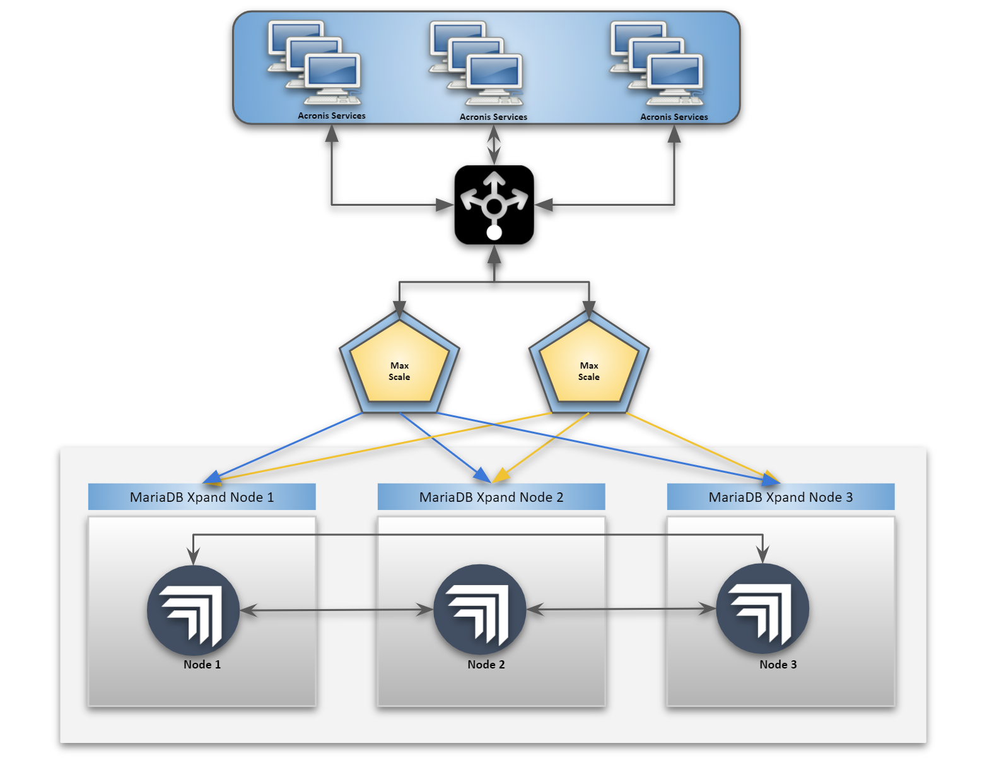

# Setting up The MariaDB Enterprise Xpand Native Cluster

This guide is to set up an Xpand native cluster on CentOS7/RHEL7 OS

## Architecture

The minimum requirement for Xpand have 3 nodes cluster. Xpand can also be deployed together with MariaDB server, but this document discusses Xpand Native dedicated cluster deplloyment.

**Reference Architecture:**


### High-level Instructions

- Prepare three VM/Nodes with CentOS 7/RHEL 7 (CentOS 7 requires fewer dependencies).
- Download and Install Xpand Engine Binaries (Xpand Native).
- Download and Install MariaDB 10.5 Enterprise Client. Take note, this only installs the Client and not the MariaDB server.
- Activate Xpand Licence on 1st Xpand Node.
- Repeat installation on other two nodes
- ADD those two nodes to the cluster using the first Xpand node.

We will go through all of the above in the sections below.

## Assumptions

- **Three** nodes with `RHEL 7.x` or `CentOS 7.x`.
- 8 CPU x 16 GB minimum requirement. 
- `SELinux` and `firewalld` are disabled.
- the nodes should be able to communicate with each other.
- filesystem on all the nodes used is `ext4` others are not supported by Xpand as shown here.
  
  ```
  =====   ERROR:   =====
  Filesystem 'xfs' on /data/clustrix (mount point: /) is not supported.
    Suggest using ext4 filesystem
  ======================
  ```

## Installation

### MariaDB 10.5 Enterprise Client

Download the MariaDB Enterprise package on to all the nodes under `/tmp` file system. The MariaDB enterprise package for the respective OS can be downloaded from https://mariadb.com/downloads/#mariadb_platform-enterprise_server 

#### Local Repo Setup

Assuming the downloaded rpm package was untarred is under `/tmp/mariadb-enterprise-10.5.x.x-x86_64-rpms`

```
[shell]$ pwd
/tmp

[shell]$ ls -lrt
total 337744
drwxrwxr-x. 3 centos centos      4096 Oct  7 03:10 mariadb-enterprise-10.5.x.x-x86_64-rpms
-rwxr-xr-x. 1 centos centos 345845760 Oct 10 15:18 mariadb-enterprise-10.5.x-x-x86_64-rpms.tar
```

Based on the above folder setup, we can now create a repository file `/etc/yum.repos.d/mariadb.repo` and add the following content to it. This will define a local repository for CentOS/RHEL.

```
[local]
name=MariaDB ES 10.5
baseurl=file:///tmp/mariadb-enterprise-10.5.x-x-x86_64-rpms
enabled=1
gpgcheck=0
protect=1
```

Note: The `baseurl` must point to the location where the extracted tar exists. 

#### Install MariaDB Enterprise

Now we can directly execute the `yum install` without worrying about the dependencies as follows since we have already set up a local MariaDB Enterprise server repository.

```txt
[shell]$ yum -y install MariaDB-client

Dependencies Resolved

==========================================================================================================================================================================================
  Package                                    Arch                       Version                                    Repository                                                         Size
==========================================================================================================================================================================================
Installing:
 MariaDB-client                              x86_64                     10.5.x-1.el7                               mariadb-es-main                                                   7.0 M
 MariaDB-compat                              x86_64                     10.5.x-1.el7                               mariadb-es-main                                                   2.2 M
     replacing  mariadb-libs.x86_64 1:5.5.64-1.el7
Installing for dependencies:
..
..
..
Complete!
```

This needs to be done on all the Xpand nodes. Once done, we can proceed with Xpand server setup.

### Important Nodes

- All the following steps are to be done on all the nodes unless otherwise specified
- The filesystem on all the nodes must be `ext4`
- Filesystem creation example
  - `[shell]$ lsblk`
  - `[shell]$ mkfs -t ext4 /dev/nvme0n1`
  - `[shell]$ mount /dev/nvme0n1 /data`
- Recommended to create a separate munt for **Xpand logs** as well

### Install Xpand Dependencies

#### For RHEL 7

- MariaDB Server & Xpand Dependencies
  ```
  ==========================================================================================================================================================================================
  Package                                    Arch                       Version                                    Repository                                                         Size
  ==========================================================================================================================================================================================
  Installing:
   xpand-common                              x86_64                      glassbutte-1074.el7                        /xpand-common-glassbutte-1074.el7.x86_64                          44 M
  Installing for dependencies:
   MySQL-python                              x86_64                      1.2.5-1.el7                                rhel-7-server-rhui-rpms                                           90 k
   libdwarf                                  x86_64                      20130207-4.el7                             rhel-7-server-rhui-rpms                                          109 k
   libdwarf-tools                            x86_64                      20130207-4.el7                             rhel-7-server-rhui-optional-rpms                                 161 k
   libicu                                    x86_64                      50.2-4.el7_7                               rhel-7-server-rhui-rpms                                          6.9 M
   psmisc                                    x86_64                      22.20-17.el7                               rhel-7-server-rhui-rpms                                          141 k
   yajl                                      x86_64                      2.0.4-4.el7                                rhel-7-server-rhui-rpms                                           39 k
  ```

- `sudo rpm -ivh https://dl.fedoraproject.org/pub/epel/epel-release-latest-7.noarch.rpm`
- `yum-config-manager --enable "Red Hat Enterprise Linux 7 Server - Optional from RHUI (RPMs)"`
  - To get this name check the list of disabled repos through **`yum repolist disabled`** and copy the text that says **`Optional from RHUI`** as above
  - If the above is not possible, download the dependency manually and install
    - **`libdwarf`** & **`libdwarf-tools`** available here:
      - `yum -y install https://rpmfind.net/linux/centos/7.9.2009/os/x86_64/Packages/libdwarf-20130207-4.el7.x86_64.rpm`
      - `yum -y install https://rpmfind.net/linux/centos/7.9.2009/os/x86_64/Packages/libdwarf-tools-20130207-4.el7.x86_64.rpm`

#### For CentOS 7

- `sudo yum -y install epel-release`

After installing `epel-release` and optional packages, install the dependencies as follows.

```
[shell]$ yum -y install bzip2 xz wget screen ntp ntpdate htop mdadm

Dependencies Resolved

==============================================================================================================================================================================================================================================================
 Package                                                      Arch                                           Version                                                                    Repository                                                       Size
==============================================================================================================================================================================================================================================================
Installing:
 bzip2                                                        x86_64                                         1.0.6-13.el7                                                               rhel-7-server-rhui-rpms                                          52 k
 htop                                                         x86_64                                         2.2.0-3.el7                                                                epel                                                            103 k
 mdadm                                                        x86_64                                         4.1-4.el7                                                                  rhel-7-server-rhui-rpms                                         439 k
 ntp                                                          x86_64                                         4.2.6p5-29.el7_8.2                                                         rhel-7-server-rhui-rpms                                         549 k
 ntpdate                                                      x86_64                                         4.2.6p5-29.el7_8.2                                                         rhel-7-server-rhui-rpms                                          87 k
 screen                                                       x86_64                                         4.1.0-0.25.20120314git3c2946.el7                                           rhel-7-server-rhui-rpms                                         552 k
 wget                                                         x86_64                                         1.14-18.el7_6.1                                                            rhel-7-server-rhui-rpms                                         547 k
Installing for dependencies:
 autogen-libopts                                              x86_64                                         5.18-5.el7                                                                 rhel-7-server-rhui-rpms                                          66 k
 libreport-filesystem                                         x86_64                                         2.1.11-53.el7                                                              rhel-7-server-rhui-rpms                                          41 k

Transaction Summary
==============================================================================================================================================================================================================================================================
Install  7 Packages (+2 Dependent packages)
Installed:
  bzip2.x86_64 0:1.0.6-13.el7    htop.x86_64 0:2.2.0-3.el7    mdadm.x86_64 0:4.1-4.el7    ntp.x86_64 0:4.2.6p5-29.el7_8.2    ntpdate.x86_64 0:4.2.6p5-29.el7_8.2    screen.x86_64 0:4.1.0-0.25.20120314git3c2946.el7    wget.x86_64 0:1.14-18.el7_6.1   

Dependency Installed:
  autogen-libopts.x86_64 0:5.18-5.el7                                                                                       libreport-filesystem.x86_64 0:2.1.11-53.el7                                                                                      

Complete!
```

***Note:** Enable NTP process on all the nodes*

```txt
[shell]$ systemctl start ntpd && systemctl enable ntpd
```

### Preparing Filesystem

A dedicated mount `/data` with the type of `ext4` should be available, the output of the `df -h --print-type` should report a dedicated mount for `/data` with sufficient storage as follows

```txt
[shell]$ df -h --print-type
[centos@ip-172-31-9-216 ~]$ df -h --print-type 
Filesystem     Type      Size  Used Avail Use% Mounted on
devtmpfs       devtmpfs  7.4G     0  7.4G   0% /dev
tmpfs          tmpfs     7.4G     0  7.4G   0% /dev/shm
tmpfs          tmpfs     7.4G   17M  7.4G   1% /run
tmpfs          tmpfs     7.4G     0  7.4G   0% /sys/fs/cgroup
/dev/xvda1     xfs       8.0G  1.4G  6.7G  17% /
tmpfs          tmpfs     1.5G     0  1.5G   0% /run/user/1000
/dev/nvme0n1   ext4      436G   73M  414G   1% /data
/dev/nvme0n2   ext4       50G   10M   50G   1% /data/log
```

_**Note:** If the mount is not available with the type of `ext4` the installation of Xpand will fail._

### Download the Xpand binaries

Download the latest binaries from https://mariadb.com/downloads/#mariadb_platform-mariadb_xpand and transfer the binaries to all of the Xpand nodes

Once transferred, un-tar the file and install.

```txt
[shell]$ ls -rlt
total 128816
-rwxr-xr-x 1 root root 131905837 Sep 28 06:31 xpand-5.x.x.tar

[shell]$ tar -xvf xpand-5*.tar
xpand-5.3.11_rc.el7/
xpand-5.3.11_rc.el7/xpand-xpdnode-5.3.11_rc-1.el7.x86_64.rpm
xpand-5.3.11_rc.el7/clxdbi-combined-2.2.1-962.el7.tar.bz2
xpand-5.3.11_rc.el7/README
xpand-5.3.11_rc.el7/clxgui-combined-2.2.1-703.el7.tar.bz2
xpand-5.3.11_rc.el7/xpand-common-glassbutte-1068.el7.x86_64.rpm
xpand-5.3.11_rc.el7/xpand-utils-5.3.11_rc-1.el7.x86_64.rpm
xpand-5.3.11_rc.el7/clxgui_configure.sh
xpand-5.3.11_rc.el7/clxdbi_configure.sh
xpand-5.3.11_rc.el7/LICENSE-SWDL
xpand-5.3.11_rc.el7/checksums.md5
xpand-5.3.11_rc.el7/xpdnode_install.py
```

#### Install the Xpand binaries

Installing Xpand binaries on all the nodes as follows, the port `5001` is something that is up to us to decide, the `--yes` makes sure that Xpand uses all the defaults and recommended settings, if using `--wizard` we will have the option to customize ports and installation locations, etc.

***Note:** The warning `LOG_PATH should not be on the same storage volume (/data) as DATA_PATH.` can be ignored for this test, but as a best practice considering performance, the data directory and the log directory should be in separate physical mounts.*


```txt
[shell]$ cd xpand-5.*
[shell]$ ./xpdnode_install.py --wizard --mysql-port 5001 --unix-socket /data/clustrix/xpand.sock
or
[shell]$ ./xpdnode_install.py --yes --mysql-port 5001 --unix-socket /data/clustrix/xpand.sock
### This will auto accept all the defaults and run install witnout any prompts

=== Warning: ===
LOG_PATH should not be on the same storage volume (/data) as
  DATA_PATH.
================


MariaDB Xpand successfully configured!
Loaded plugins: amazon-id, rhui-lb, search-disabled-repos
Examining /home/ec2-user/xpand-5.3.11_rc.el7/xpand-common-glassbutte-1068.el7.x86_64.rpm: xpand-common-glassbutte-1068.el7.x86_64
Marking /home/ec2-user/xpand-5.3.11_rc.el7/xpand-common-glassbutte-1068.el7.x86_64.rpm to be installed
Resolving Dependencies

==============================================================================================================================================================================================================================================================
 Package                                                       Arch                                          Version                                                    Repository                                                                       Size
==============================================================================================================================================================================================================================================================
Installing:
 xpand-common                                                  x86_64                                        glassbutte-1068.el7                                        /Xpand-common-glassbutte-1068.el7.x86_64                                         44 M
Installing for dependencies:
 MySQL-python                                                  x86_64                                        1.2.5-1.el7                                                
 ...
 ...
 ...
Updating for dependencies:
 mariadb-libs                                                  x86_64                                        1:5.5.65-1.el7                                             rhui-REGION-rhel-server-releases                                                759 k

Transaction Summary
==============================================================================================================================================================================================================================================================

Complete!

Loaded plugins: amazon-id, rhui-lb, search-disabled-repos
Examining /home/ec2-user/xpand-5.3.11_rc.el7/xpand-xpdnode-5.3.11_rc-1.el7.x86_64.rpm: xpand-xpdnode-5.3.11_rc-1.el7.x86_64
Marking /home/ec2-user/xpand-5.3.11_rc.el7/xpand-xpdnode-5.3.11_rc-1.el7.x86_64.rpm to be installed
Resolving Dependencies
--> Running transaction check
---> Package xpand-xpdnode.x86_64 0:5.3.11_rc-1.el7 will be installed
--> Finished Dependency Resolution

Dependencies Resolved

==============================================================================================================================================================================================================================================================
 Package                                                  Arch                                              Version                                                    Repository                                                                        Size
==============================================================================================================================================================================================================================================================
Installing:
 xpand-xpdnode                                            x86_64                                            5.3.11_rc-1.el7                                            /Xpand-xpdnode-5.3.11_rc-1.el7.x86_64                                            333 M

Transaction Summary
==============================================================================================================================================================================================================================================================

Complete!

Loaded plugins: amazon-id, rhui-lb, search-disabled-repos
Examining /home/ec2-user/xpand-5.3.11_rc.el7/xpand-utils-5.3.11_rc-1.el7.x86_64.rpm: xpand-utils-5.3.11_rc-1.el7.x86_64
Marking /home/ec2-user/xpand-5.3.11_rc.el7/xpand-utils-5.3.11_rc-1.el7.x86_64.rpm to be installed
Resolving Dependencies
--> Running transaction check
---> Package xpand-utils.x86_64 0:5.3.11_rc-1.el7 will be installed
--> Finished Dependency Resolution

Dependencies Resolved

==============================================================================================================================================================================================================================================================
 Package                                                 Arch                                               Version                                                     Repository                                                                       Size
==============================================================================================================================================================================================================================================================
Installing:
 xpand-utils                                             x86_64                                             5.3.11_rc-1.el7                                             /Xpand-utils-5.3.11_rc-1.el7.x86_64                                              15 M

Transaction Summary
==============================================================================================================================================================================================================================================================
                                                                                                          

Complete!

MariaDB xpand RPMs installed successfully
MariaDB xpand service started... Please wait for the database to
  initialize (This will take a minute.)
.......................
MariaDB xpand initialized.

MariaDB xpand is now ready for use.
checking options
setting config path
reading settings from /etc/clustrix/clxdbi.conf
reading settings from environment
checking settings from /etc/clustrix/clxnode.conf
checking built-in default settings
settings complete
checking /etc/clustrix
checking /etc/clustrix/clxdbi.conf
writing config
seeking local archive
found ./clxdbi-combined-2.2.1-962.el7.tar.bz2
probing for existing /opt/clustrix/clxdbi
checking /var/tmp/clxdbi-extract-1601319180
extracting ./clxdbi-combined-2.2.1-962.el7.tar to /var/tmp/clxdbi-extract-1601319180
checking /opt/clustrix/clxdbi
extracting clxdbi to /opt/clustrix/clxdbi
extracting common code to /opt/clustrix/clxui-common
cleaning up /var/tmp/clxdbi-extract-1601319180
using install opts --start
installing
no log file, buffering log output

starting clxdbi installation
warning: vendor/rpm/libpcap-1.5.3-8.el7.x86_64.rpm: Header V3 RSA/SHA256 Signature, key ID f4a80eb5: NOKEY
installing rpms
Failed to set locale, defaulting to C
updating links...
links updated
starting server
preparing clxdbi for first run
/opt/clustrix/clxdbi/vendor/bundle/ruby/2.6.0/gems/get_process_mem-0.2.1/lib/get_process_mem.rb:10: warning: BigDecimal.new is deprecated; use BigDecimal() method instead.
linking to clustrixdb nanny
clxdbi install completed
checking /etc/logrotate.d
adding /etc/logrotate.d/clxdbi
writing tmpfiles conf
checking options
setting config path
reading settings from /etc/clustrix/clxgui.conf
reading settings from environment
checking built-in default settings
settings complete
checking /etc/clustrix
checking /etc/clustrix/clxgui.conf
writing config
seeking local archive
found ./clxgui-combined-2.2.1-703.el7.tar.bz2
probing for existing /opt/clustrix/clxgui
checking /var/tmp/clxgui-extract-1601319219
extracting ./clxgui-combined-2.2.1-703.el7.tar to /var/tmp/clxgui-extract-1601319219
checking /opt/clustrix/clxgui
extracting clxgui to /opt/clustrix/clxgui
extracting common code to /opt/clustrix/clxui-common
cleaning up /var/tmp/clxgui-extract-1601319219
using install opts --start
installing

starting clxgui installation
warning: vendor/rpm/libxslt-1.1.28-5.el7.x86_64.rpm: Header V3 RSA/SHA256 Signature, key ID f4a80eb5: NOKEY
rpms already installed
updating links...done
starting server
preparing clxgui for first run
linking to clustrixdb nanny
clxgui install completed
checking /etc/logrotate.d
adding /etc/logrotate.d/clxgui
writing tmpfiles conf

*** This Node's IP (Needed later during cluster configuration): 172.31.20.172
For easiest use of the `clx` cluster management tool, configure passwordless ssh between all nodes for these users: Xpand, Xpandm
```

MariaDB Xpand is installed successfully, do this on all the remaining nodes.

### Connecting to Xpand

***Note:** The following is to be done only on the 1st Xpand node!*

The first thing to do would be to install the license provided by the MariaDB team using the `set global license='JSON Text';` syntax. This needs to be done on the **first Xpand** node directly and not on the MariaDB server.

```txt
[shell]$ mariadb --socket /data/clustrix/xpand.sock

Welcome to the MariaDB monitor.  Commands end with ; or \g.
Your MySQL connection id is 37889
Server version: 5.0.45-xpand-5.3.11_rc 

Copyright (c) 2000, 2018, Oracle, MariaDB Corporation Ab and others.

Type 'help;' or '\h' for help. Type '\c' to clear the current input statement.

MySQL [(none)]> set global license='{"expiration":"2020-11-01 00:00:00","maxnodes":"3","company":"MariaDB","maxcores":"32","email":"faisal@mariadb.com","person":"Faisal Saeed","signature":"...my_special_signature_key_string..."}';
Query OK, 0 rows affected (0.024 sec)
```

#### Create Test Data

Since we are directly connected to Xpand Native, we dont need to specify any `engine=xpand` clause, even if we did, it will not work. However `engine=InnoDB` works but the table is still created as Xpand since InnoDB engine is just there for compatibility so that a schema from standard MariaDB server can be migrated over to Xpand. Once in Xpand, everything is Xpand.

```
MySQL [(none)]> create database testdb;
Query OK, 0 rows affected (0.002 sec)

MySQL [(none)]> use testdb;
Database changed

MySQL [testdb]> create table tab(id serial, c1 varchar(100));
Query OK, 0 rows affected (0.004 sec)

MySQL [testdb]> insert into tab(c1) select column_name from information_schema.columns;
Query OK, 984 rows affected (0.537 sec)
```

We now have a table with some data sitting on the 1st node. It is not yet distributed to other nodes as there are no other nodes in the cluster. Let's verify that with the help of `/opt/clustrix/bin/clx stat` command.

```
[shell]$ /opt/clustrix/bin/clx stat
Cluster Name:    cl43726fe0eeda8c3d
Cluster Version: 5.3.13
Cluster Status:   OK
Cluster Size:    1 nodes - 2 CPUs per Node
Current Node:    ip-172-31-19-210 - nid 1

nid |      Hostname     | Status |   IP Address   | TPS |      Used      |  Total
----+-------------------+--------+----------------+-----+----------------+--------
  1 |  ip-172-31-19-210 |    OK  |  172.31.19.210 |   0 |  21.1M (0.01%) |  329.8G
----+-------------------+--------+----------------+-----+----------------+--------
                                    172.31.19.210 |   0 |  21.1M (0.01%) |  329.8G
```

We can see, the cluster is just one node at the moment, let's add the other two nodes to this cluster.

***Note:** Before adding the nodes, we need to ensure that Xpand and MariaDB client are already installed on all the other nodes.*

### Setting up the Xpand Cluster

Now that the 1st node is working fine and the other two nodes are ready, we can add these two Xpand nodes to the Xpand cluster as per follows

Log in to the first Xpand node using Xpand socket and run the `ALTER CLUSTER ADD 'IP for Node 2', 'IP for Node 3;`

***Note:** This is to be done only on the 1st node where "license" was added*

```txt
[shell]$ mariadb --socket /data/clustrix/xpand.sock
Welcome to the MariaDB monitor.  Commands end with ; or \g.
Your MySQL connection id is 21505
Server version: 5.0.45-Xpand-5.3.11_rc 

Copyright (c) 2000, 2018, Oracle, MariaDB Corporation Ab and others.

Type 'help;' or '\h' for help. Type '\c' to clear the current input statement.

MySQL [(none)]> ALTER CLUSTER ADD '172.31.1.151', '172.31.0.17';
Query OK, 0 rows affected (0.008 sec)
```

Now the cluster is ready, let's verify 

```txt
[shell]$ /opt/clustrix/bin/clx stat
Cluster Name:    cl43726fe0eeda8c3d
Cluster Version: 5.3.13
Cluster Status:   OK
Cluster Size:    3 nodes - 2 CPUs per Node
Current Node:    ip-172-31-19-210 - nid 1

nid |      Hostname     | Status |   IP Address   | TPS |      Used      |  Total
----+-------------------+--------+----------------+-----+----------------+--------
  1 |  ip-172-31-19-210 |    OK  |  172.31.19.210 |  12 |  22.7M (0.01%) |  324.9G
  2 |  ip-172-31-23-146 |    OK  |  172.31.23.146 |   0 |   8.2M (0.00%) |  324.9G
  3 |   ip-172-31-31-10 |    OK  |   172.31.31.10 |   0 |   8.1M (0.00%) |  324.9G
----+-------------------+--------+----------------+-----+----------------+--------
                                                     12 |  38.9M (0.00%) |  974.6G
```

The three node cluster is ready and we can now connect to any node using the same `mariadb --socket /data/clustrix/xpand.sock` and verify the database `testdb` and the table `tab` area already available and distributed automatically by Xpand.

## Xpand Maintenance

To stop/start/restart the entire cluster from **any node** that has already been added to the cluster, we can execute the following commands

- **`/opt/clustrix/bin/clx dbstart`**
  - Start the entire cluster (all nodes)
- **`/opt/clustrix/bin/clx dbstop`**
  - Stop the entire cluster (all nodes)
- **`/opt/clustrix/bin/clx dbrestart`**
  - Restarts the entire cluster (all nodes)

To stop/start/restart indivdual nodes we need to connect to the particular server and execute one of the following depending on what is required

- **`systemctl status clustrix`**
- **`systemctl stop clustrix`**
- **`systemctl start clustrix`**
- **`systemctl restart clustrix`**

These will work on individual nodes.

Assuming we stop one of the nodes using `systemctl stop clustrix` the status check command will show the following

```txt
[shell]$ /opt/clustrix/bin/clx stat
Cluster Name:    cl43726fe0eeda8c3d
Cluster Version: 5.3.13
Cluster Status:   ATTN
Cluster Size:    3 nodes - 2 CPUs per Node
Current Node:    ip-172-31-19-210 - nid 1

nid |      Hostname     |  Status |   IP Address   | Zone | TPS |      Used      |  Total
----+-------------------+---------+----------------+------+-----+----------------+--------
  1 |  ip-172-31-19-210 |     OK  |  172.31.19.210 |    0 |   0 |  22.6M (0.01%) |  324.9G
  2 |  ip-172-31-23-146 |     OK  |  172.31.23.146 |    0 |   0 |  25.8M (0.01%) |  324.9G
  3 |   ip-172-31-31-10 |   DOWN  |   172.31.31.10 |    0 |   0 |      0 (0.00%) |       0
----+-------------------+---------+----------------+------+-----+----------------+--------
                                                              0 |  48.3M (0.01%) |  649.8G
```

Since the default is 2 replicas for each data slice, the cluster is still able to work without issues, but if we lose another node, the entire cluster will go down as shown in the example.

```txt
[shell]$ /opt/clustrix/bin/clx stat
Error connecting to database via /data/clustrix/mysql.sock: (1, '[16388] Group change during GTM operation: group change in progress, try restarting transaction')
== Using cached node details ==
Cluster Name:    cl43726fe0eeda8c3d
Cluster Version: 5.3.13
Cluster Status:   UNKW
Cluster Size:    3 nodes - 2 CPUs per Node

nid |      Hostname     |  Status |   IP Address   | Zone | TPS |    Used    | Total
----+-------------------+---------+----------------+------+-----+------------+------
  1 |  ip-172-31-19-210 |   UNKW  |  172.31.19.210 |    0 |   0 |  0 (0.00%) |     0
  2 |  ip-172-31-23-146 |   UNKW  |  172.31.23.146 |    0 |   0 |  0 (0.00%) |     0
  3 |   ip-172-31-31-10 |   UNKW  |   172.31.31.10 |    0 |   0 |  0 (0.00%) |     0
----+-------------------+---------+----------------+------+-----+------------+------
                                                              0 |  0 (0.00%) |     0
```

The unknown status means that the cluster is not accessible, but as soon as one of the downed node is recovered, the cluster should be back online.

Here I am starting up one of the down servers using `systemctl start clustrix` and the cluster comes back online, ready for new connections.

```txt
[root@ip-172-31-19-210 xpand-5.3.13.el7]# /opt/clustrix/bin/clx stat
Cluster Name:    cl43726fe0eeda8c3d
Cluster Version: 5.3.13
Cluster Status:   ATTN
Cluster Size:    3 nodes - 2 CPUs per Node
Current Node:    ip-172-31-19-210 - nid 1

nid |      Hostname     |  Status |   IP Address   | Zone | TPS |      Used      |  Total
----+-------------------+---------+----------------+------+-----+----------------+--------
  1 |  ip-172-31-19-210 |     OK  |  172.31.19.210 |    0 |   0 |  22.8M (0.01%) |  324.9G
  2 |  ip-172-31-23-146 |   DOWN  |  172.31.23.146 |    0 |   0 |      0 (0.00%) |       0
  3 |   ip-172-31-31-10 |     OK  |   172.31.31.10 |    0 |   0 |  35.2M (0.01%) |  324.9G
----+-------------------+---------+----------------+------+-----+----------------+--------
                                                              0 |  57.9M (0.01%) |  649.8G
```

### Backup & Restore

#### Requirements 

- Passwordless SSH setup is requried for backup/restore to work
  - Refer to this for details: <https://mariadb.com/docs/deploy/xpand-node/#ssh-configuration>
- FTP/SFTP server to store backup
  - This is mandatory, Unlike MariaDB InnoDB setup, Xpand requires a dedicated FTP/SFTP server
  - This is required because the data is distributed across multiple nodes, the backup will need to collect it all onto a single location
  - firewall oppened between all Xpand nodes and the FTP/SFTP server
  - Xpand recommends vsftpd: <https://security.appspot.com/vsftpd.html> for fast backup/restore

#### Backup & Restore

Backup and Restore commands are executed similar to SQL statements using MariaDB client

```sql
MySQL [(none)]> BACKUP db_name1.*, db_name2.tbl_name1, db_name2.tbl_name2 TO 'ftp://storage01/uploads/selective_backup.jun01'; 
MySQL [(none)]> BACKUP *.* EXCLUDING db_name2.tbl_name1 TO 'ftp://storage01/uploads/selective_backup.jun01';
MySQL [(none)]> BACKUP *.* TO 'ftp://storage01/uploads/full.jun01';
```

Similarly to Restore, the `LAZY PROJECT` restores only the primary slice of each table, the replicas are later on done by Xpand's rebalancer.

On the other hand, `REPLICAS = n` will forcefully create the replica slices immediately instead of waiting for the rebalancer to kick in and do create the missing replica slices. 

```sql
MySQL [(none)]> RESTORE * FROM 'ftp://storage01/uploads/johndoe.kibbles.jun01' LAZY PROTECT;
MySQL [(none)]> RESTORE * FROM 'ftp://storage01/uploads/johndoe.kibbles.jun01' REPLICAS = 2;
```

Refer to <https://docs.clustrix.com/display/SAG91/ClustrixDB+Fast+Backup+and+Restore> for details on the syntax and various options.

## Setting Up MaxScale

For MaxScale, the latest version 2.5 or higher (if available) is needed as this verion contains the `xpandmon` Monitor service. 

Standard `/etc/maxscale.cnf` configuration as follows

```txt
[MaxScale]
threads=auto

[BootStrapNode-1]
type=server
address=172.31.16.29
port=5001

[Xpand]
type=monitor
module=xpandmon
servers=BootStrapNode-1
user=maxmon
password=password
cluster_monitor_interval=100000ms
health_check_threshold=3
dynamic_node_detection=true

[Xpand-Service]
type=service
router=readwritesplit
user=maxuser
password=password
cluster=Xpand
transaction_replay=true
slave_selection_criteria=LEAST_GLOBAL_CONNECTIONS

[Read-Write-Listener]
type=listener
service=Xpand-Service
protocol=MariaDBClient
port=5009
```

The `servers` section only mentions the first node of the cluster, we can define more than one node as bootstrap as `BootStrapNode-2`, etc. But one is enough, the `xpandmon` will go ahead and identify all the nodes in the cluster automatically. 

We can see, in the ReadWriteSplit service, the Servers are not listed instead we have `cluster=Xpand` This points back to the `xpandmon` section and all the list of nodes is automatically retrieved. This way, we can add nodes to the backend and MaxScale will automatically handle all of them! We don't need to define or change anything within the MaxScale config.

Looking at the `maxctrl list servers` we can see the automatically identified nodes. The list includes the BootStrap node and the same node is again listed as automatically idengtified node, this is the expected behaviour.

```
[root@mx1 ~]# maxctrl list servers
┌────────────────┬──────────────┬──────┬─────────────┬─────────────────┬──────┐
│ Server         │ Address      │ Port │ Connections │ State           │ GTID │
├────────────────┼──────────────┼──────┼─────────────┼─────────────────┼──────┤
│ @@Xpand:node-3 │ 172.31.25.90 │ 5001 │ 0           │ Master, Running │      │
├────────────────┼──────────────┼──────┼─────────────┼─────────────────┼──────┤
│ @@Xpand:node-2 │ 172.31.19.93 │ 5001 │ 0           │ Master, Running │      │
├────────────────┼──────────────┼──────┼─────────────┼─────────────────┼──────┤
│ @@Xpand:node-1 │ 172.31.16.29 │ 5001 │ 0           │ Master, Running │      │
├────────────────┼──────────────┼──────┼─────────────┼─────────────────┼──────┤
│ BootStrapNode  │ 172.31.16.29 │ 5001 │ 0           │ Master, Running │      │
└────────────────┴──────────────┴──────┴─────────────┴─────────────────┴──────┘
```

When the user connects to the `Read-Write-Listener` port `5009`, MaxScale will auto distribute the connections across all the Xpand nodes while still making use of transaction replay features of this router.

### MaxScale User Setup

The `maxmon` and `maxuser` users needs the following grants.

```sql
MySQL [(none)]> GRANT SELECT ON system.* TO maxuser@'%';
MySQL [(none)]> GRANT SELECT ON system.* TO maxmon@'%';
MySQL [(none)]> GRANT SHOW DATABASES ON *.* to maxmon@'%';
MySQL [(none)]> GRANT SUPER ON *.* TO maxmon@'%';
```

This concludes our document on how to set up an Xpand cluster with a Star Schema using GTID-based replication!

### Thanks!
